# Getting Started with Coded UiPath Agents Without Leaving your IDE

In this workshop, you will build your first coded agent on UiPath. We will do the following five tasks:

1. Create an AI agent and run it in your IDE
2. Update the Agent to use an API @tool
3. Evaluate its performance using evaluation sets
4. Improve it using evaluation feedback

By the end of the workshop, you will have built a working AI-powered automation agent and know how to test it using evaluation sets.

* * *
This example builds an agent that validates addresses, but you can build your agent to do almost anything. 

If you are looking for ideas, check out our [common hackathon ideas for agents.](Agent-Ideas.md)

## Prerequisites
This lab assumes you have the following:
- **UiPath account** to run the agent and evaluate its execution.
- **VS Code** with Python 3.11+ is assumed for the lab instructions.
   - **Bash terminal** — the commands in this lab use Bash syntax to maximize compatibility across shells. 
   
      In VS Code, open a new terminal and select **Git Bash** (or equivalent) as the terminal type. PowerShell and CMD syntax differ and may cause unexpected errors.
   - **uv** — a fast Python package manager used throughout this lab. 
   
      It is preferred over `pip` because it is significantly faster, handles virtual environment activation automatically, and is the recommended path in the UiPath SDK docs. Install it with:
      ```bash
         pip install uv
      ```
      or see the [uv installation docs](https://docs.astral.sh/uv/getting-started/installation/) for other options. 
- **Admin rights** — installing packages (`uv`, the UiPath SDK, and dependencies) requires admin/elevated permissions. If you are on a work laptop with restrictions, confirm you can install packages before starting, or work with your IT team in advance.

   **If you cannot install `uv`** (e.g., due to corporate restrictions), activate your virtual environment manually and replace `uv run uipath ...` with `uipath ...` throughout the lab.

- **USPS Developer account** *(required for Step 5)* — Step 5 adds a real address-validation API to your agent using USPS. You will need a free USPS developer account with a registered app to get a Client ID and Client Secret. [Register at cop.usps.com](https://cop.usps.com/) — allow 15–20 minutes if you're setting this up for the first time. You can complete Steps 1–4 while waiting for access.

No existing knowledge of UiPath is required for this lab, but it will make it go faster.

# Workshop: Building a Coded Agent in UiPath


## Step 1 — Install UiPath into VS Code
Let's setup your IDE to connect with UiPath.

1. Create a new empty folder for your project and open it in VS Code (**File → Open Folder**). This folder will be your project workspace — all commands in the lab run from its root.

2. Install the [UiPath Python SDK](https://github.com/UiPath/uipath-python) into your project using [the installation instructions on the UiPath Python SDK Getting Started with the CLI page](https://uipath.github.io/uipath-python/core/getting_started/#getting-started-with-the-cli).

   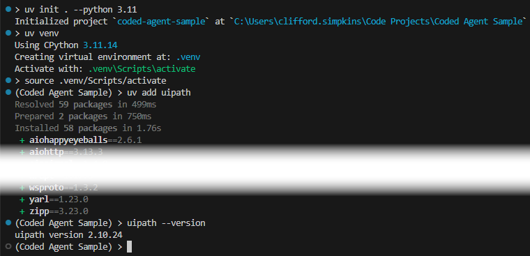


3. Validate the SDK has been installed by checking the version number:

   ```bash
   uipath --version
   ```

   The response will be something like: ``uipath version 2.10.24``

4. Authenticate to UiPath. This will open a web browser to complete authentication:

   ```bash
   uipath auth
   ```

   If you are a member of multiple UiPath organizations, you may be prompted to select which one to authenticate against. If you have multiple tenants, you may be prompted to select a tenant.

   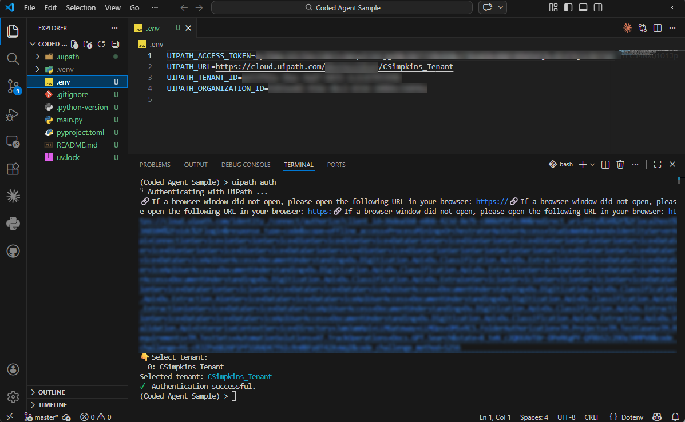

   Once authenticated, a `.env` file will be created in your project folder with your access token, organization, and tenant information.

5. Initialize the project to generate the entry points needed to run the agent:

   ```bash
   uipath init
   ```

   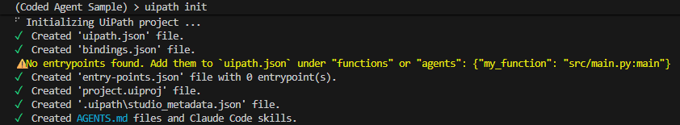


## Step 2 - Explore the new Project structure
Now that the project is on your local machine, let's take a moment and explore what is in the project.

Your project structure includes the following files. While some of these files may be empty, we will populate them in the next step.  

* ``AGENTS.md`` describes the CLI commands that are available from the Python SDK that your coding agent can make use of. The file both defines the role of your coding agent and the UiPath skills that are available to it.
   * This file and those in the ``.agent`` folder comes from the Python SDK.
   * The SDK also creates a ``CLAUDE.md`` file that points Claude Code to this file
* ``main.py`` will contain your agent's code. This likely contains a single HelloWorld-style ``printf()`` call 
* ``uipath.json`` contains the information needed for UiPath to run the coded agent

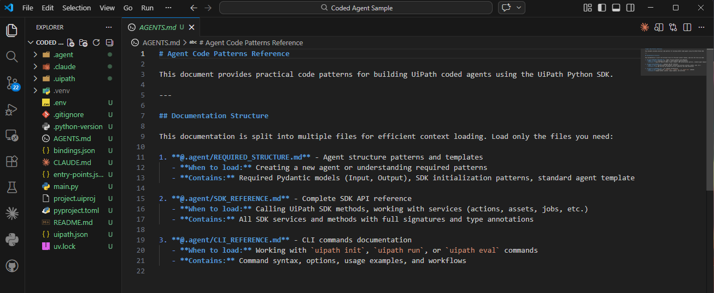

## Step 3 — Run the Agent
Run the agent locally using the CLI.

1. Before we can run, we need to update ``uipath.json`` to know how to run our agent. To do this, we need to add an entry into the ``agents`` node pointing to the ``./main.py:main``:

   ```json
   {
      "$schema": "https://cloud.uipath.com/draft/2024-12/uipath",
      "runtimeOptions": {
         "isConversational": false
      },
      "packOptions": {
         "fileExtensionsIncluded": [],
         "filesIncluded": [],
         "filesExcluded": [],
         "directoriesExcluded": [],
         "includeUvLock": true  
      },
      "functions": {},
      "agents": {"agent": "./main.py:main"}
   }
   ```

2. Run the agent locally using the following command:

   ```bash
   uv run uipath run agent
   ```

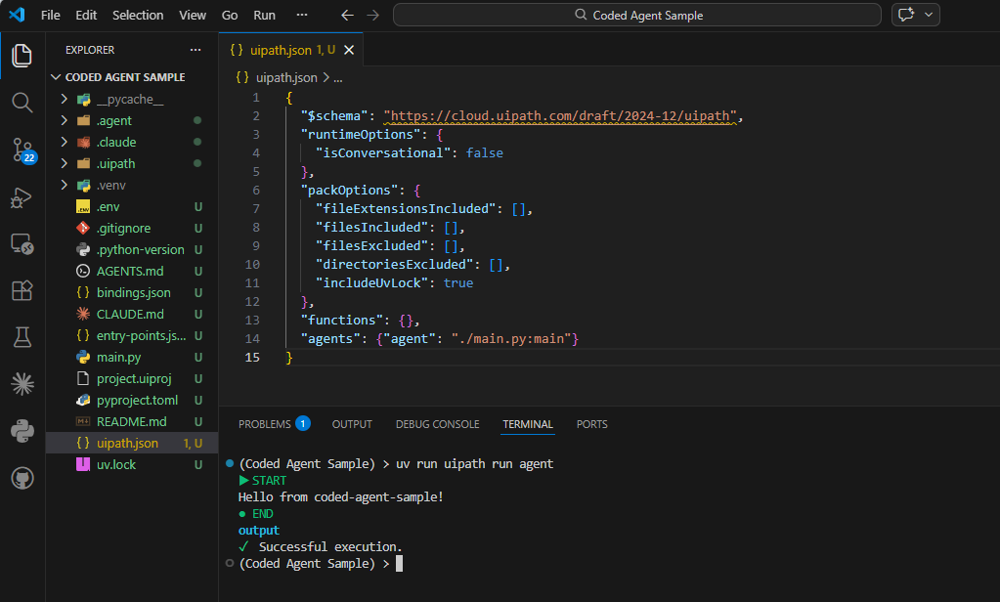

Hello, Agent! ^_^


## Step 4 — Generate your Coded Agent using your Coding Agent
Now we can use our IDE's ***coding agent*** (e.g., Claude Code) to create our ***coded agent***.

To demonstrate this, do the following:
1. Open up your coding agent (e.g., Copilot or Claude Code)
2. Enter a prompt to explain what you want the agent to do. For example:

```
Let's create a UiPath coded agent per .\AGENTS.md file and use the LangGraph approach.
1. Use the prompt below for the UiPath agent
2. Create a valid input.json file with a valid test address (1 Rockefeller Plaza, New York, NY 10020)

Important implementation notes: UiPath SDK LLM service methods (e.g. llm_openai.chat_completions) are async — all LangGraph nodes that call them must be async def, and main must be async def using graph.ainvoke instead of graph.invoke

#### Prompt for the UiPath agent ####
You are an address parser, you will be provided with a single string of an address and your job is to break it down into the following parts:
- streetNumber: the house/building number.​
- preDirectional: directional prefix before the street name (N, S, E, W,
NE, NW, SE, SW).​
- streetName: the primary street name only, without number, direction, or
suffix.​
- streetType: the street suffix (St, Ave, Blvd, Dr, Ln, Rd, Ct, Pl, Way, Cir,
etc.) in abbreviated form.​
- postDirectional: directional suffix after the street name/type.​
- unitType: secondary designator (Apt, Suite, Unit, Bldg, Floor, Rm, #).​
- unitNumber: the unit number or letter.​
- city: the city or municipality.​
- state: 2-letter US state/territory abbreviation.​
- zipCode: 5-digit ZIP code.​
- zipPlus4: 4-digit ZIP+4 extension (no dash). Empty if not provided.​
- country: defaults to \"USA\" unless explicitly stated otherwise.
```

   Note that the prompt includes two important details:
   * **LangGraph approach** — reinforcing this prevents the coding agent from taking a bespoke approach that may require extra debugging.
   * **Async implementation note** — UiPath SDK LLM methods are async; this ensures the coding agent generates correct async code from the start.

   > **Coding agents are non-deterministic.** Your output will differ from the screenshots — that's expected. What matters is that `main.py` runs without errors and returns a parsed address.

   You should see that it added a new ``input.json`` file with a sample address:
   ```json
   {
     "address": "1 Rockefeller Plaza, New York, NY 10020"
   }
   ``` 

   You can change this to be whatever address that you would like to use.

3. Let's now reinitialize the project to pull in any new dependencies

   ```bash
   uipath init
   ```

   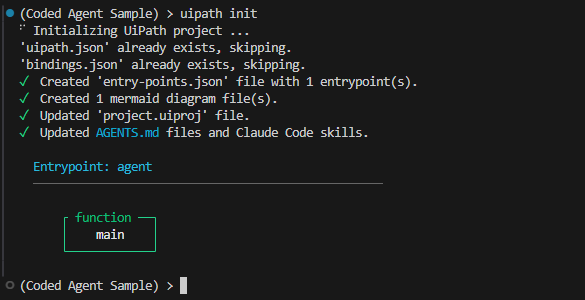


4. And now let's run the agent, passing the new ``input.json`` file that the agent created

   ```bash
   uipath run agent --file input.json
   ```

   The terminal will display the parsed address components, and you should see the address broken down into the following parts among them: street number, street name, city, state, and zip code

   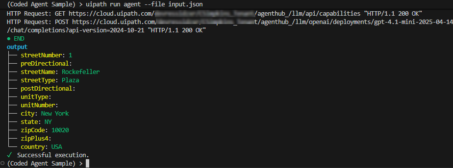


## Step 5 — Add an External API Tool
Having a well-crafted agent prompt is awesome, but there is so much more that they can do when equiped with tools such as external APIs.

To demonstrate use of external APIs, let's add the **USPS validation API** to our agent. 

To do this, we will need to do the following:

1. If you haven't already, register for a USPS developer account at [https://cop.usps.com/](https://cop.usps.com/) and create a business account to get API access.

   

   

2. Once your developer account is set up, create an application by selecting ``my apps`` from the top nav, select the ``developer apps`` tab, and create an app entry. This gives you a Client ID and Client Secret.

   

3. Add your USPS Client ID and Client Secret to your ``.env`` file:

   ```yaml
   USPS_CLIENT_ID=your_client_id
   USPS_CLIENT_SECRET=your_client_secret
   ```

4. Use your AI coding agent (e.g., Claude Code) to implement the USPS integration. The prompt below includes the full API contract — use it as-is for best results:  

```
Add a USPS addresses/v3 validation node to the LangGraph agent, running after address parsing.

AUTH: POST https://apis.usps.com/oauth2/v3/token using grant_type=client_credentials with the USPS_CLIENT_ID / USPS_CLIENT_SECRET from .env.

LOOKUP: GET https://apis.usps.com/addresses/v3/address with streetAddress (built from parsed components), city, state, ZIPCode, and optional secondaryAddress.

Important — response structure: DPV validation fields are under additionalInfo, not address. Corrected ZIP fields are under address.

{
  "address":        { "ZIPCode": "...", "ZIPPlus4": "..." },
  "additionalInfo": { "DPVConfirmation": "Y|S|D|N", "vacant": "Y|N", "business": "Y|N", "DPVCMRA": "Y|N" },
  "corrections":    [{ "text": "human-readable message" }]
}
Y/S = deliverable, D = building found but unit number required, N = not found

ERROR HANDLING: Gracefully degrade and handle HTTP errors - parse the USPS JSON error body into uspsNotes. On network exceptions, catch and write the message to uspsNotes.

ADD TO OUTPUT:
- uspsDeliverable — True only when DPVConfirmation is Y or S. D is a real address but not deliverable without a unit number, so it is False.
- uspsNotes — DPV description or error message
- validAddressNotes — human-readable summary including vacant/commercial/CMRA flags and any correction messages

AFTER IMPLEMENTING: Run using 'uipath run' and the input.json file to verify all three USPS fields are populated. If uspsNotes shows DPV: with no value, the field path is wrong — print the raw USPS response body to inspect the actual keys, fix, and re-run. Remove any debug print statements before finishing.
```

Your ***AI coding agent*** should now update your ***coded agent*** to use the USPS service, you can test it out using the same run command you used in Step 8.  

```bash
uv run uipath run agent --file input.json
```

Upon execution, the agent should:  

1. Parse the address
2. Validate the address via the USPS API
3. Return normalized output and any USPS address notes.

As the agent is running, you should see in the terminal the API calls to the USPS service, and the output should include a fully-formed address with relevant USPS notes.

   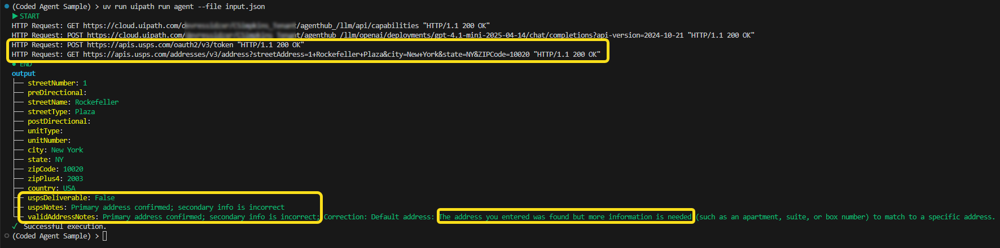


## Step 6 — Run Evaluation Tests
We will now use the evaluation suite to test and score how well our agent does its job.

1. Copy the ``EVALS.md`` file (in this repo) into the ``.agent`` folder in your coded agent project. This file is a reference guide for your AI coding agent — it contains the evaluation framework patterns and examples it needs to write good test cases.

   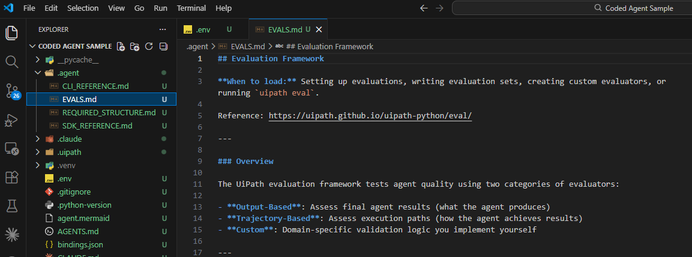

2. Ask your coding agent to use ``EVALS.md`` to create your evaluation test cases. You can use the following prompt:

   ~~~
   Use @.agent/EVALS.md to create 3 evaluation test cases for this agent to test various address examples:
   1. addresses that are invalid
   2. addresses that have a misspelled city
   3. messy formatting. 
   
   Include the evaluator JSON config files in `evaluations/evaluators/` and the eval set in `evaluations/eval-sets/`. Before writing any files, check the UiPath Python SDK source at https://github.com/UiPath/uipath-python — look in `packages/uipath/samples/calculator/evaluations/` for the correct evaluator config file format and structure. And also use the guide at https://uipath.github.io/uipath-python/eval/ 

   ~~~

3. Run the evaluation:

   ```bash
   uv run uipath eval agent evaluations/eval-sets/evaluation-set-default.json --workers 3 --output-file eval-results.json
   ```

Evaluation tests may include:  

- valid address (e.g., building number too high/low)
- invalid address (e.g., non-existant city)
- misspelled city name
- messy formatting 

   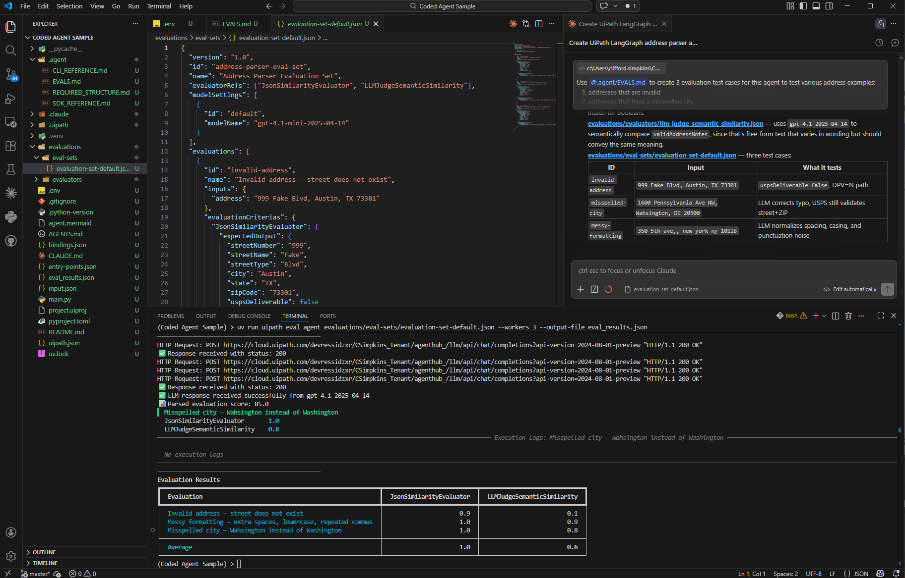


To dig into the evaluation results further, open up the ``eval-results.json`` file specified above, and you can see...


## Step 7 — Connect your Agent to a UiPath Studio Project
While we could stop here, let's look at how much more you can do with your evaluation sets once they are connected to a UiPath project.

1. Log into https://cloud.uipath.com/ and select ``Studio`` from the side menu. This will open up UiPath Studio Web.
2. Click the ``Create New`` button and select ``Agent`` from the drop-down to create a new Agent.

   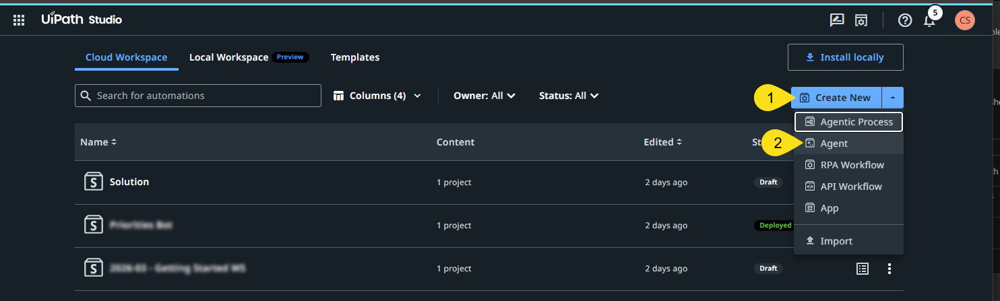


3. Select ``Coded`` as your agent type and click the ``Start Fresh`` button.

   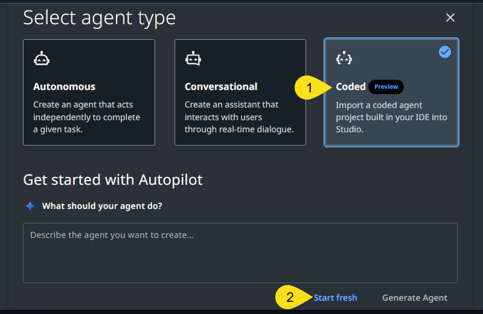


This creates an empty Agent project in UiPath Studio that you can connect your project to. To enable us to push the code into the project, we need to make two changes to the local code.

4. From Agent Definition page in UiPath Studio, copy the ``UIPATH_PROJECT_ID`` and paste that into your ``.env`` file using your IDE.

   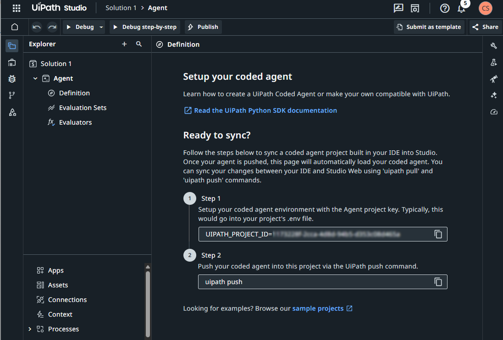


5. Update the ``pyproject.toml`` file to include an ``authors`` entry. UiPath requires this to package the project for push — it's a known requirement. After adding the entry, the file should look like the following (use your own project name):

```
[project]
name = "your-project-name"
version = "0.1.0"
description = "Add your description here"
readme = "README.md"
requires-python = ">=3.11"
authors = [
    {name = "Agentic Dev"}
]
dependencies = [
    "uipath>=2.10.21",
    "langgraph>=0.2.0",
    "httpx>=0.27.0",
]
```


6. With the local metadata updated, let's push the code up to the project. If you get errors that start from a 401 HTTP error, your token may have timed out and you should use ``uipath auth`` to reauthenticate.

```bash
uipath push
```

   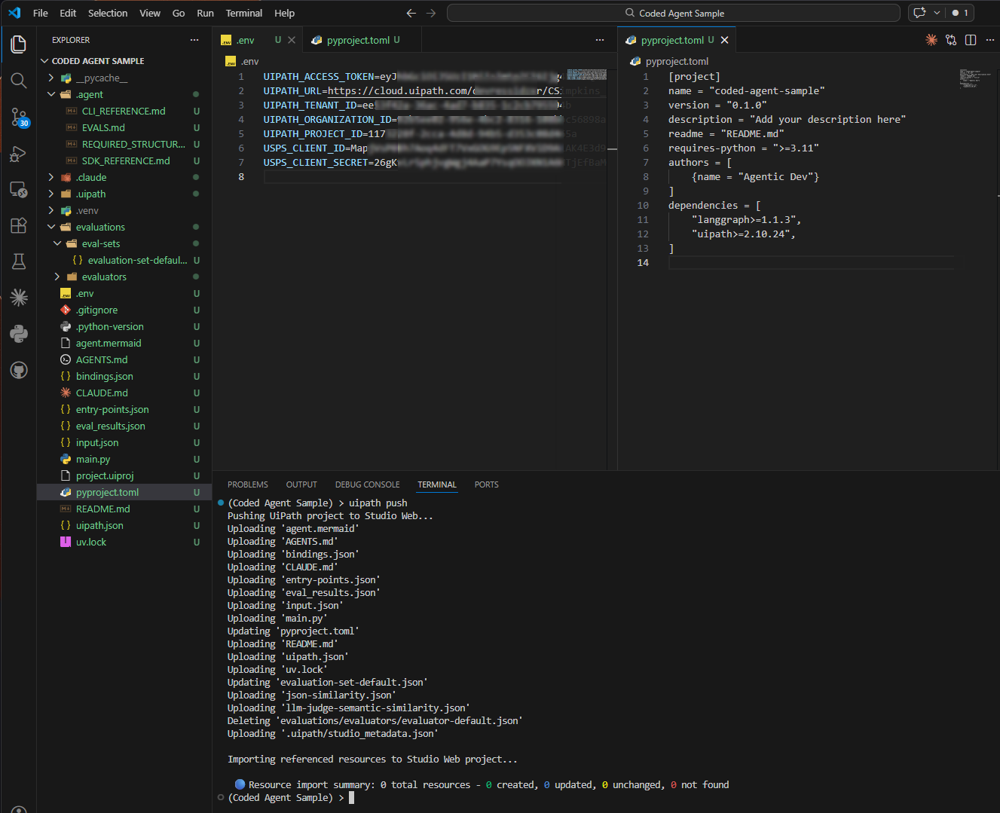


Once pushed to the UiPath Studio project, the Definition page will update to show your entrypoint and the properties window (access via the wrench icon along the right of the design canvas) will display your project information as well as the latest version (which should be v1.0.0 to start).

   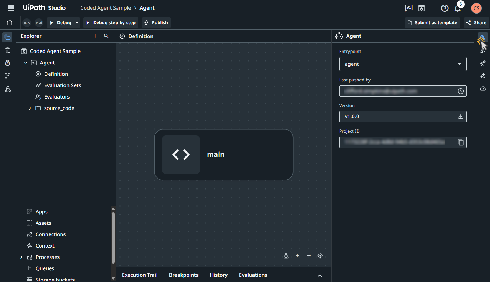

## Step 8 — Review Evaluation Results
With the agent in UiPath Studio, let's look at the project's **Evaluation Sets** . The project's evaluation sets should look familiar because they are the same files we created and ran locally earlier. The ``uipath push`` should have brought your evaluation sets into the project, but it did not bring in the eval run(s) that you've run.

1. Select the ``Evaluation Sets`` node in the project and take a look at the three tabs here:
   - **Evaluations** should contain the three evaluations that we created earlier - these were pulled from ``./evaluations/eval-sets/evaluation-set-default.json``
   - **Runs** should be empty
   - **Evaluators** contains the three evaluatators that we created earlier - these are located in the ``./evaluations/evaluators/`` folder

2. Let's run the evaluations by navigating to the ``Evaluations`` tab, selecting all of the evaluations, and selecting ``Run (3) selected``

   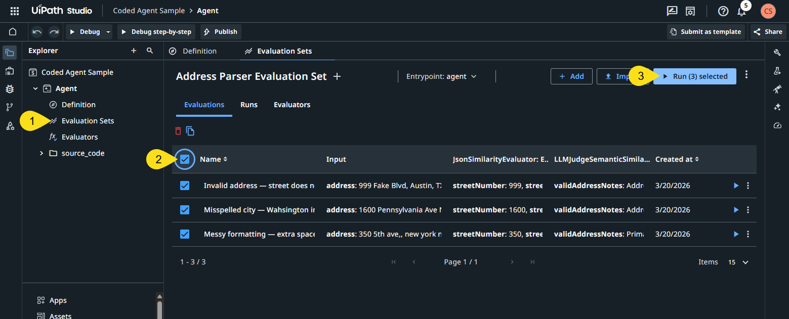


3. After they run, you should see an entry in the ``Runs`` tab for the run - expand that run using the arrow to the left and you should see Evaluation Results for each of the evaluations.

4. To explore the evaluation runs in more detail, select the run and view the run summary - one entry per evaluator. To do this, you can either...
   - Click on the 8-character hexadecimal run number (e.g. `890abcde`)
   - Click on the three dots under ``Actions`` and select ``View Details``

      *Note*: hovering over a score box gives you a preview of the evaluation, as well as guidance for improving the evaluation.

   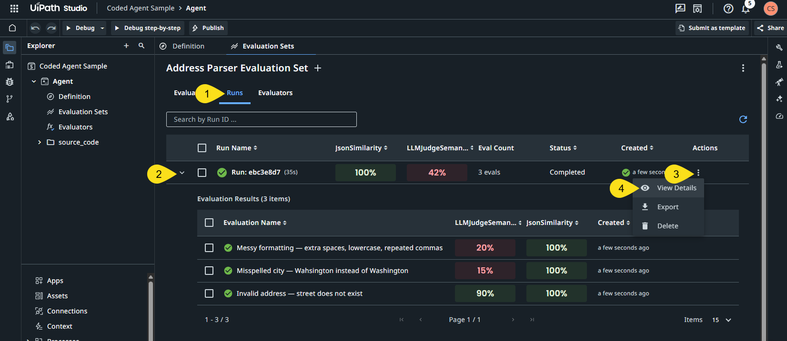


5. Then click on the evaluation that you want to see more information on. This will open up a trace for that evaluation run.
   - You will have a tab for each of the evaluators that you can dig into

      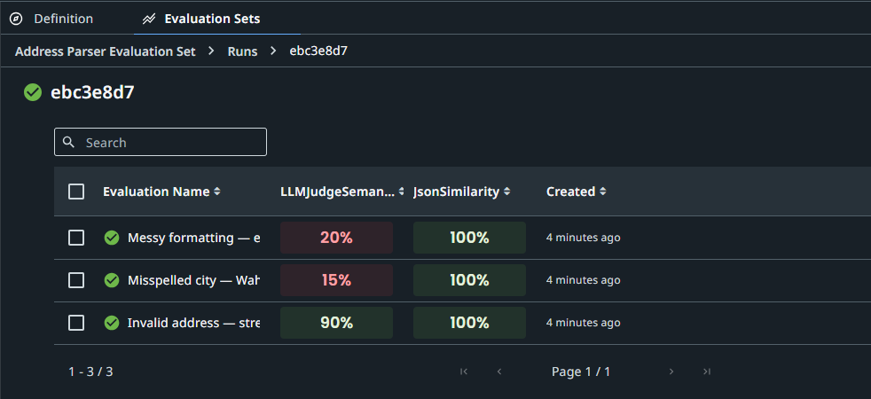

   - Each tab displays a three-panel view with a summary of the run, an execution trace, and evaluation results.
   
   You can use this rich set of information to inform how your agent performed given the input passed into it.

      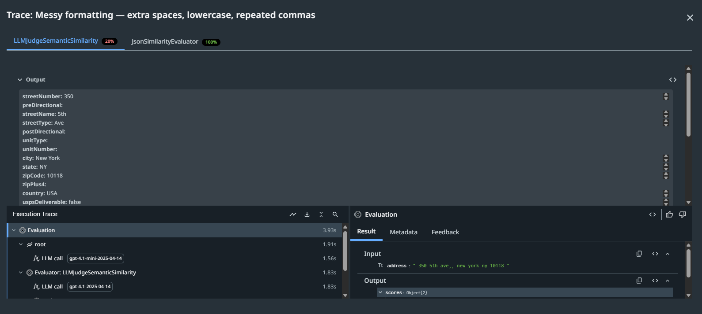


From this point forward, your agent evaluation scores will appear here, regardless of whether you run them within UiPath Studio or from the IDE. Now that your agent has a PROJECT_ID, it knows where to send the evaluations.

## Step 9 — Iterate and Improve the Agent *(Optional)*
Edit the logic inside ``main.py`` to improve your address validator. Your evaluations should provide some excellent advice on areas for improvement.

Example improvements:  
- better parsing
- stronger validation
- improved formatting


## Step 10 — Rerun the Agent *(Optional)*
After making changes, rerun your agent, using either the ``input.json`` or eval sets you already created.

```bash
uv run uipath run agent --file input.json
```
```bash
uv run uipath eval agent evaluations/eval-sets/evaluation-set-default.json --workers 10
```

Afer running your eval sets, you can return again to UiPath Studio, and you should see your eval results show up in the UiPath Studio Evaluation Set Runs table. Hopefully you should see the scores inprove based on the changes you made to your code.


## Step 11 — Push Coded Agent Updates to UiPath
Push the updated project back to Studio Web to create a version/snapshot of your coded agent.

```bash
uipath push
```

Then commit and push your code for version control system, if applicable.

*Note: If you receive errors while pushing your code back to UiPath, check to see if you are still authenticated. If needed, quickly reauthenticate using ``uipath auth``*

* * *
## Congratulations!

You've successfully created a coded agent that runs on UiPath!
- You quckly created an UiPath agent using CLI commands and created the agent from prompt in your IDE
- You extended your agent to call an external, credential-protected API -- all from a prompt to your coding agent
- You set up evaluation tests to exercise your agent - evaluating both the happy path (well formed inputs) and evaluations that tested bad and malformed inputs
- Finally, we pushed the code up to UiPath Studio and ran our evaluation sets from within UiPath Studio to test it out

Next, we invite you to try out more of the platform.