# Getting Started with Coded UiPath Agents

In this workshop, you will build your first coded agent on UiPath.  

1. Create an AI agent in UiPath Studio Cloud
2. Clone the Agent and run it locally in your IDE
3. Update the Agent to use an API tool
4. Evaluate its performance
5. Improve it using evaluation feedback

By the end, you will have built a working AI-powered automation agent.

* * *
This example builds an agent that validates addresses, but you can build your agent to do almost anything. If you are looking for ideas, you can find [ideas at the bottom of this lab.](#need-ideas-try-one-of-these-hackathon-projects)

* * *
# Building a Coded Agent in UiPath

## Step 1 — Open UiPath Studio Cloud
Navigate to your UiPath workspace: [https://staging.uipath.com/uipathlabsworkshop/studio_/projects](https://staging.uipath.com/uipathlabsworkshop/studio_/projects)  
You should see your **Cloud Workspace with existing projects**.  

Click ``Create New``

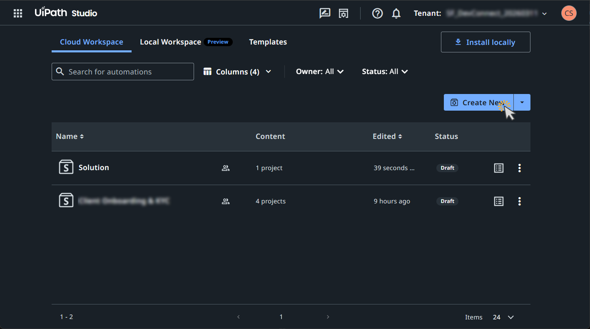


## Step 2 — Choose What to Build
When creating a new solution you will see multiple options:  

- Agentic Process
- Agent
- RPA Workflow
- API Workflow
- App
- Case Management

For this workshop select ``Agent``

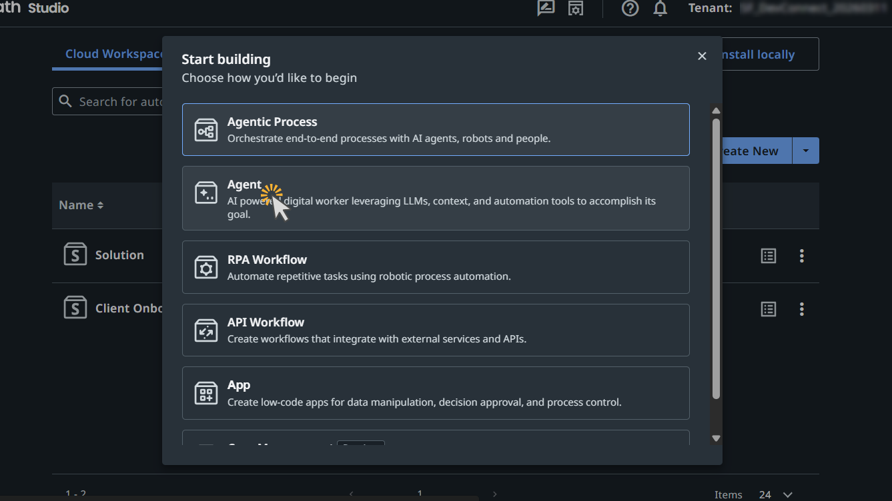


## Step 3 — Generate an Agent with Autopilot
We can use UiPath Autopilot to generate an agent from a simple description.  

To demonstrate this, do the following:
1. Select ``Autonomous`` as the agent type
2. Enter a prompt for ``what your agent should do``. For example:

```
Create an address parser agent where you will be provided with an addressand your job is to break it into its parts.
```

3. Click the ``Generate Agent`` button

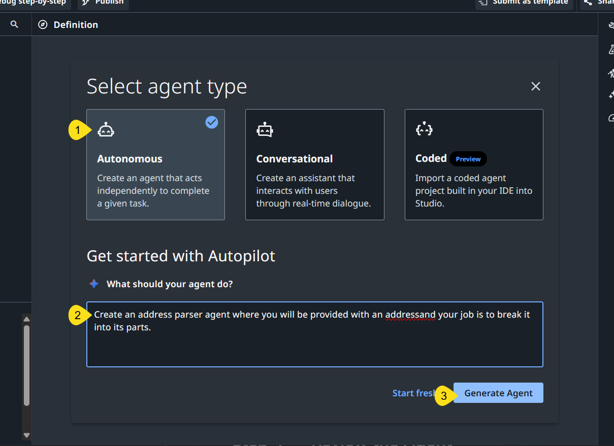

4. Review and accept Autopilot's recommendations as it configures your new Agent Solution

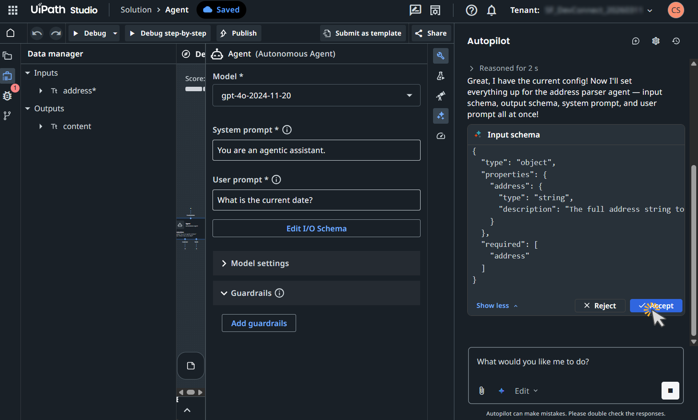


## Step 4 — Review the Agent Canvas

Once created, the **Agent Canvas** will appear.  

Selecitng the agent, Studio will open up the properties window, where you can configure properties such as:  

- Model
- System Prompt
- User Prompt
- Tools
- Input/Output arguments
- Context
- Guardrails

The properties are also accessible using the wrench icon in the upper-right corner of the Studio design canvas.

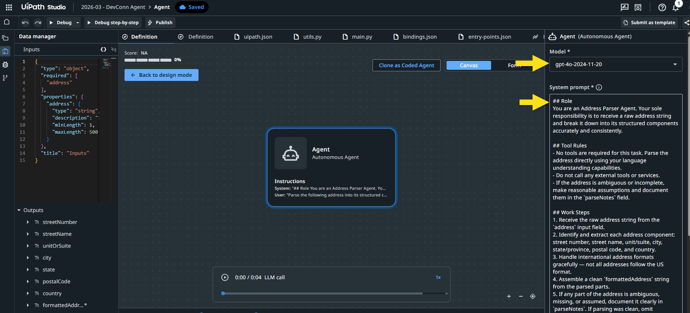


## Step 5 — Clone the Agent as a Coded Agent
To customize your agent with code, do the following:
1. Click on the ``Clone as Coded Agent`` button at the top of the design canvas.

2. Review the new ``Coded Copy of Agent`` part of the solution - this is code that was generated, which we will open in the next step.

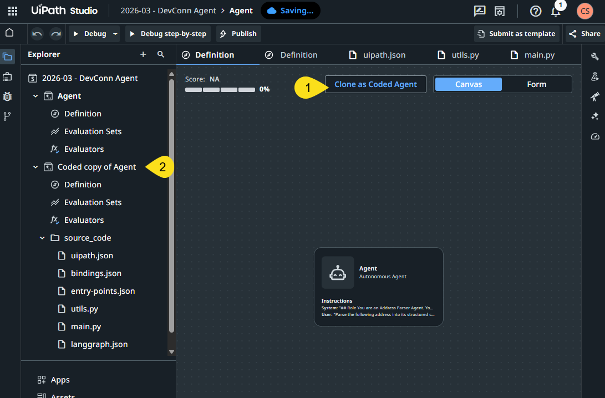

## Step 6 — Open the Project in Cursor or VS Code
Let's open the generated project in **Cursor or VS Code** and examine it's contents.

1. Open your IDE in the folder you want to use for the project.
2. Configure the project to use the [UiPath Python SDK](https://github.com/UiPath/uipath-python) using the following commands.

   - Initialize the Python environment by opening a terminal (top menu):

   ```console
   $ uv init . --python 3.11
   $ uv venv
   $ uv add uipath
   ```

   - You will see various outputs after each, but should not see error messages.

3. Validate the SDK has been installed by checking the version number:

   ```console
   $ uipath --version
   ```

   - The response will be: “uipath-ts-cli version 1.0.0-dev-actionApp.1”

4. Authenticate to the UiPath Staging environment. This will open up a web browser to authenticate you:

   ```console
   $ uipath auth --staging --force
   ```

   - If prompted to select your organization, select the ``uipathlabsworkshop`` organization.

      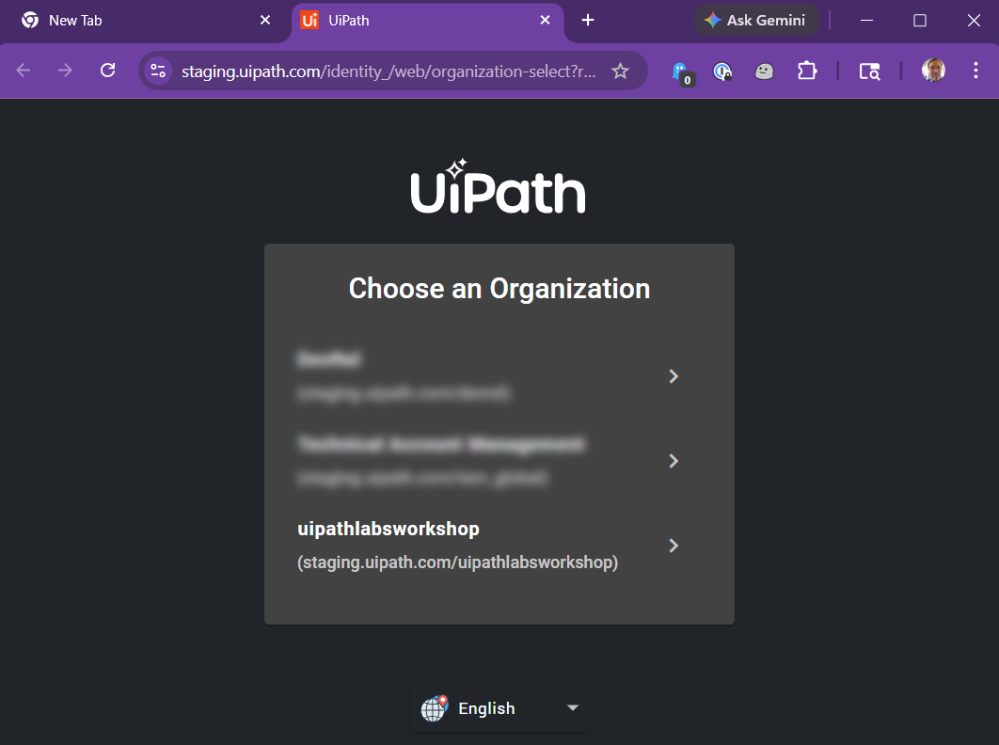

   - You will then be presented with the tenants within that organization that you have access to. For this lab, select the  ``SF_DevConnect_20260311`` tenant.

      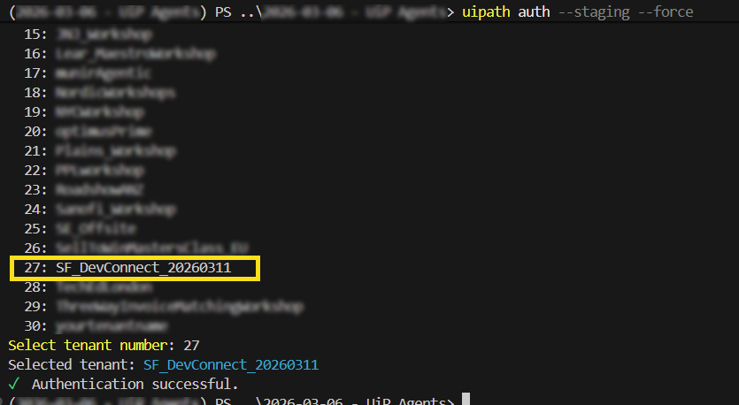

5. Add your UiPath project information to your `.env` file:

   ```yml
   UIPATH_PROJECT_ID=abcdef12-3456-7890-abcd-ef1234567890
   ```

   If the project didn't create a ``.env`` file in the root of your project, you can create one in your IDE and add the UIPATH_PROJECT_ID above to it.

   To find your Peoject ID number, you can pull it from the Studio Web URL after `url/designer/` and before the `?solutionId=`

      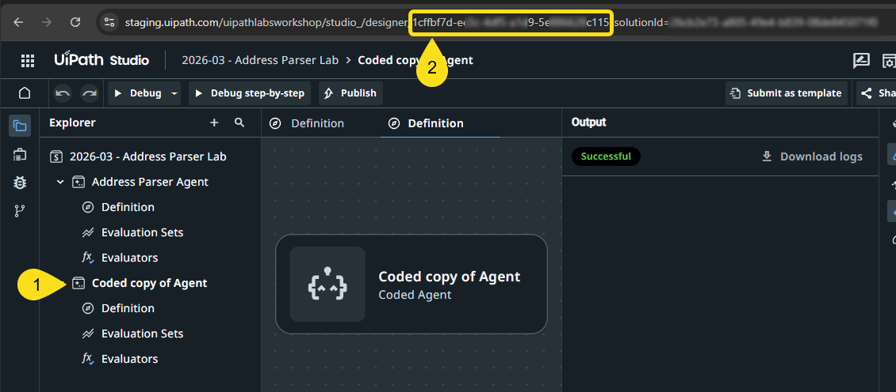

6. Pull the project:

   ```console
   $ uipath pull
   ```

   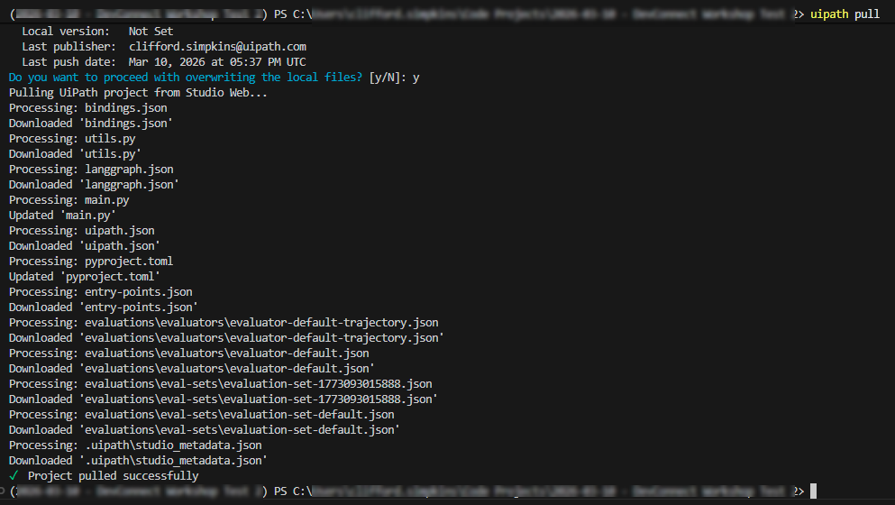


## Step 7 - Explore the new Project
Now that the project is on your local machine, let's take a moment and explore what is there.

You now have a project structure includes the following files. Note that these files may be empty, but we will populate them in Step 8.  

* ``AGENTS.md`` describes the CLI commands that are available from the Python SDK. We will be running these in the following steps
* ``main.py`` contains the agent properties that we setup in UiPath Studio Cloud
* ``input.json`` provides the input values that the agent will use when it runs. This file is likely empty for you to start.
* evaluation files

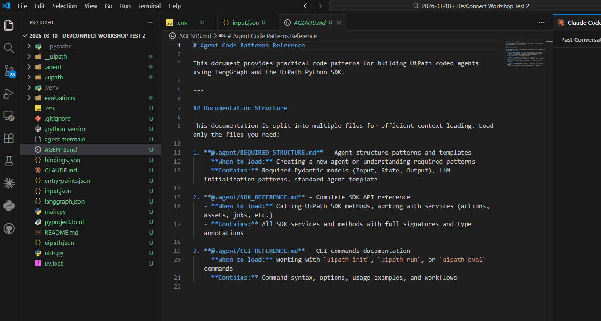

## Step 8 — Run the Agent with input values
Run the agent locally using the CLI.

1. Populate the `input.json` file to store the address that you want to pass as an input parameter to the agent:

   ```json
   {
      "address": "1600 Pennsylvania Ave NW, Washington DC 20500"
   }
   ```

2. Run the agent locally using the following command, which will use address in your `input.json` file and run the agent:

   ```console
   $ uv run uipath run agent --file input.json
   ```

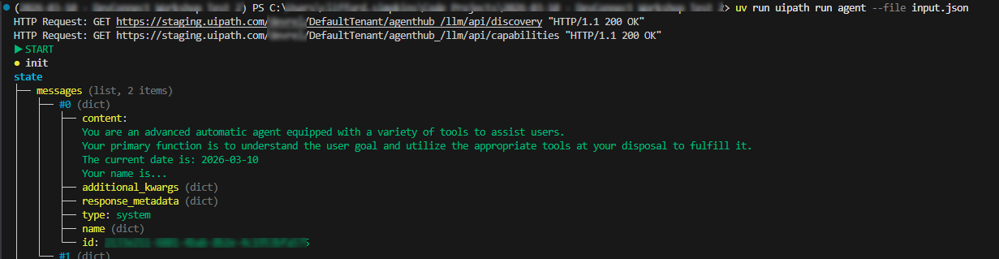


## Step 9 — Review the Agent Output
The terminal will display the parsed address components.  

You should see the following in the output:  
- street number
- street name
- city
- state
- zip code

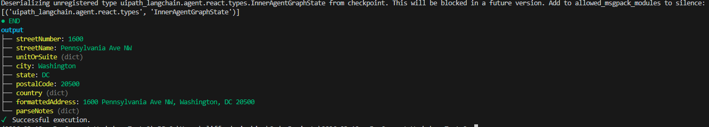


## Step 10 — Add an External API Tool
Having a well-crafted agent prompt is awesome, but there is so much more that they can do when equiped with tools such as external APIs.

To demonstrate use of external APIs, let's add the **USPS validation API** to our agent. 

To do this, we will need to do the following:  

1. Register for a USPS account at [https://cop.usps.com/](https://cop.usps.com/) - and create a 'business account' on the website so that you have access to their developer APIs

   

   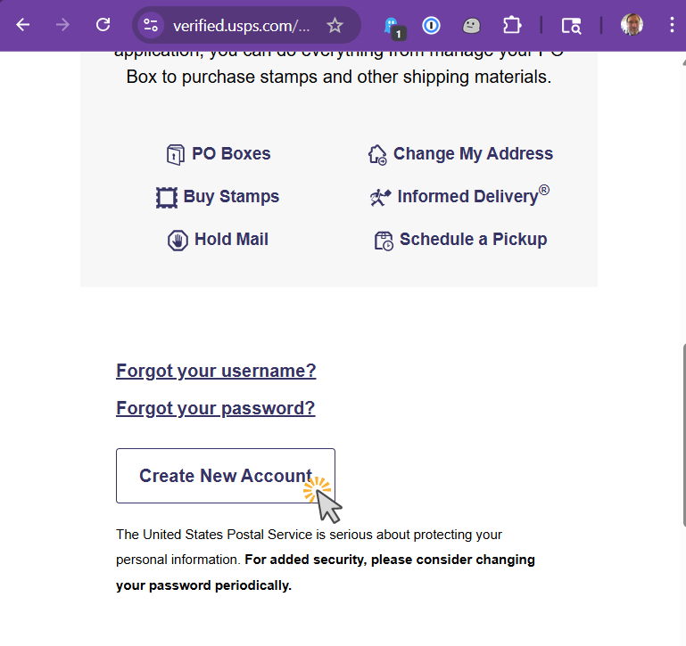

2. Once you have a developer acocunt created, create an application by selecting ``my apps`` from the top nav, select the ``developer apps`` tab, and create an app entry to clal the APIs.

   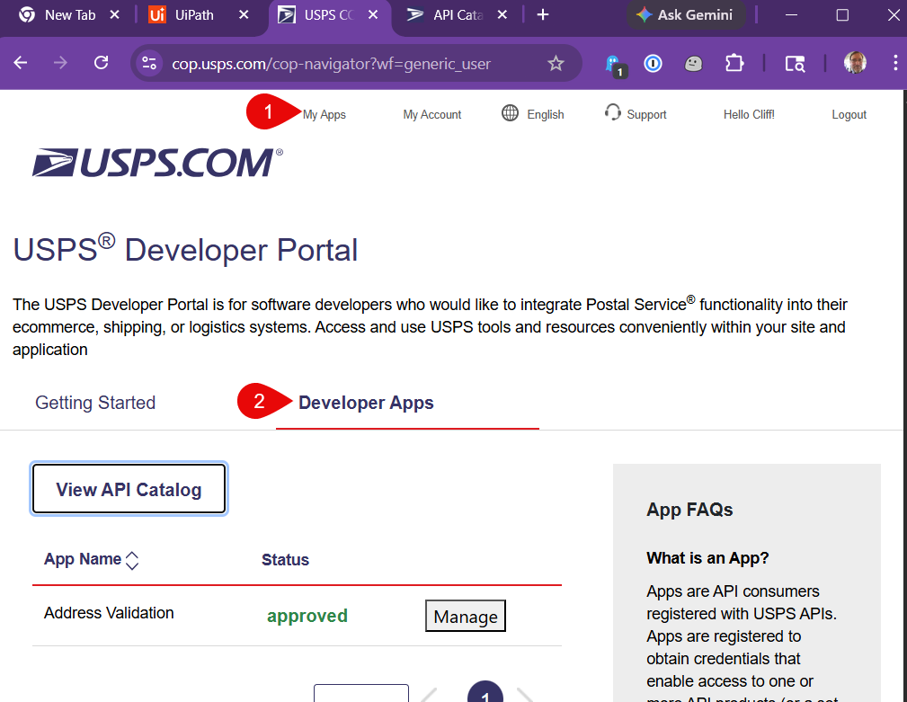

2. Add your USPS Client ID and Client Secret to your ``.env`` file. This will enable your agent to call the service.

   ```yaml
   USPS_CLIENT_ID=your_client_id
   USPS_CLIENT_SECRET=your_client_secret
   ```


3. Add the code to call the service (e.g., tools.py)
4. Update the agent to call that tool

To accelerate this work, you can use an AI coding agent (e.g., Claude Code) to update the agent to use this API. A prompt such as the below should work:  

```
Let's update this coded agent to use the addressesv3 API from USPS to validate the address.
- I've updated the .env file to include my USPS_CLIENT_ID and USPS_CLIENT_SECRET
- I need you to add the proper tool to call the APIs and to update the prompt so that the agent calls that tool
```

Your ***AI coding agent*** should now update your ***coded agent*** to use the USPS service, you can test it out using the same run command you used in Step 8.  

```console
uv run uipath run agent --file input.json
```

Upon execution, the agent should:  

1. Parse the address
2. Validate the address via API
3. Return normalized output


As the agent is running, you should see in the terminal the calls to the USPS service...

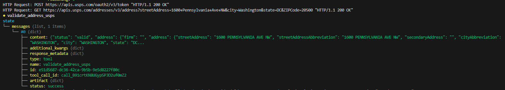

...and a more fully formed address...

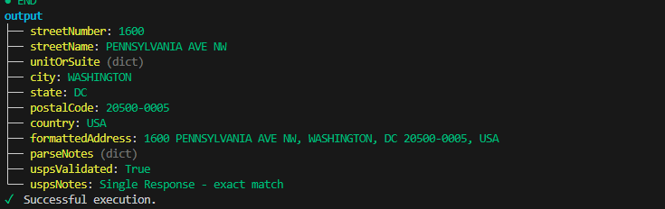


## Step 11 — Run Evaluation Tests
We will now use the evaluation suite to test and score how well our agent does its job.

1.  Add the ``evals.md`` file (in this repo) to the  ``.agents`` folder in your coded agent project
   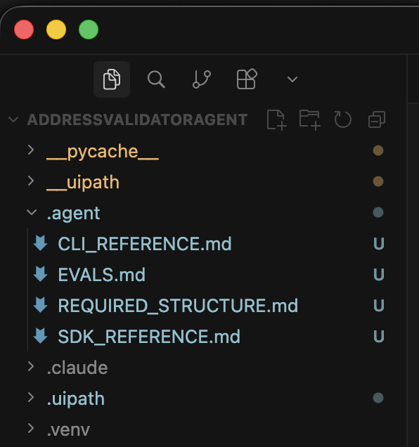

2. Ask your coding agent to ``evals.md`` to create your evaluation test cases. You can use the following prompt:

   ~~~
   Use @.agents/eval.md to create 3 evaluation test cases to test various address examples
   ~~~
  
3. Populate `uipath.json` with entry points that the eval command will use to run your test cases.    
You can do this by running the following command:  

   ```console
   $ uipath eval agent evaluations/eval-sets/evaluation-set-default.json --output-file eval-results.json
   ```

Evaluation tests may include:  

- valid address
- invalid address
- misspelled city
- messy formatting

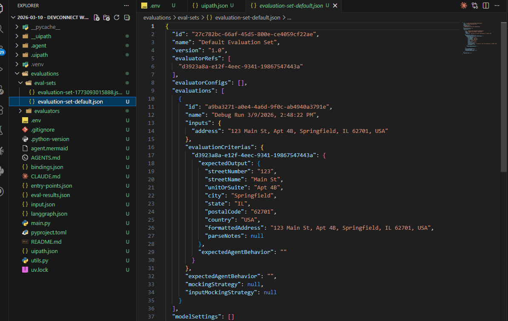


## Step 12 — Review Evaluation Results
Open **Evaluation Sets** in UiPath Studio.  
You will see evaluation scores such as:  

- semantic similarity
- agent trajectory

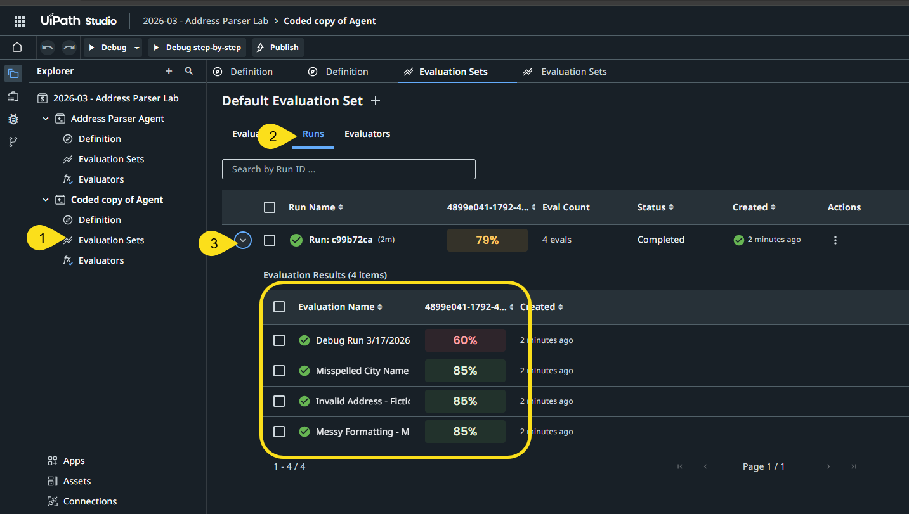


## Step 13 — Inspect Evaluation Traces
Click an evaluation to see the detailed trace.  
This shows:  

- agent reasoning
- API calls
- intermediate outputs


## Step 14 — Iterate and Improve the Agent
Edit the logic inside ``main.py``

Example improvements:  

- better parsing
- stronger validation
- improved formatting

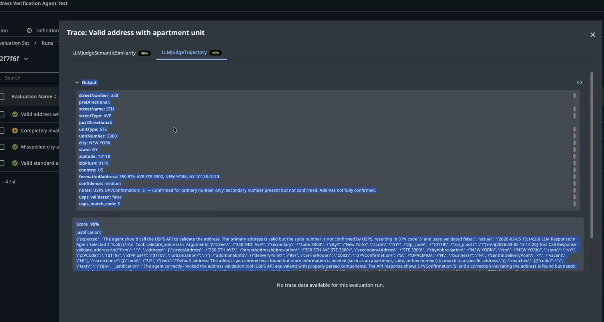


## Step 15 — Rerun the Agent
After making changes, rerun:  

```console
$ uipath run agent
$ uipath eval
```

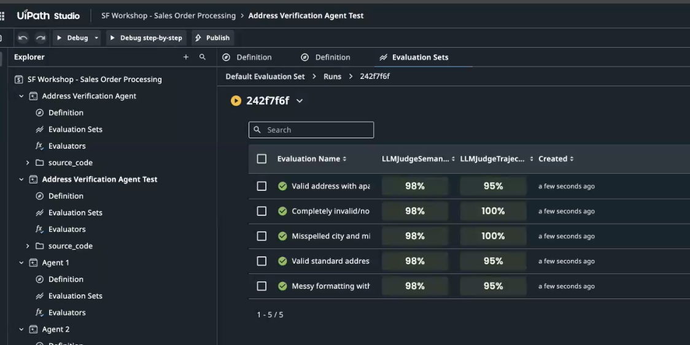


## Step 16 — Push Updates
If you're using version control, commit and push updates.

## Step 17 — Final Evaluation Run
Run the evaluation again to measure improvements.

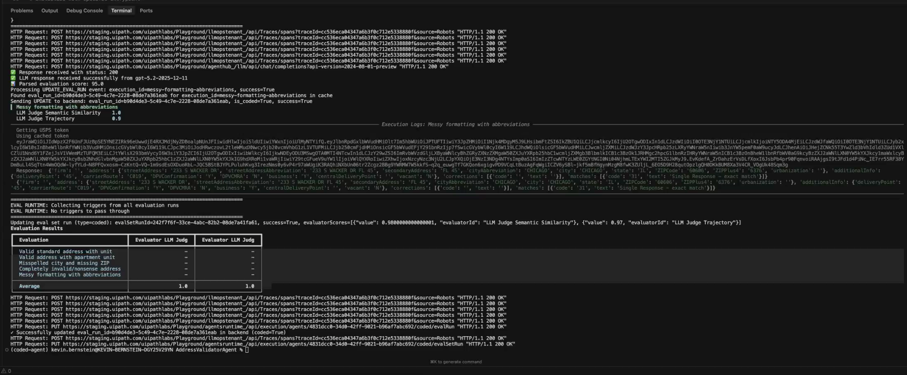


## Step 18 — Confirm Successful Results
You should see improved evaluation scores across tests.

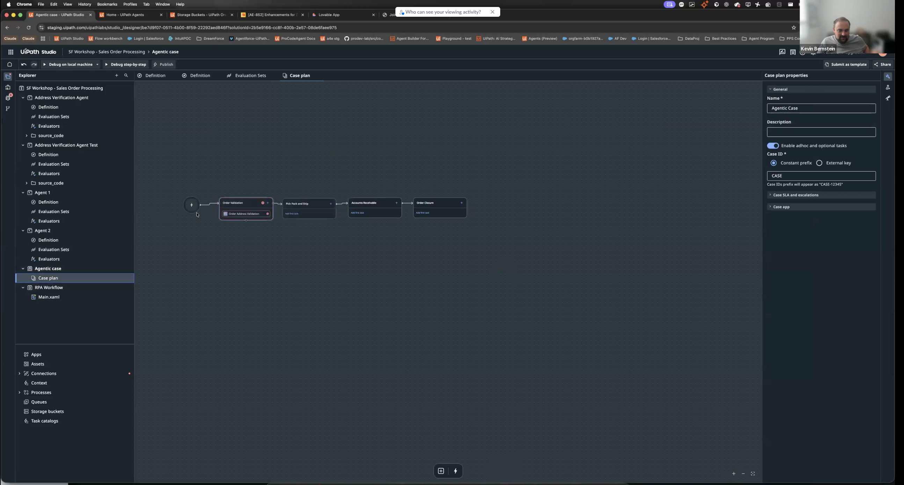

* * *

# Need Ideas? Try One of These Hackathon Projects

* * *

## AI Support Ticket Triage Agent
Input:  

```
Customer support request
```

Agent outputs:  

- issue category
- priority level
- suggested response
- escalation recommendation

Example output:  

```
Category: Billing
Priority: High
Suggested Response: Investigating payment gateway error
```

* * *

## AI Data Extraction Agent
Input:  

```
Email or document text
```

Agent extracts structured data:  

```
Name
Order number
Address
Date
```

Example output:  

```
{ "name": "John Adams", "order_number": "88921", "address": "14 West Pine St, Phoenix AZ"}
```

* * *

## DevOps Log Analysis Agent
Input:  

```
System logs
```

Agent returns:  

```
Root cause
Severity
Suggested action
```

Example:  

```
Root cause: Database timeout
Severity: Critical
Action: Restart connection pool
```

* * *

## Weather API Agent (Easy Starter)
Agent calls a weather API and summarizes results. 

This example follows a very similar pattern to the postal address validation above.

Example:  

```
What is the weather in Chicago tomorrow?
```

Output:  

```
Chicago forecast: 72°F and sunny
```

* * *

## Meeting Summary Agent
Input:  

```
Meeting transcript
```

Output:  

```
Summary
Key decisions
Action items
```

* * *