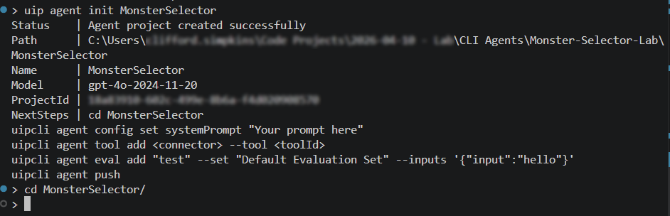
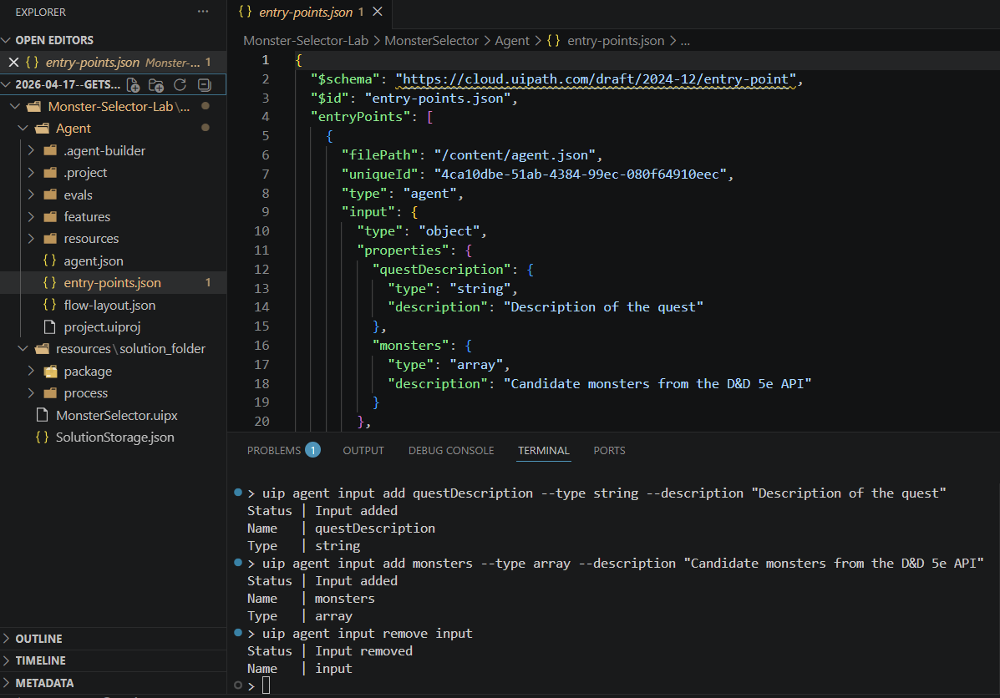
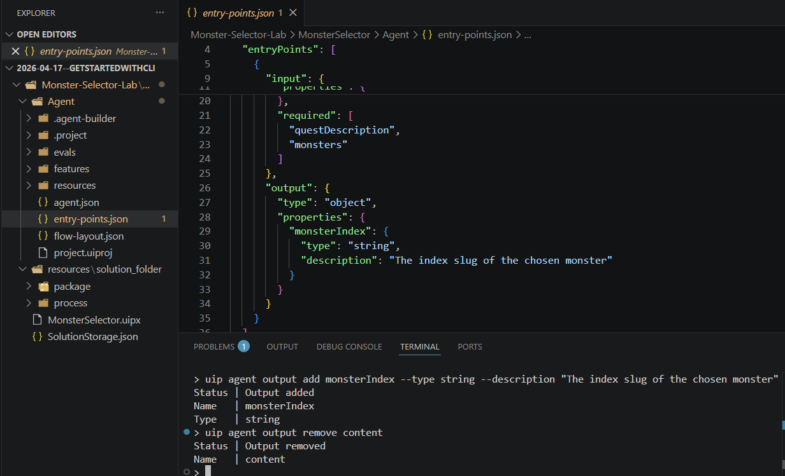
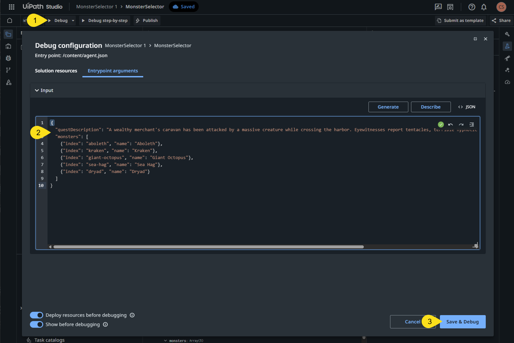
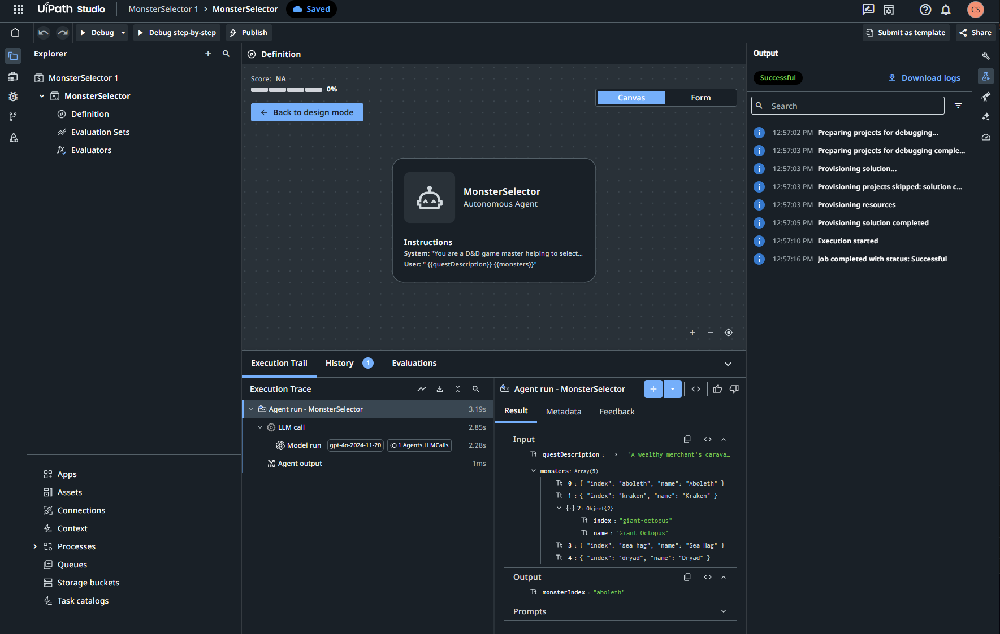

# Getting Started with Agents using the CLI

In this workshop, you will use the UiPath command line interface ('CLI') to build a low-code agent from scratch - without opening using UiPath Studio until the very last step. You will do the following:

1. Install the UiPath CLI, skills, and the agent tool
2. Scaffold a new low-code agent project
3. Set the system prompt that drives the agent's behavior
4. Define the agent's input and output schemas
5. Validate the agent and push it to UiPath Studio Web
6. Test the agent in Studio Web with a real scenario

**Estimated time:** 30-45 minutes


## What we are building
In this guide, we will build and publish a low-code agent for a fictional Adventurer's Guild for a fantasy role-playing game ('RPG') world. 

We will build a **Monster Selector** that picks the most thematically appropriate monster for a quest that it is provided from a list of potential foes. This agent will be ready to use in larger orchestration patterns and it will also be used in a companion 'Getting Started with Evals' guide.

> **Feel free to adapt the lab**
>
> As you complete the guide, you can follow along with the Monster Selector example, or adapt it to your own use-case. To customize it, you only need to adjust three things: the system prompt that details your scenario's persona and rules; your input values; and your output values.
>
> After adjusting these values, the rest of the lab should enable almost any scenario.


* * *

## Prerequisites

This lab assumes you have the following:

- **CLI version** - validated against UiPath CLI v0.2.0 (installed in Step 1). Different versions may behave differently; report drift with `uip feedback send`.
- **UiPath account** - sign up or log in at [cloud.uipath.com](https://cloud.uipath.com) before starting.
- **Node.js 18+** - required to install the UiPath CLI. Check with `node --version`. Download from [nodejs.org](https://nodejs.org/) if needed.
- **Bash terminal** - the commands in this lab use Bash syntax. In VS Code, open a new terminal and select **Git Bash** (or equivalent) as the terminal type. PowerShell and CMD syntax differ and may cause unexpected errors.
- **Admin rights** - installing global npm packages requires admin/elevated permissions. If you are on a work laptop with restrictions, confirm you can install packages before starting.

No existing knowledge of UiPath is required for this lab.

> **What this lab does NOT need.** Unlike the coded agent lab, this lab does not require Python, `uv`, or a coding agent. Low-code agents can be configured entirely using the Agent Builder or using the CLI - their "code" is a system prompt plus input/output schemas, not Python or Javascript.


# Build an Agent using the CLI

## Step 1 - Install the UiPath CLI and Agent Tool

The UiPath CLI (`uip`) is a cross-platform command-line tool for UiPath authentication, project scaffolding, and deployment. It uses a modular tool system - the base CLI handles auth, and you install additional tools for the project types you build.

Install the base CLI globally using npm:

```bash
npm install -g @uipath/cli
```

Verify the installation:

```bash
uip --version
```

You should see a version number like `0.2.0`.

Now install the agent tool - this adds the `uip agent` command group used throughout this lab:

```bash
uip tools install agent-tool
```

Verify the tool is installed:

```bash
uip tools list
```

You should see `agent-tool` in the output.

<!-- screenshot: step-01.png - terminal showing uip --version and tools list output -->


## Step 2 - Install UiPath Skills for Your Coding Agent *(optional)*

If you are using a coding agent (Claude Code, Cursor, Copilot, etc.) alongside the CLI, installing the UiPath skills gives it knowledge of agent project structure, CLI commands, and best practices. Skipping this step does not affect the lab - every command is explicit below - but skills make agent building faster when you want your coding agent to troubleshoot or edit the agent later.

```bash
uip skills install --agent claude
```

If you are using a different coding agent, replace `claude` with your agent: `cursor`, `copilot`, `gemini`, or `codex`.

The skills are installed globally to your home directory (e.g., `~/.claude/skills/` for Claude Code). They are available in every project from this point forward.


## Step 3 - Authenticate to UiPath

Authenticate the CLI to your UiPath account:

```bash
uip login
```

This opens a browser window where you will:

1. Sign in to your UiPath account
2. Select your tenant (if you have multiple)

Once complete, the terminal confirms you are logged in.

Verify your login status at any time with:

```bash
uip login status
```

<!-- screenshot: step-03.png - terminal showing login status output -->


## Step 4 - Scaffold the Monster Selector Agent

Create a working directory for the lab and scaffold a new low-code agent:

```bash
mkdir Monster-Selector-Lab
cd Monster-Selector-Lab

uip agent init MonsterSelector
```

This creates a `MonsterSelector/` directory containing an `Agent/` subdirectory (the agent itself), a `MonsterSelector.uipx` solution manifest, a `resources/` folder, and an auto-generated project ID.

  


Move into the solution root:

```bash
cd MonsterSelector
```

> **Run all `uip agent` commands from the solution root (`MonsterSelector/`), not from inside `Agent/`.** The CLI looks for the solution manifest in the current directory - running from `Agent/` will fail with *"Cannot read properties of null (reading 'inputSchema')"*.

The scaffold gives you a minimal working agent with placeholder inputs and outputs. In the next three steps, you'll set the system prompt that drives the agent's behavior, then replace the placeholder input and output schemas.

<!-- screenshot: step-04.png - terminal showing uip agent init output -->


## Step 5 - Set the System Prompt

The system prompt is where your agent's behavior is defined. It provides the instructions for how you want your agent to behave - what context it should assume to have, the rules for operation, the voice of its response, and the output format. Set it in one command:

```bash
uip agent config set systemPrompt "You are an RPG game master helping to select the most thematically appropriate monster for a quest. Given a quest description and a list of candidate monsters (each with a name and an index slug), pick the ONE monster whose lore, environment, or threat level best fits the quest. Return ONLY the index slug of your chosen monster. Do not return the full object or any commentary - just the string slug. If multiple candidates fit, favor the most iconic or thematically resonant choice."
```

Verify the prompt was stored:

```bash
uip agent config get systemPrompt
```

> **As you adapt the prompt to your use case**, you can use the prompt format above to structure your prompt:
>
> (1) swap the "RPG game master" persona for the persona relevant to your agent's domain - a triage nurse picking the right specialist, a procurement officer matching vendors to requirements, a librarian recommending books.
>
> (2) swap out the instructions to match what you want your agent to do - the rules that you want your agent persona to follow and the exact output that you want it to return. The more specific the prompt, the better your agent will perform.
>
> Provided you tailor the prompt and the inputs/outputs in the next two steps to your use case, the rest of the lab works the same way for almost any scenario.

## Step 6 - Define the Input Schema

A Monster Selector needs two inputs: the **quest description** (what the party is being asked to do) and the **list of candidate monsters** (already fetched from an external source like the D&D 5e API). *If you customized the prompt in Step 5, define inputs that match your own domain instead - e.g., patient symptoms + a list of specialists, or vendor requirements + a list of candidate vendors.*

Add the first input:

```bash
uip agent input add questDescription --type string --description "Description of the quest"
```

Add the second input:

```bash
uip agent input add monsters --type array --description "Candidate monsters from the D&D 5e API"
```

Remove the placeholder input that came from the scaffold:

```bash
uip agent input remove input
```



Each command emits JSON confirming the change (`"Status": "Input added"` or `"Status": "Input removed"`), and the added inputs are persisted into `Agent/agent.json` -  open it in your editor to see the updated schema.

## Step 7 - Define the Output Schema

The agent needs to return a single value: the **index slug** of the chosen monster (e.g., `"ancient-red-dragon"` or `"kraken"`). The caller uses this slug to look up the full monster stats from the D&D API. *If you're on a custom domain, your output should be whatever single value the caller actually needs - a specialist ID, a recommended vendor, a book title.*

Add the output:

```bash
uip agent output add monsterIndex --type string --description "The index slug of the chosen monster"
```

Remove the placeholder output:

```bash
uip agent output remove content
```




## Step 8 - Validate the Agent

Before pushing, validate the agent project locally:

```bash
uip agent validate
```

You should see `"Status": "Valid — compatible with Studio Web"` in the JSON output.

> **About the storage version warnings.** You may see warnings like `storageVersion is 47.0.0 but validation schemas are at 44.0.0`. These are safe to ignore - the CLI auto-migrates the storage version when it publishes the agent. The warning is a known noise issue in CLI 0.2.0 that does not block anything.


## Step 9 - Push to UiPath Studio Web

Push the agent to Studio Web:

```bash
uip agent push
```

The output confirms the push with a `SolutionId` and `CloudProjectId` - your agent now exists as an editable project in Studio Web.

```json
{
  "Result": "Success",
  "Code": "AgentPush",
  "Data": {
    "Status": "Agent imported into Studio Web",
    "Name": "MonsterSelector",
    "SolutionId": "<uuid>",
    "ProjectCount": 1,
    "CloudProjectId": "<uuid>"
  }
}
```

> **Push vs. publish.** `uip agent push` imports the agent as a **source project in Studio Web** - editable, testable, and ready for iteration. `uip agent publish` would instead pack and upload to **UiPath Orchestrator** as a deployable package. Publish is the right call for production deployment pipelines; push is the right call for development and testing, which is what this lab is doing.

<!-- screenshot: step-09.png - terminal showing successful push output -->


## Step 10 - Test the Agent in Studio Web

1. Log in to [cloud.uipath.com](https://cloud.uipath.com) and select **Studio** from the side menu.

2. Find your **MonsterSelector** agent in the project list. Click it to open.

   <!-- screenshot: step-10a.png - Studio Web project list showing MonsterSelector -->

3. Studio Web opens the agent in Agent Builder. You should see the system prompt you set in Step 5 in the prompt panel, and the `questDescription` + `monsters` inputs and `monsterIndex` output in their respective panels.

4. Click **Debug** (top toolbar). Paste the following JSON as the input:

   ```json
   {
     "questDescription": "A wealthy merchant's caravan has been attacked by a massive creature while crossing the harbor. Eyewitnesses report tentacles, terrible hypnotic powers, and strange psychic disturbances for miles around.",
     "monsters": [
       {"index": "aboleth", "name": "Aboleth"},
       {"index": "kraken", "name": "Kraken"},
       {"index": "giant-octopus", "name": "Giant Octopus"},
       {"index": "sea-hag", "name": "Sea Hag"},
       {"index": "dryad", "name": "Dryad"}
     ]
   }
   ```

5. Click the **Save & Debug** button to run the test.

    


5. The agent will run and you should see progress in the ``Output`` window. You should see both the inputs and outputs visible in the ``Agent run`` window.

      

    Once done, the `monsterIndex` should contain the suggested monster - most likely `"aboleth"` (aboleths are the iconic tentacled, mind-controlling aquatic horror in D&D lore) or `"kraken"` (larger, less cerebral). Both are defensible picks.


> **Expect non-determinism.** Even with `temperature: 0`, LLMs can produce different outputs across runs, and the default model (`gpt-4o-2024-11-20`) can be updated behind the scenes. The goal here is *a defensible pick*, not a specific string. If the agent returns `"giant-octopus"`, that's a worse pick - worth testing with a few more inputs to see if the prompt needs tightening.

Try a few more quests to get a feel for how the agent reasons:

- `"questDescription": "Clear out the moon-worshipping coven that's been abducting village children under the full moon"` with monster candidates including `"sea-hag"`, `"night-hag"`, `"green-hag"`, `"dryad"` → should pick a hag
- `"questDescription": "Slay the beast that's been terrorizing the northern kingdoms with fire and ancient cruelty"` with candidates including `"ancient-red-dragon"`, `"young-red-dragon"`, `"hell-hound"`, `"salamander"` → should pick the ancient red dragon

* * *


## Congratulations!

You've built a published low-code agent using the UiPath CLI:

- You scaffolded a new agent project with `uip agent init` - no browser, no code editor
- You defined structured inputs and outputs via CLI commands - not JSON editing
- You wrote the agent's behavior as a system prompt and stored it with `uip agent config set`
- You validated and pushed it to Studio Web with two commands - ready for testing, iteration, and (eventually) evaluation

The key commands you used:

| Command | What it does |
|---|---|
| `uip agent init` | Scaffold a new low-code agent project |
| `uip agent input add` / `output add` | Define input and output parameters |
| `uip agent input remove` / `output remove` | Remove a parameter |
| `uip agent config set` / `get` | Read or write an agent configuration value (system prompt, model, etc.) |
| `uip agent validate` | Local schema check against Studio Web requirements |
| `uip agent push` | Import the agent as a source project in Studio Web |


## What's Next

- **[Getting Started with Agent Evals](../Getting-Started-With-Agent-Evals/Getting-Started-With-Agent-Evals.md)** *(coming soon)* - use your Monster Selector to learn how to build evaluation sets, run cloud evaluations, and interpret scores. Picks up exactly where this lab ends.
- **Orchestration patterns** *(future lab)* - your agent is now callable from API workflows, UiPath Flow projects, and other agents. A future workshop will cover invoking it from an orchestration.
- [UiPath Agents documentation](https://docs.uipath.com) - full reference for low-code and coded agent capabilities
- [UiPath Community](https://community.uipath.com) - forums, how-tos, and developer discussion
- **Hit a snag?** Run `uip feedback send` to report a bug or improvement directly from the CLI.


> **Next time, you can skip to the end.** Now that you know what `uip agent init`, `input add`, `output add`, and `config set systemPrompt` do under the hood, your coding agent can do all of it from a single prompt. With the UiPath skills installed (Step 2), try this in a fresh empty directory:
>
> > *"Create a low-code UiPath agent that [describe your domain in plain English - e.g., 'triages incoming patient messages and picks the right specialist based on symptoms']. Scaffold it, set the system prompt, define inputs and outputs, validate, and push to Studio Web."*
>
> Your coding agent will read the skill, run the same CLI commands you just ran manually, and push the agent in about a minute. The manual walkthrough you did here is is intended to provide you with mental model to know whether your coding agent got it right.
