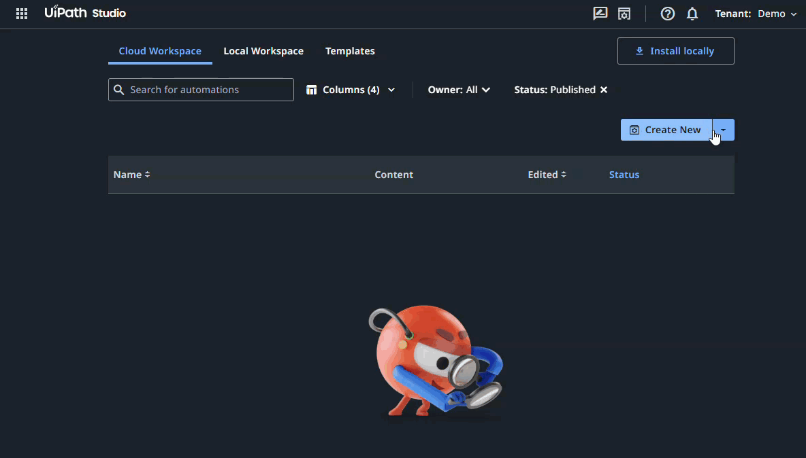
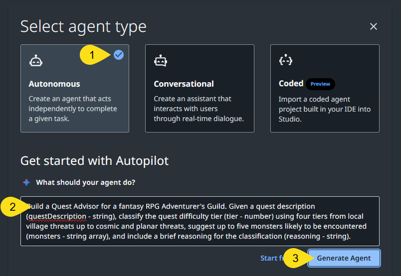
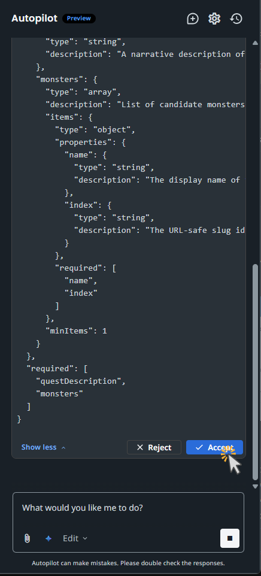
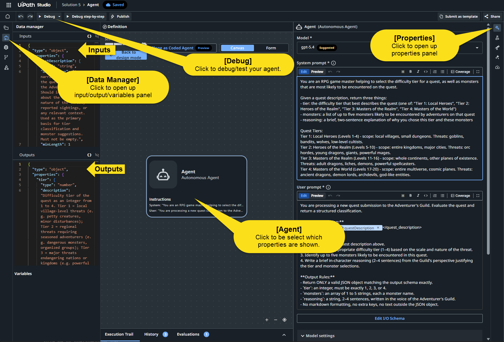
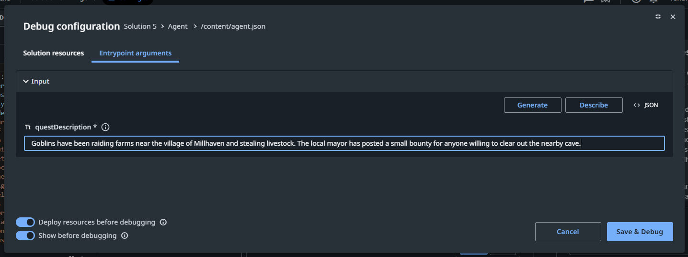
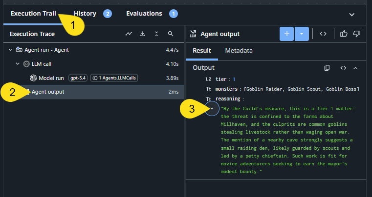

# Building a Low-Code Agent in Studio Web

In this lab, you will build a low-code agent entirely in the UiPath Studio Web browser interface - no CLI, no code, no IDE. You will:

1. Create a new agent project in Studio Web
2. Generate the agent configuration using Autopilot
3. Review and refine the system prompt, inputs, and output
4. Test the agent live in the debug panel

There are a few approaches to create UiPath agents. This lab explores the Agent Builder project within Studio Web; you can also create agents using the [UiPath CLI](../agents/guide.md) and using the [LangGraph SDK](../agents-langgraph/guide.md).

**Estimated time:** 15-20 minutes

## What you are building

This lab builds a **Quest Advisor** - a low-code agent for a fictional Adventurer's Guild in a fantasy RPG world. Given a quest description, the agent classifies the quest difficulty and suggests monsters the adventurers are likely to encounter.

| Component | Details |
| --- | --- |
| **System prompt** | RPG game master that classifies quest difficulty and identifies likely monsters based on the description |
| **Input: `questDescription`** | `string` - the quest description |
| **Output: `tier`** | `number` - difficulty tier (1-4, where 1 = Local Heroes and 4 = Masters of the World) |
| **Output: `monsters`** | `array` - up to five monsters likely to be encountered |
| **Output: `reasoning`** | `string` - brief explanation of the tier classification and monster choices |

* * *

## Prerequisites

- **UiPath account** - sign up or log in at [cloud.uipath.com](https://cloud.uipath.com) before starting.
- A modern web browser.

No CLI, SDKs, or local tooling is needed for this lab.

* * *

# Workshop: Building a Low-Code Agent in Studio Web

## Step 1 - Open Studio Web

Log in to [cloud.uipath.com](https://cloud.uipath.com) and open **Studio** from the left navigation. You will land on your Cloud Workspace, which shows your existing solutions and a **Create New** button.
1. Select **Create New**.
2. Select the **Agent** project type from the available options.




* * *

## Step 2 - Generate the Agent with Autopilot

Studio Web's Autopilot can configure an agent from a plain-language description. You describe what you want, and Autopilot proposes the system prompt, input schema, and output schema.

1. Select **Autonomous** as the agent type.

2. In the **What should your agent do?** field, paste the following brief description:

<!-- test:manual reason="Autopilot prompt entry in Studio Web new agent dialog" -->

```text
Build a Quest Advisor for a fantasy RPG Adventurer's Guild. Given a quest description (questDescription - string), classify the quest difficulty tier (tier - number) using four tiers from local village threats up to cosmic and planar threats, suggest up to five monsters likely to be encountered (monsters - string array), and include a brief reasoning for the classification (reasoning - string).
```

3. Select **Generate Agent**, then review Autopilot's suggestions and accept them to create the agent.

    


> **Autopilot is non-deterministic.** Your generated configuration may differ from the screenshots - that is expected. What matters is that the agent canvas loads. If the canvas shows an error or fails to load, refresh the page and repeat this step.

* * *

## Step 3 - Review the Agent Canvas

Autopilot will analyze the prompt you gave it and walk you through building and configuring it. Use the **Autopilot** window to review the suggestions and agree on the final agent design.



Once the agent is created, the **Agent Canvas** opens. Click the agent node to open its **Properties** panel on the right side of the screen. You can also open properties using the wrench icon in the upper-right corner of the canvas.

Confirm that Autopilot configured the following correctly:

- **Input** - `questDescription` (string) is listed
- **Outputs** - `tier` (number), `monsters` (array), and `reasoning` (string) are listed
- **System prompt** - references tier classification and monster selection


<!-- test:manual reason="UI review and potential editing in Agent Canvas Properties panel" -->





### Refine the system prompt *(optional)*

Autopilot generates a working system prompt from your brief description, but it may not include precise tier boundaries. If you want consistent, well-defined tier classifications, replace the system prompt in the Properties panel with the following:

<!-- test:manual reason="optional system prompt replacement in Agent Canvas Properties panel" -->
```text
You are an RPG game master helping to select the difficulty tier for a quest, as well as monsters that are most likely to be encountered on the quest.

Given a quest description, return three things:
- tier: the difficulty tier that best describes the quest (a number: 1, 2, 3, or 4)
- monsters: a list of up to five monsters likely to be encountered by adventurers on that quest
- reasoning: a brief, two-sentence explanation of why you chose this tier and these monsters

Quest Tiers:
Tier 1: Local Heroes (Levels 1-4) - scope: local villages, small dungeons. Threats: goblins, bandits, wolves, low-level cultists.
Tier 2: Heroes of the Realm (Levels 5-10) - scope: entire kingdoms, major cities. Threats: orc hordes, young dragons, giants, powerful mages.
Tier 3: Masters of the Realm (Levels 11-16) - scope: whole continents, other planes of existence. Threats: adult dragons, liches, demons, powerful spellcasters.
Tier 4: Masters of the World (Levels 17-20) - scope: entire multiverse, cosmic planes. Threats: ancient dragons, demon lords, archdevils, god-like entities.
```

* * *

## Step 4 - Test the Agent

Select **Debug** in the top toolbar. This opens the debug panel where you can run the agent with sample input.

1. In the input panel, paste the following string:

<!-- test:manual reason="UI interaction - Debug panel input in Studio Web" -->
```text
Goblins have been raiding farms near the village of Millhaven and stealing livestock. The local mayor has posted a small bounty for anyone willing to clear out the nearby cave.
```
2. Select **Save & Debug** to run the agent.

    

The agent should return a `tier` of `1` and a `monsters` list containing goblins and similar low-level threats. If the tier comes back higher, check the system prompt in Step 3 - the tier boundaries may not have been captured correctly.

To access the return results:

1. Select **Execution Trail** along the bottom of the Studio canvas.
2. Within the **Execution Trace** panel, select `Agent Output`, which updates the **Agent output** panel.
3. Review the `tier`, `monsters`, and `reasoning` returned by the agent.
4. Expand the `reasoning` text to view the string in its entirety.

  


> **Agents are non-deterministic.** Even with temperature set to 0, the model can return slightly different monster lists across runs. The goal is a reasonable tier classification and a thematically appropriate list, not specific exact values.

Try these two additional inputs to test different difficulty tiers:

### Tier 2 - kingdom-level threat

<!-- test:manual reason="additional debug test case in Studio Web" -->
```text
A young dragon has claimed the mountain pass connecting two kingdoms, demanding tribute from all merchant caravans passing through. Trade has ground to a halt and the king needs someone to deal with it.
```

Expected: tier `2` with the dragon and likely bandit/mercenary companions.

### Tier 4 - cosmic threat

<!-- test:manual reason="additional debug test case in Studio Web" -->
```text
A demon lord has torn open a rift to the Abyss above the capital city. The sky burns red, fiends pour through in endless waves, and reality itself is beginning to unravel.
```

Expected: tier `4` with demon lords, archdevils, and other planar threats.

* * *

## Congratulations!

You built and tested a low-code agent in Studio Web:

- Created a new agent project using Autopilot from a plain-language description
- Reviewed and confirmed the system prompt, input schema, and output schema in the Agent Canvas
- Ran three live test cases across all difficulty tiers and interpreted the results

## What's Next

- [Getting Started with UiPath Agents](../agents/guide.md) - build and configure a low-code agent from the CLI using `uip agent init`, without opening Studio Web, then upload and test it there
- [Adding Tools to Your UiPath Agent](../agents-tools/guide.md) - extend an agent with tools that call external APIs
- [Getting Started with Agent Evals](../../Getting-Started-With-Agent-Evals/Getting-Started-With-Agent-Evals.md) - build evaluation sets, run cloud evaluations, and interpret scores
- [UiPath Agents documentation](https://docs.uipath.com) - full reference for low-code and coded agent capabilities
- [UiPath Community](https://community.uipath.com) - forums, how-tos, and developer discussion
