# Adding Tools to Your UiPath Agent

In this lab you continue building **UiPathfinder** - a D&D-themed reference application built on UiPath. You will build a live API connector that searches the D&D 5e SRD, then give your Monster Selector agent that connector as a tool. The agent will use it autonomously at runtime: deciding what to search for, calling the API, and selecting the best match from the results.

By the end you will have `UiPathfinder.QuestParser`: an agent that receives only a quest description, decides what to search for, calls the Monster Query tool, and returns the selected monster's key fields - no pre-populated list required.

Without a tool, the agent depends on the caller to pre-fetch candidates and pass them in as data. Adding a tool changes that: the agent decides at runtime what to search for, calls the API, and reasons over live results. This is the pattern behind most production agent workflows - the agent's value comes from its ability to fetch and reason, not just classify what it's handed.

You will do the following:

1. Build a Monster Query API Workflow that calls the D&D 5e SRD
2. Connect it to your Monster Selector agent as a tool
3. Update the agent contract to reflect the new capability
4. Test the full tool-using agent end-to-end

**Estimated time:** 30-45 minutes

## What you are building

| Component | Details |
| --- | --- |
| **API Workflow** | Accepts `searchName` (string), calls the Open5e D&D 5e SRD API, returns `monsterResults` array |
| **Agent input: `questDescription`** | `string` - the quest description; the agent fetches its own candidates via the tool |
| **Agent output: `monsterIndex`** | `string` - slug identifier of the selected monster |
| **Agent output: `monsterName`** | `string` - display name of the selected monster |
| **Agent output: `monsterType`** | `string` - creature type (e.g. beast, undead, dragon) |
| **Agent output: `monsterCr`** | `string` - challenge rating |
| **Agent output: `monsterReasoning`** | `string` - the agent's explanation of why it selected this monster for the quest |

* * *

## Prerequisites

<!-- test:prereq name="Node.js" version=">=18" -->
```bash
node --version
```

<!-- test:prereq name="uip" version=">=1.1" -->
```bash
uip --version
```

- **Studio Web** - runs in your browser; no desktop installation required. Open [Studio Web](https://cloud.uipath.com) in Chrome, Edge, or Firefox before starting.
- **UiPath account** - sign up or log in at [cloud.uipath.com](https://cloud.uipath.com) before starting.
- **Node.js 18+** - required to install the UiPath CLI. Install from [nodejs.org](https://nodejs.org/) if needed.
- **UiPath CLI v1.1+** - required to deploy the starter. Check with `uip --version`.
- **A Monster Selector agent in Studio Web** - this lab builds on the agent from [Getting Started with UiPath Agents](../agents/guide.md). If you completed that lab, your agent is already there. If not, deploy the starter:

<!-- test:manual reason="requires git clone and uip login before starter upload" -->
```bash
git clone https://github.com/cliff-simpkins/UiPath-Workshops.git
cd UiPath-Workshops/starters/monster-selector
uip login
uip solution upload .
```

Open [Studio Web](https://cloud.uipath.com) and confirm **MonsterSelector** appears in your workspace before beginning Step 1.

* * *

# Workshop: Adding Tools to Your UiPath Agent

## Step 1 - Build the Monster Query API Workflow

An API Workflow is a lightweight workflow published as an API endpoint. You will build one that wraps the [Open5e](https://open5e.com/) D&D 5e SRD monster search - one input, one HTTP request, one output. Once published, it will appear in the agent builder as a tool your agent can call.

This step has several sub-steps; budget 10-15 minutes to complete it.

### Create a new API Workflow project

In Studio Web, create a new project and select **API Workflow** as the project type.

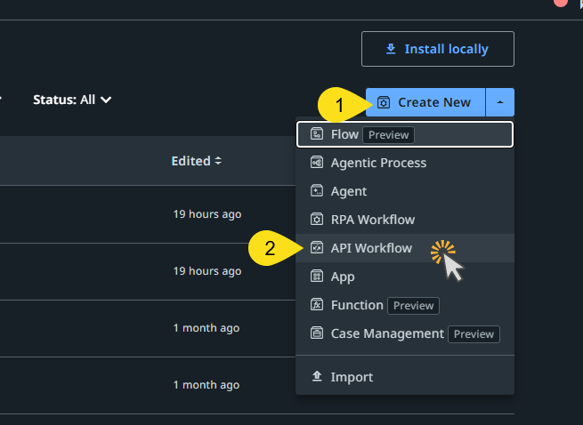

Rename the solution and the default workflow. Right-click on each name in the project explorer and select **Rename**:

- **Solution name:** `Monster Query - 5e SRD`
- **Workflow name:** `API Query - 5e Monsters`

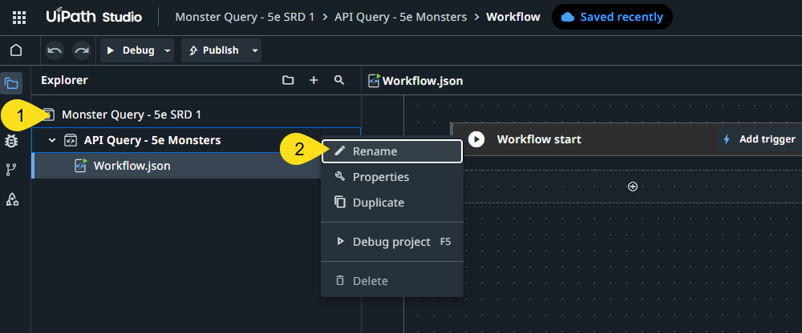

### Configure inputs and outputs

Select the **Data Manager** (clipboard icon along the left rail) to access the data variables for the workflow.

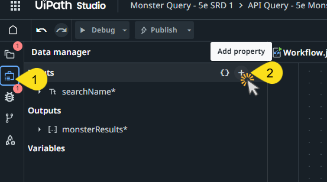

Add one input argument to the workflow:

| Name | Type | Required | Description |
| --- | --- | --- | --- |
| `searchName` | String | Yes | The monster name or partial name to search for |

Add one output argument:

| Name | Type | Required | Description |
| --- | --- | --- | --- |
| `monsterResults` | Array | Yes | Monster result list |

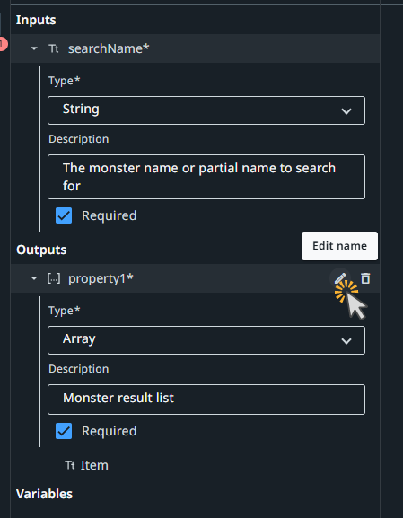

### Add the HTTP Request

In the workflow canvas, click the **+** button between activities to open the activity menu. Select **HTTP Request**.

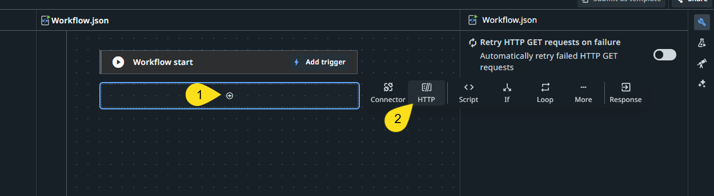

**Configure the activity name and connection properties:**

- **Name:** `HTTP Request - Open5e Monster Query`
  Right-click on the activity and select **Rename** to change the name.
- **Authentication:** Manual authentication
- **Method:** GET
- **URL:** `https://api.open5e.com/v1/monsters/`

Rename the output of the HTTP Request activity to `searchResults`.

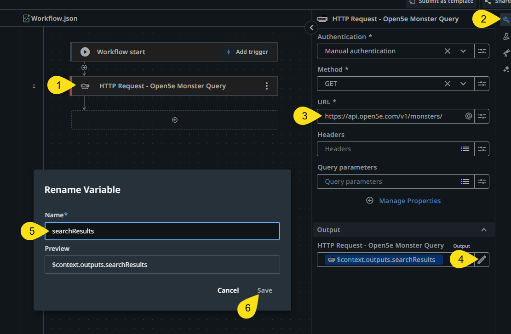

**Set the Query Parameters property:**

Open the **Query Parameters** property and add the following fields:

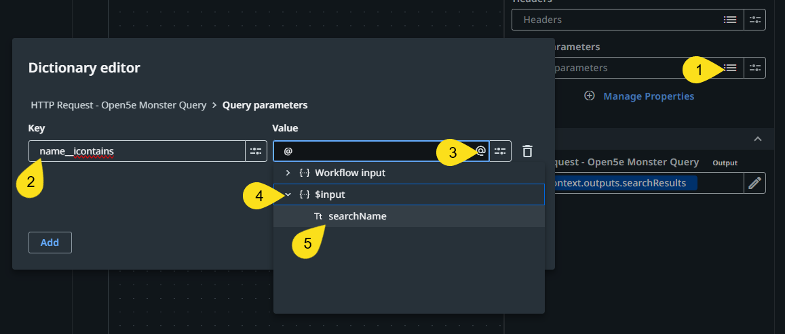

| Key | Value |
| --- | --- |
| `name__icontains` | `@searchName` |
| `document__slug` | `wotc-srd` |
| `limit` | `10` |
| `fields` | `slug,name,desc,type,size,cr,challenge_rating,alignment,v2_converted_path` |

What each parameter does:

- `name__icontains` - case-insensitive partial match; `dragon` returns "Adult Red Dragon", "Young Blue Dragon", and others
- `document__slug: wotc-srd` - filters to the official D&D 5e SRD; without it, results include third-party homebrew content
- `limit: 10` - caps candidates at 10; enough for the agent to reason over without flooding its context
- `fields` - limits the response to only the fields the agent needs; the full Open5e monster object is much larger and would waste token budget

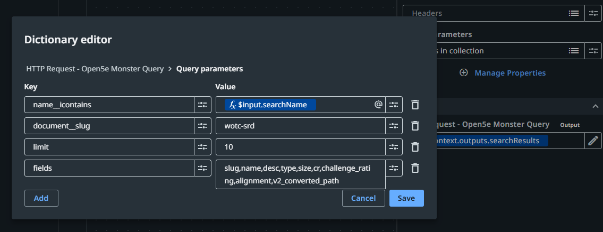

> **About the [HTTP Request activity](https://docs.uipath.com/studio-web/automation-cloud/latest/user-guide/http) settings:**
> The activity exposes the standard HTTP building blocks. Most you will configure for every API you call; some you will skip for public APIs like this one:
>
> - **Authentication** - pre-built options for OAuth 2.0, API key, and Basic auth. Set to "Manual authentication" here because Open5e requires none. For authenticated APIs, choose the appropriate option and supply credentials.
> - **Headers** - key/value pairs sent with every request. Common uses: `Authorization: Bearer <token>` for token-based APIs, `Accept: application/json` to control response format, and API versioning headers.
> - **Body** - used with POST, PUT, and PATCH requests to send JSON, form data, or raw content. Not applicable for GET requests, which carry parameters in the URL via query parameters.
> - **Query Parameters** - key/value pairs appended to the URL. The `@variableName` syntax references workflow arguments by name - `@searchName` pulls in the `searchName` input argument defined in the Data Manager. See [configuring activities](https://docs.uipath.com/studio-web/automation-cloud/latest/user-guide/configuring-activities) for more on variables and expressions in Studio Web.
> - **Output (renamed to `searchResults`)** - receives the full HTTP response including status code, headers, and body. Renaming from the default keeps the Set Response expression readable.

### Add the Response

In the workflow canvas, click the **+** button after the HTTP Request and select **Set Response**.

Set Response defines what the API Workflow returns to its caller - in this case, what the agent's tool receives when it invokes the workflow. Whatever you put in the response body here becomes the tool output the agent reasons over.

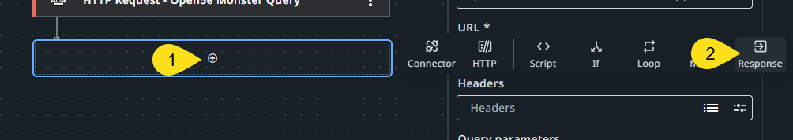

Set the response body to:

```json
{
  "monsterResults": $context.outputs.searchResults.content.results
}
```

`$context.outputs` contains every named output from the activities in this workflow. `searchResults` is the output variable you renamed on the HTTP Request activity; `.content.results` navigates into the response envelope that Open5e wraps its data in, down to the actual array of monster entries. For more information, check out [the UiPath documentation on using Javascript to access workflow data](https://docs.uipath.com/studio-web/automation-cloud/latest/user-guide/managing-api-workflows#accessing-data-using-javascript).

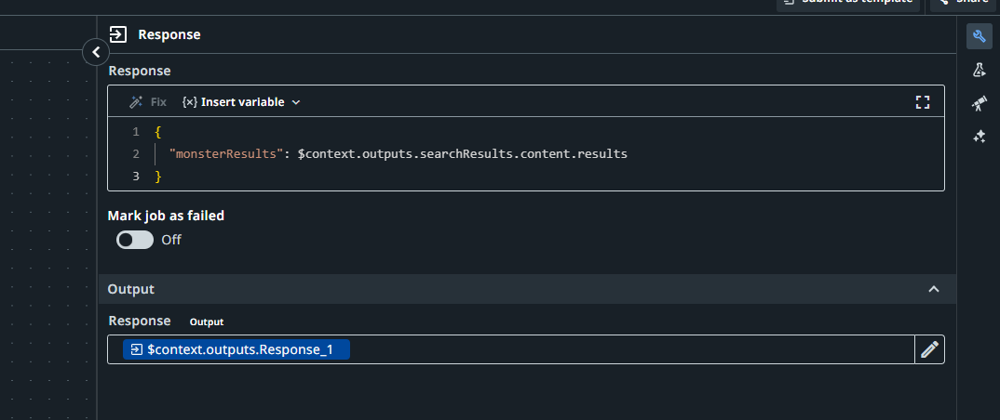

### Test the workflow

Debug the workflow to confirm it returns results. Open the debug configuration and set `searchName` to `dragon` or `goblin`.

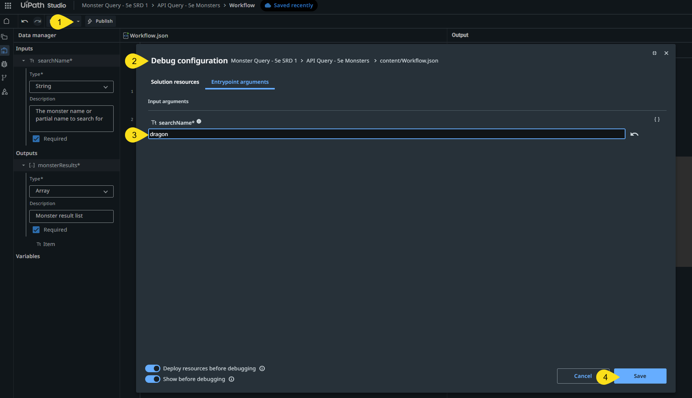

Click **Debug** and verify the response includes a `monsterResults` array with monster entries before continuing.

A successful response contains up to 10 entries, each with fields like `name`, `type`, `cr`, and `slug`. If you see an empty array, try a different search term - not every creature name has an exact match in the SRD.

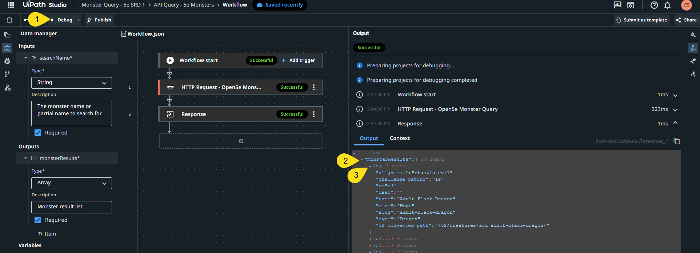

### Publish to your feed

Publishing registers the workflow as a deployable process in Orchestrator. This is what makes it discoverable in the agent builder's **Available resources** list - the builder surfaces published workflows from your workspace, not drafts saved locally in Studio Web.

Publish the workflow to your personal workspace feed.

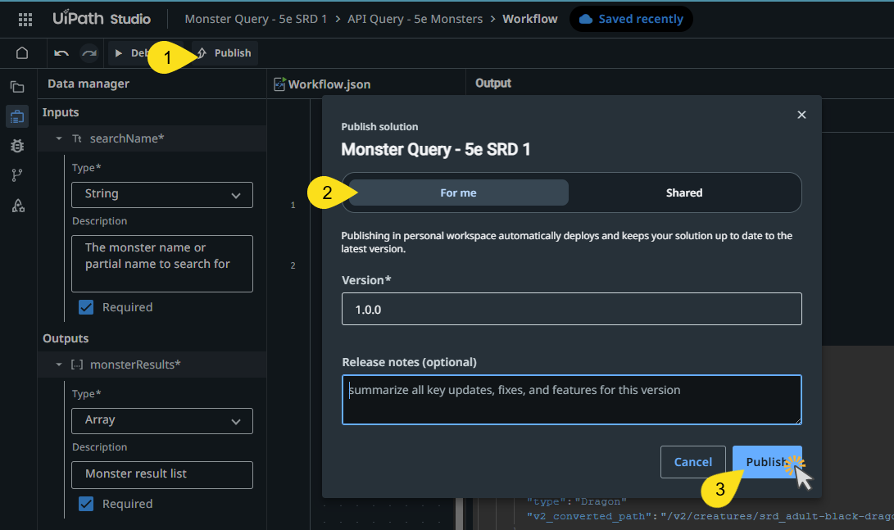

> **Workflow not appearing in Available resources in Step 3?** The workflow must be published - not just saved - before it is visible as a tool. If it does not appear, return here and confirm the publish completed successfully, then refresh the agent builder.

* * *

## Step 2 - Open the Monster Selector Agent

In Studio Web, navigate to your **MonsterSelector** solution and open it in the agent builder.

Take a moment to orient on its current state before making changes:

- **Input:** `questDescription` (string) and `monsters` (array of candidates passed in by the caller)
- **Output:** `monsterIndex` (string) - the slug of the chosen monster
- **System prompt:** instructs the agent to pick the best match from the provided list

In this lab you will remove the `monsters` input and the requirement to pre-populate candidates. The agent will fetch them itself using the tool you just built.

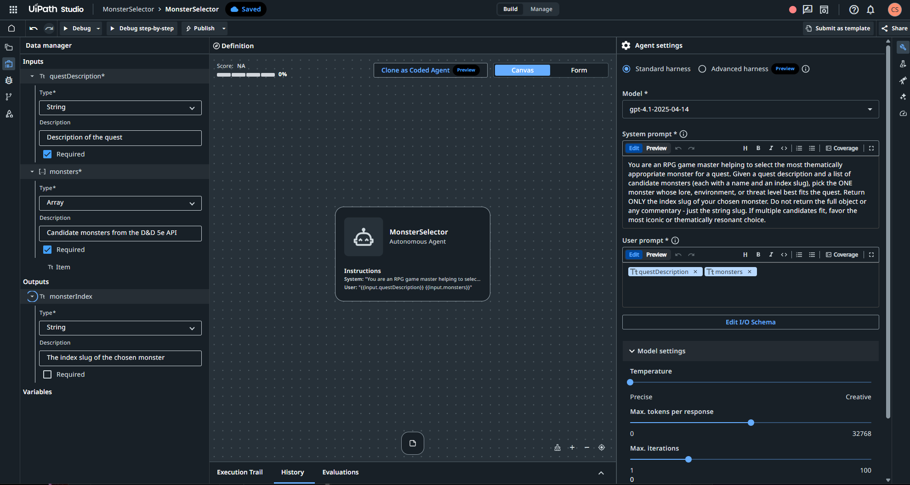

* * *

## Step 3 - Connect the API Workflow as a Tool

### Add the tool

Make sure you are on the **Canvas** view - use the **Canvas / Form** toggle at the top of the agent builder. The **+** button under Tools is only visible in Canvas view.

On the agent canvas, click **+** under **Tools**. From the **Toolbox** panel, select **API workflow**.

The **Available resources** panel lists API workflows published to your workspace. Select the workflow you created in Step 1.

> **Available resources is empty?** The workflow must be published before it appears here. Return to Step 1 and complete the **Publish to your feed** sub-step, then come back and try again.

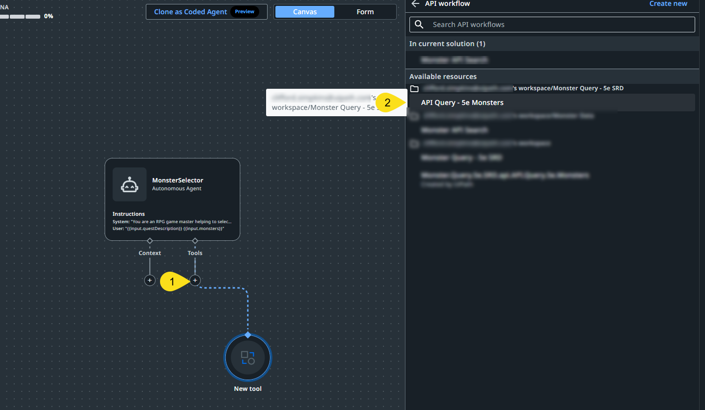

### Configure the tool description

Give the tool a name and description. The description is what the agent reads at runtime to decide when and how to call the tool - write it as an instruction to the agent, not a label for humans:

- **Name:** `Monster Query`
- **Description:** `Searches the D&D 5e SRD for monsters matching a name or creature type. Returns up to 10 candidates with name, type, CR, size, alignment, and description. Call this tool when you need to find monster candidates for a quest.`

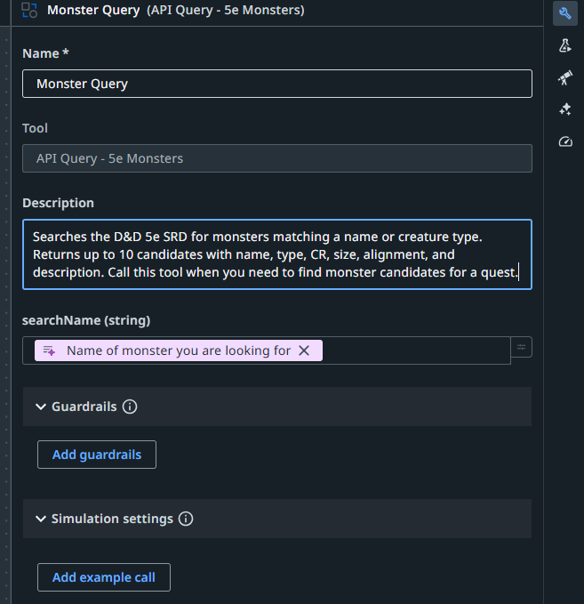

> **The description drives tool selection.** The agent uses this text - not the tool name - to decide when and how to call it. A vague description produces vague tool use. Be specific about what the tool returns and when to use it.

* * *

## Step 4 - Update the Agent Contract

With the tool connected, update the agent definition to reflect the new contract: the agent no longer needs a pre-populated monster list, and it now returns structured monster data including its own reasoning.

The three changes in this step work together: removing `monsters` ends the agent's dependency on the caller for data; the output schema declares what the agent commits to returning; the updated prompt tells the agent how to use its new capability. None of the three works without the others.

To edit the agent definition, click the agent node on the canvas to open the definition panel on the right.

### Remove monsters from the input

In the agent definition, remove the `monsters` property from the input schema. The updated input should have only `questDescription`:

| Field | Type | Required | Description |
| --- | --- | --- | --- |
| `questDescription` | string | Yes | Description of the quest |

### Add the output schema

Add an output schema with the five fields from the design table at [What you are building](#what-you-are-building):

| Field | Type |
| --- | --- |
| `monsterIndex` | string |
| `monsterName` | string |
| `monsterType` | string |
| `monsterCr` | string |
| `monsterReasoning` | string |

> **`monsterReasoning` is agent-generated, not from the API.** The agent writes this field itself - it is the agent's explanation of why the selected monster fits the quest. Unlike the other four fields, which come from the tool's results, `monsterReasoning` reflects the agent's own judgment. This makes it the most interesting field to evaluate in the next lab.

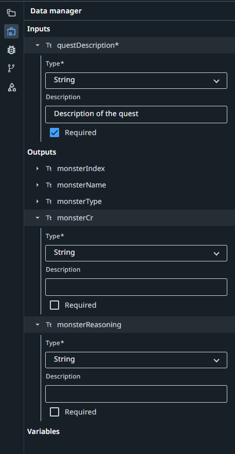

### Update the system prompt

Replace the system prompt with one that instructs the agent to use the tool, select a monster, and explain its reasoning. Open the **Instructions** panel on the canvas and update the system message:

```text
You are a quest classifier for an adventurer's guild. Given a quest description, your job is to find the most thematically appropriate monster from the D&D 5e SRD and to return information about that monster.

When given a quest description:
1. Analyze the quest to determine what kind of creature fits the context - consider creature type, challenge rating, environment, and theme.
2. Call the Monster Query tool with a search term that targets that creature type.
3. Review the returned candidates and select the best fit for the quest.
4. Return the selected monster's key fields and a monsterReasoning that explains why this monster fits the quest.

Always call the Monster Query tool before selecting a monster. Do not guess monster details from memory.
```

> **Coding agents are non-deterministic.** Your prompt will produce different results than the example above - that is expected. What matters is that the agent calls the tool, reasons over the candidates, and returns all five required output fields.

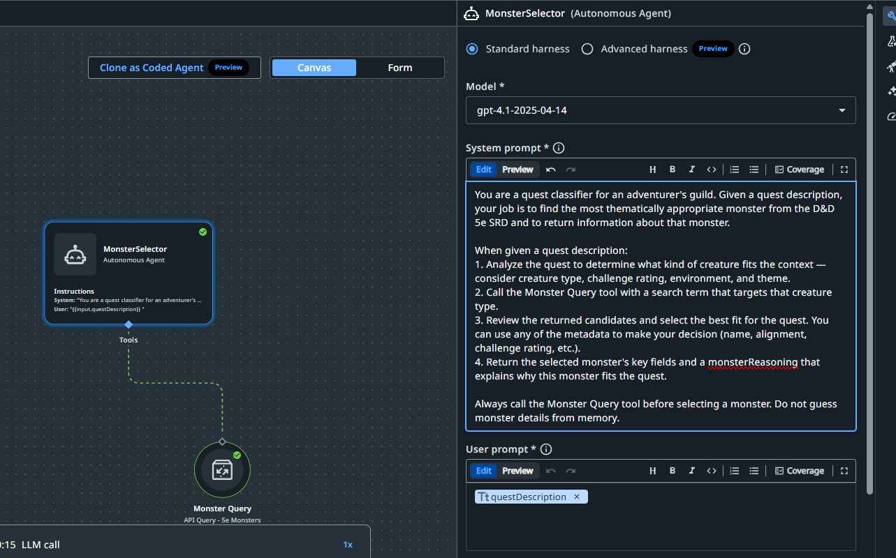

* * *

## Step 5 - Test End-to-End

Open the **Test** panel using the toolbar at the top of the agent builder. Enter a quest description:

```text
The villagers report a massive creature has been destroying farms on the edge of the forest at night.
```

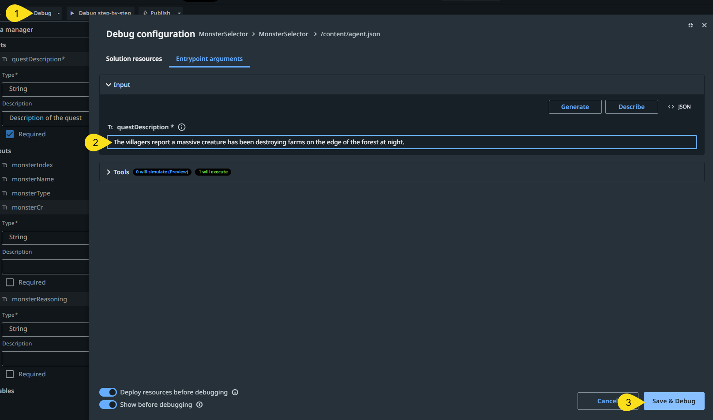

Run the agent and watch the **Execution Trail** at the bottom of the agent builder.

The Execution Trail shows the agent's full decision process. For a tool-using agent, expect at least three events: the agent's initial analysis of the quest, the tool call with the search term it chose, and the tool response with the candidate list. The agent then reasons over those candidates before producing its final output.

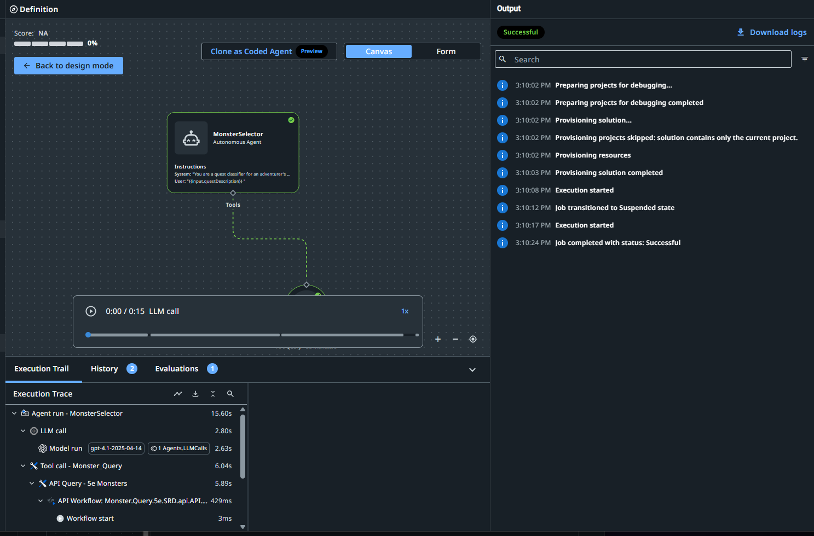

You should see:

1. The agent calls **Monster Query** with a search term it chose based on the quest
2. The tool returns a list of candidates
3. The agent selects the best match and returns the five output fields

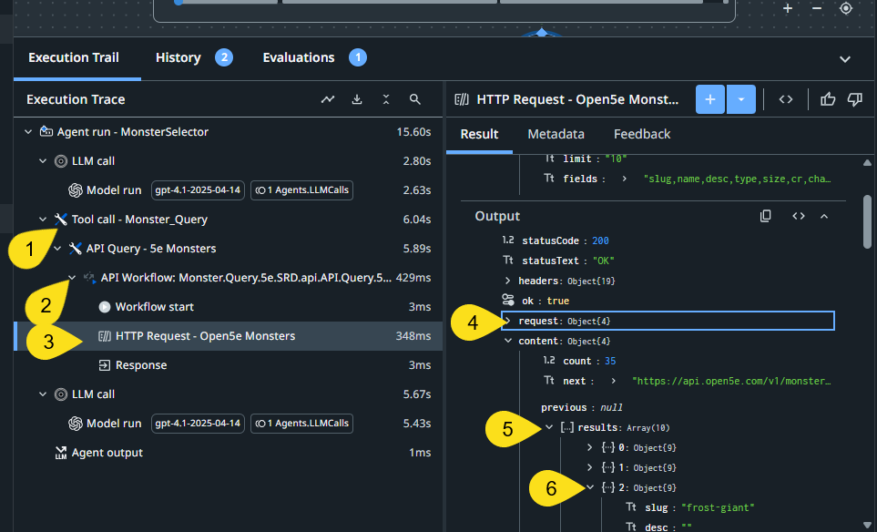

Verify the output contains all five fields: `monsterIndex`, `monsterName`, `monsterType`, `monsterCr`, and `monsterReasoning`. The `monsterReasoning` field should explain why the agent chose this monster for the quest.

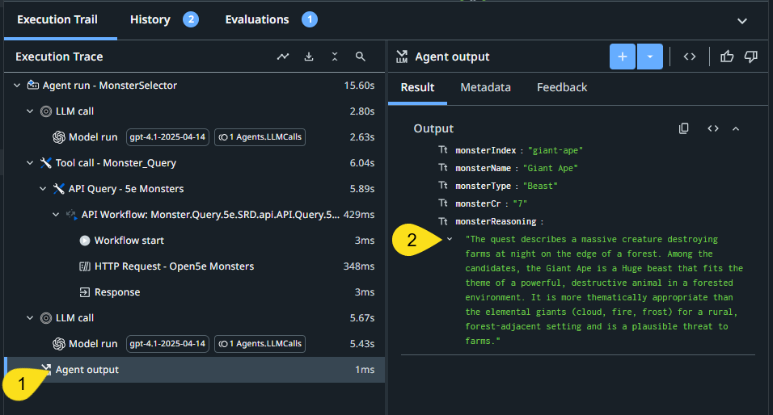

* * *

## Congratulations

You have built the first component of UiPathfinder:

- You built a live API connector that searches the D&D 5e SRD - one input, one HTTP request, one output
- You connected it to your agent as a tool with a single click in the agent builder
- The agent now decides autonomously when to call the tool, what to search for, and which candidate best fits the quest

The two-step reasoning chain (search term selection - candidate evaluation) is exactly the kind of trajectory that produces meaningful evaluation signal - which is what the next lab is about.

## What's Next

- [Getting Started with Agent Evals](../../Getting-Started-With-Agent-Evals/Getting-Started-With-Agent-Evals.md) - evaluate the agent you just built and use the results to drive prompt iteration
- [Open5e API docs](https://open5e.com/api-docs) - explore the full monster search API to understand what fields are available
- [UiPath Integration Service](https://docs.uipath.com/integration-service) - build tools that connect to SaaS APIs without writing a custom workflow
- [UiPath Community](https://community.uipath.com) - forums, how-tos, and developer discussion
