# Adding Tools to Your UiPath Agent

This lab builds part of **UiPathfinder**, an RPG Adventure system built on UiPath for a fictional Adventurer's Guild. It extends an agent built in the [Getting Started with UiPath Agents](../agents/guide.md) lab. You build a live API connector that searches the 5e SRD (System Reference Document), then give your Monster Selector agent that connector as a tool. The agent uses it autonomously at runtime: deciding what to search for, calling the API, and selecting the best match from the results.

By the end you will have `UiPathfinder.QuestParser`: an agent that receives only a quest description, decides what to search for, calls the Monster Query tool, and returns the selected monster's key fields, with no pre-populated list required.

Without a tool, the agent depends on the caller to pre-fetch candidates and pass them in as data. Adding a tool changes that: the agent decides at runtime what to search for, calls the API, and reasons over live results. This is the pattern behind most production agent workflows; the agent's value comes from its ability to fetch and reason, not just classify what it is handed.

You will do the following:

1. Build a Monster Query API Workflow that calls the 5e SRD.
2. Connect it to your Monster Selector agent as a tool.
3. Update the agent contract to reflect the new capability.
4. Test the full tool-using agent end-to-end.

**Estimated time:** 30-45 minutes

## What you are building

| Component | Details |
| --- | --- |
| **API Workflow** | Accepts `searchName` (string), calls the Open5e 5e SRD API, returns `monsterResults` array |
| **Agent input: `questDescription`** | `string`; the quest description. The agent fetches its own candidates via the tool |
| **Agent output: `monsterIndex`** | `string`; the API's `key` identifier for the selected monster, for example `srd_goblin` |
| **Agent output: `monsterName`** | `string`; display name of the selected monster |
| **Agent output: `monsterType`** | `string`; creature type (for example, beast, undead, dragon). The API returns this as an object, so the agent reads `type.name` |
| **Agent output: `monsterCr`** | `string`; challenge rating. The API returns a number, such as `0.25`, which the agent renders as text |
| **Agent output: `monsterReasoning`** | `string`; the agent's explanation of why it selected this monster for the quest |

* * *

## Prerequisites

<!-- test:prereq name="Node.js" version=">=18" ignore-for-docs="true" -->
```bash
node --version
```

<!-- test:prereq name="uip" version=">=1.1" ignore-for-docs="true" -->
```bash
uip --version
```

- **Studio Web** - runs in your browser; no desktop installation required. Open [Studio Web](https://cloud.uipath.com) in Chrome, Edge, or Firefox before starting.
- **UiPath account** - sign up or log in to [UiPath Automation Cloud](https://cloud.uipath.com) before starting.
- **Node.js 18+** - required to install the UiPath CLI. Install from [nodejs.org](https://nodejs.org/) if needed.
- **UiPath CLI v1.198.0+** - required to deploy the starter. Check with `uip --version`; install or upgrade with `npm install -g @uipath/cli`.
- **A Monster Selector agent in Studio Web** - this lab builds on the agent from [Getting Started with UiPath Agents](../agents/guide.md). If you completed that lab, your agent is already there. If not, deploy the starter:

<!-- test:manual reason="requires git clone and uip login before starter upload" -->
```bash
git clone https://github.com/cliff-simpkins/UiPath-Workshops.git
cd UiPath-Workshops/starters/monster-selector
uip login
uip solution upload .
```

Open [Studio Web](https://cloud.uipath.com) and confirm **MonsterSelector** appears in your workspace before beginning Step 1.

# Build the API workflow

## Step 1 - Build the Monster Query API workflow

An API Workflow is a lightweight workflow published as an API endpoint. You build one that wraps the [Open5e](https://open5e.com/) 5e SRD monster search: one input, one HTTP request, one output. Once published, it appears in the agent builder as a tool your agent can call.

This step has six sub-steps; budget 10–15 minutes to complete it.

### Create a new API workflow project

Select **Create New** from your Cloud Workspace. In the **Start building** dialog, choose **API Workflow** under **Task automation**.

Selecting the type creates the project immediately, with no name prompt, so you rename it in the next step.

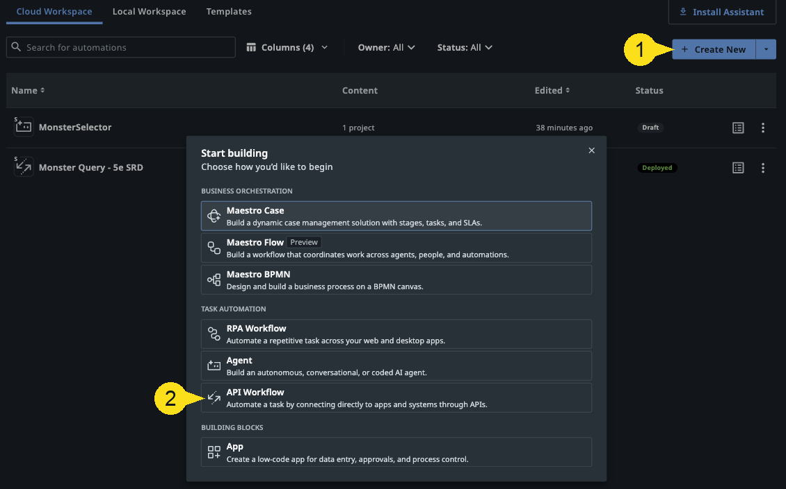

Rename the solution and the default workflow. Open the context menu for each name in the project explorer and select **Rename**:

- **Solution name:** `Monster Query - 5e SRD`
- **Workflow name:** `API Query - 5e Monsters`

### Configure inputs and outputs

Select the **Data Manager** (clipboard icon along the left rail) to access the data variables for the workflow.

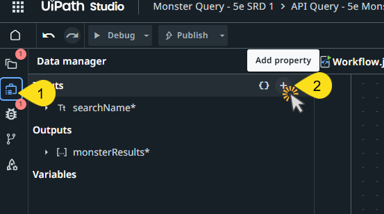

Add one input argument to the workflow:

| Name | Type | Required | Description |
| --- | --- | --- | --- |
| `searchName` | String | Yes | The monster name or partial name to search for |

Add one output argument:

| Name | Type | Required | Description |
| --- | --- | --- | --- |
| `monsterResults` | Array | Yes | Monster result list |

### Add the HTTP request

1. In the workflow canvas, select **+** between activities to open the activity menu. Select **HTTP**. The activity appears on the canvas as **HTTP Request**.
2. Open the activity context menu and select **Rename**. Name it `HTTP Request - Open5e Monster Query`.
3. In the **Properties** pane, confirm **Authentication** is **Manual authentication** and **Method** is **GET**. Both are the defaults on a new activity, so there is normally nothing to change.
4. Set **URL** to `https://api.open5e.com/v2/creatures/`.
5. Rename the activity output to `searchResults`.

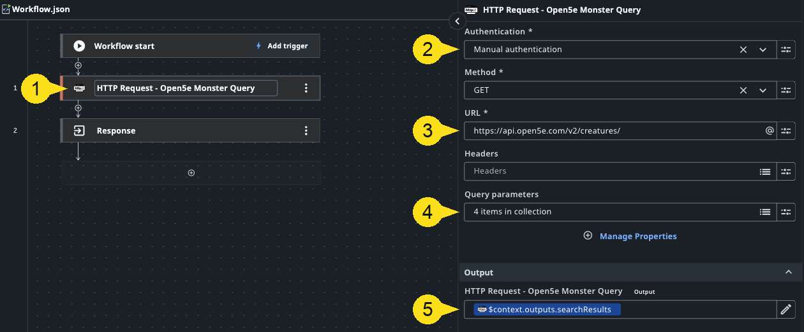

**Set the Query parameters property:**

Open the **Query parameters** property, which opens a **Dictionary editor** with Key and Value columns, and add the following fields:

| Key | Value |
| --- | --- |
| `name__icontains` | the `searchName` input argument - see the warning below |
| `document__key` | `srd-2014` |
| `limit` | `10` |
| `fields` | `key,name,type,size,challenge_rating,alignment` |

> **Warning: `name__icontains` takes the `searchName` variable, and you must pick it from the variable picker rather than type it.** In the value field, type `@` to open the picker and select **searchName**. The field then renders the value as a chip, and the stored value is `$input.searchName`.
>
> Typing `@searchName` as plain text does **not** resolve to the variable. It is sent to the API as the literal string `@searchName`, which returns HTTP 200 with zero results while every node on the canvas stays green. If your workflow succeeds but finds no monsters, check this field first and confirm it renders as a chip.

What each parameter does:

- `name__icontains`: case-insensitive partial match; `dragon` returns "Adult Red Dragon", "Young Blue Dragon", and others
- `document__key: srd-2014`: filters to the official 5e SRD; without it, results include every publisher in the database, third-party content included
- `limit: 10`: caps candidates at 10; enough for the agent to reason over without flooding its context
- `fields`: limits the response to only the fields the agent needs; the full v2 creature object is much larger and would waste token budget

> **Warning: Open5e ignores query parameters it does not recognize, and returns HTTP 200 anyway.** Misspell `document__key`, or use the v1 spelling `document__slug`, and the filter is silently dropped: the call succeeds, the run is green, and the agent receives creatures from every publisher instead of the SRD. A `goblin` search returns 2 results with the filter applied and 29 without it, so check that the result count looks like a handful rather than a catalogue.

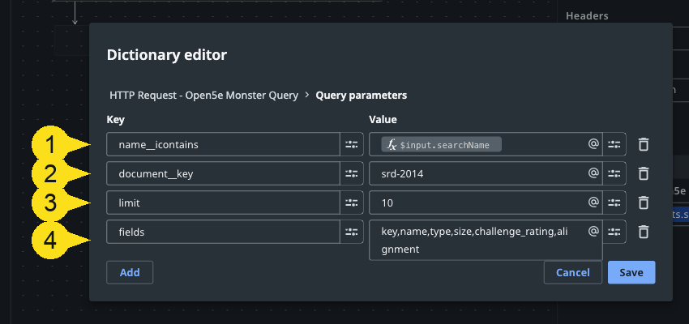

### HTTP Request property reference

The activity exposes the standard HTTP building blocks. Most you will configure for every API you call; some you will skip for public APIs like this one:

- **Authentication**: pre-built options for OAuth 2.0, API key, and Basic auth. Set to "Manual authentication" here because Open5e requires none. For authenticated APIs, choose the appropriate option and supply credentials.
- **Headers**: key/value pairs sent with every request. Common uses: `Authorization: Bearer <token>` for token-based APIs, `Accept: application/json` to control response format, and API versioning headers.
- **Body**: used with POST, PUT, and PATCH requests to send JSON, form data, or raw content. Not applicable for GET requests, which carry parameters in the URL via query parameters.
- **Query parameters**: key/value pairs appended to the URL. To reference a workflow argument, type `@` to open the variable picker and select the argument - the field stores `$input.<name>` and displays it as a chip. `@` is the picker's trigger character, not a reference syntax you can type out. See [configuring activities](https://docs.uipath.com/studio-web/automation-cloud/latest/user-guide/configuring-activities) for more on variables and expressions in Studio Web.
- **Output (renamed to `searchResults`)**: receives the full HTTP response including status code, headers, and body. Renaming from the default keeps the Response expression readable.

### Add the response

1. In the workflow canvas, select **+** after the HTTP Request and select **Response**.

   The Response activity defines what the API Workflow returns to its caller (in this case, what the agent's tool receives when it invokes the workflow). Whatever you put in the response body here becomes the tool output the agent reasons over.

2. Set the response body to:

   ```json
   {
     "monsterResults": $context.outputs.searchResults.content.results
   }
   ```

`$context.outputs` contains every named output from the activities in this workflow. `searchResults` is the output variable you renamed on the HTTP Request activity; `.content.results` navigates into the response envelope that Open5e wraps its data in, down to the actual array of monster entries. For more information, check out [the UiPath documentation on using Javascript to access workflow data](https://docs.uipath.com/studio-web/automation-cloud/latest/user-guide/managing-api-workflows#accessing-data-using-javascript).

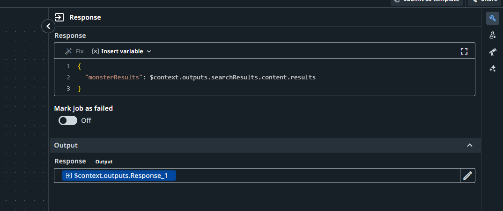

### Test the workflow

1. Select **Debug** from the toolbar.
2. In the input panel, set `searchName` to `dragon` or `goblin` and run the workflow.
3. Verify the response includes a `monsterResults` array with monster entries before continuing.

A successful response contains up to 10 entries, each with `key`, `name`, `alignment`, and `challenge_rating`, plus nested `type` and `size` objects. Searching `goblin` returns Goblin and Hobgoblin. If you see an empty array, try a different search term; not every creature name has an exact match in the SRD.

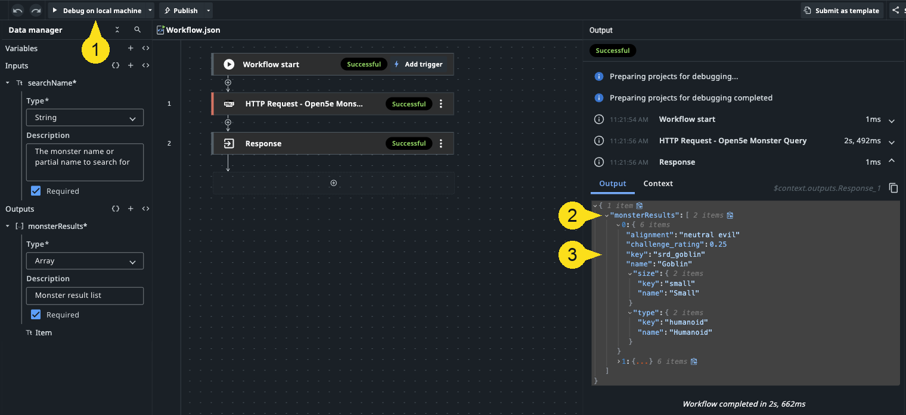

### Publish to your feed

Publishing registers the workflow as a deployable process in Orchestrator. This is what makes it discoverable in the agent builder's **Available resources** list: the builder surfaces published workflows from your workspace, not drafts saved locally in Studio Web.

1. Select **Publish** from the toolbar.
2. In the publish dialog, select **For me** to publish to your personal workspace feed. A personal workspace feed is a private package repository tied to your Orchestrator workspace; publishing "For me" makes this workflow visible only to you, which is the right scope for development and testing. See [Personal Workspaces](https://docs.uipath.com/orchestrator/automation-cloud/latest/user-guide/personal-workspaces) in the UiPath docs for details.
3. Select **Publish** to confirm.

> **Workflow not appearing in Available resources in Step 3?** The workflow must be published (not just saved) before it is visible as a tool. If it does not appear, return here and confirm the publish completed successfully, then refresh the agent builder.

* * *

With the workflow published, it is available in the agent builder as a connectable tool in the next section.

# Connect to your agent

## Step 2 - Open the Monster Selector agent

In Studio Web, navigate to your **MonsterSelector** solution and open it in the agent builder.

Take a moment to orient on its current state before making changes:

- **Input:** `questDescription` (string) and `monsters` (array of candidates passed in by the caller)
- **Output:** `monsterIndex` (string): the `key` of the chosen monster, for example `srd_goblin`
- **System prompt:** instructs the agent to pick the best match from the provided list

In this lab you remove the `monsters` input and the requirement to pre-populate candidates. The agent fetches them itself using the tool you just built.

* * *

## Step 3 - Connect the API workflow as a tool

### Add the tool

Make sure you are on the **Canvas** view: use the **Canvas / Form** toggle at the top of the agent builder. The **+** button under Tools is only visible in Canvas view.

1. On the agent canvas, select **+** under **Tools**.
2. In the **Choose tool** panel, select **API workflow** under **Toolbox**.
3. Under **Available resources**, select the workflow you created in Step 1.

   Your workflow is listed by its **project** name, nested under a `<workspace>/<solution>` folder line - so if you renamed the solution in Step 1, look for `API Query - 5e Monsters`, not the solution name. You can also filter with the **Search API workflows** box above the list.

> **Available resources empty, or showing "No tools found"?** The workflow must be published before it appears here. Return to Step 1 and complete the **Publish to your feed** sub-step, then come back and try again.

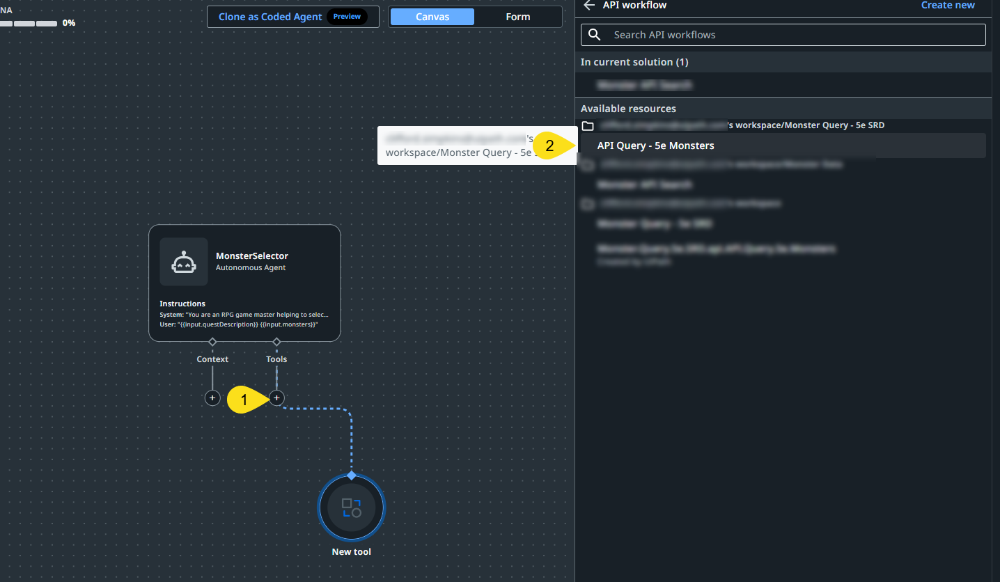

### Configure the tool description

Give the tool a name and description. The description is what the agent reads at runtime to decide when and how to call the tool; write it as an instruction to the agent, not a label for humans:

- **Name:** `Monster Query`
- **Description:** `Searches the 5e SRD for monsters matching a name or creature type. Returns up to 10 candidates with key, name, type, size, challenge rating, and alignment. Call this tool when you need to find monster candidates for a quest.`

> **The description drives tool selection.** The agent reads this description — not the tool name — to decide when and how to call the tool. A vague description produces vague tool use. Be specific about what the tool returns and when to use it.

* * *

## Step 4 - Update the agent contract

With the tool connected, update the agent definition to reflect the new contract: the agent no longer needs a pre-populated monster list, and it now returns structured monster data including its own reasoning.

The three changes in this step work together: removing `monsters` ends the agent's dependency on the caller for data; the output schema declares what the agent commits to returning; the updated prompt tells the agent how to use its new capability. None of the three works without the others.

To edit the agent definition, select the agent node on the canvas to open the definition panel on the right.

### Remove monsters from the input

In the agent definition, remove the `monsters` property from the input schema. The updated input should have only `questDescription`.

To remove the `monsters` property:

1. Within the agent, open the **Data Manager** by selecting the **Open Data Manager** icon along the left navbar (it looks like a clipboard).
2. The **Data Manager** panel has three groupings: **Inputs**, **Outputs**, and **Variables**; `monsters` should be in the **Inputs** list.
3. Point to `monsters` to reveal the edit and delete icons to the right of the label: a pencil icon (**edit**) and a trashcan icon (**delete**).
4. Select the delete icon to remove `monsters`.
5. Open the agent's **Properties** panel and remove the now-dangling `monsters` reference from the **User prompt**: select the **x** on the `monsters` chip. The User prompt should be left with only the `questDescription` chip.

> **Warning: Deleting the input does not clear the prompt that references it.** After step 4 the **User prompt** still carries a `monsters` chip, which Studio Web renders in red and flags with an error badge on **Inputs**. The agent will not run until you remove that chip, so do not skip step 5.

You should now only have one input: `questDescription`:

| Field | Type | Required | Description |
| --- | --- | --- | --- |
| `questDescription` | string | Yes | Description of the quest |

### Add the output schema

Add an output schema with the five fields from the design table at [What you are building](agents-tools.md#what-you-are-building).

Within the same **Data Manager** panel:

1. Point to the **Outputs** header to reveal the **Add property** icon (+).
2. Select **Add Property** to add each of the fields below:

| Field | Type |
| --- | --- |
| `monsterIndex` | string |
| `monsterName` | string |
| `monsterType` | string |
| `monsterCr` | string |
| `monsterReasoning` | string |

> **`monsterReasoning` is agent-generated, not from the API.** The agent writes this field itself: it is the agent's explanation of why the selected monster fits the quest. Unlike the other four fields (which come from the tool's results), `monsterReasoning` reflects the agent's own judgment.

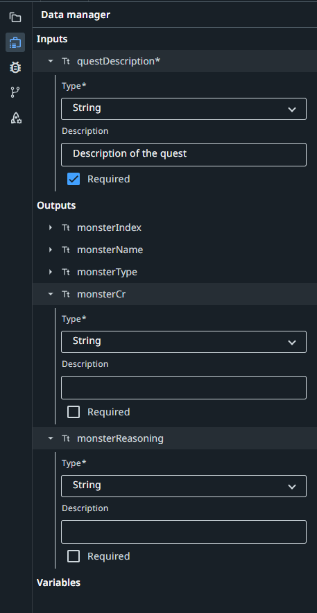

### Update the system prompt

To open the **Properties** panel, select the agent on the canvas or select the wrench icon in the upper-right corner. Replace the system message with:

```text
You are a quest classifier for an adventurer's guild. Given a quest description, your job is to find the most thematically appropriate monster from the 5e SRD and to return information about that monster.

When given a quest description:
1. Analyze the quest to determine what kind of creature fits the context - consider creature type, challenge rating, environment, and theme.
2. Call the Monster Query tool with a search term that targets that creature type.
3. Review the returned candidates and select the best fit for the quest.
4. Return the selected monster's key fields and a monsterReasoning that explains why this monster fits the quest.

Always call the Monster Query tool before selecting a monster. Do not guess monster details from memory.
```

> **Coding agents are non-deterministic.** Your prompt will produce different results than the example above; that is expected. What matters is that the agent calls the tool, reasons over the candidates, and returns all five required output fields.

* * *

With the tool connected and the agent contract updated, you are ready to test the full pipeline in the next section.

# Test end-to-end

## Step 5 - Test end-to-end

Select **Debug** from the toolbar at the top of the agent builder. In the **Debug configuration** dialog, open the **Entrypoint arguments** tab and enter a quest description, then select **Save & Debug**:

```text
The villagers report a massive creature has been destroying farms on the edge of the forest at night.
```

Run the agent and watch the **Execution Trail** at the bottom of the agent builder.

The Execution Trail shows the agent's full decision process. For a tool-using agent, expect at least three events: the agent's initial analysis of the quest, the tool call with the search term it chose, and the tool response with the candidate list. The agent then reasons over those candidates before producing its final output.

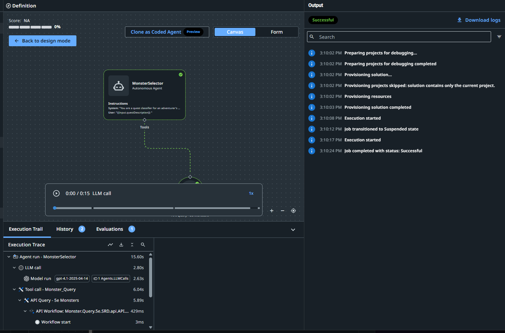

You should see:

1. The agent calls **Monster Query** with a search term it chose based on the quest.
2. The tool returns a list of candidates.
3. The agent selects the best match and returns the five output fields.

Select the **HTTP Request - Open5e Monster Query** span to see the request the tool actually sent: the `v2/creatures/` URL, the search term the agent chose in `name__icontains`, and the `document__key` and `fields` values you configured in Step 1. The response below it carries the `key` identifier for each candidate.

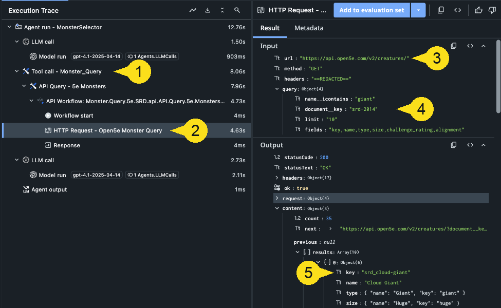

Verify the output contains all five fields: `monsterIndex`, `monsterName`, `monsterType`, `monsterCr`, and `monsterReasoning`. `monsterIndex` is the API's `key`, so it carries the `srd_` prefix - for example `srd_giant-ape`. The `monsterReasoning` field should explain why the agent chose this monster for the quest.

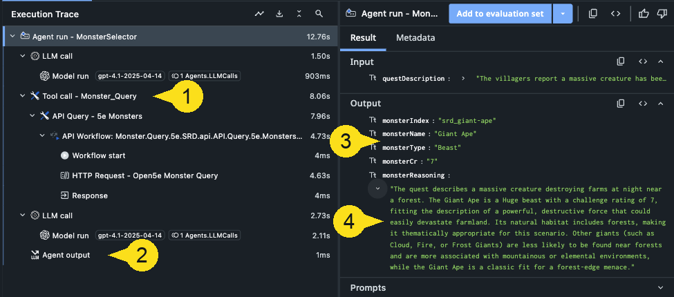

* * *

## What you built

You have built the first component of UiPathfinder:

- Built a live API connector that searches the 5e SRD: one input, one HTTP request, one output.
- Connected it to your agent as a tool with a single selection in the agent builder.
- The agent now decides autonomously when to call the tool, what to search for, and which candidate best fits the quest.

The two-step reasoning chain (search term selection and candidate evaluation) is exactly the kind of trajectory that produces meaningful evaluation signal; this is what the next lab is about.

## What's next

- [Open5e API docs](https://open5e.com/api-docs) - explore the full monster search API to understand what fields are available.
- [UiPath Integration Service](https://docs.uipath.com/integration-service) - build tools that connect to SaaS APIs without writing a custom workflow.
- [UiPath Community](https://community.uipath.com) - forums, how-tos, and developer discussion.
