# Trust, but Verify: Building a Document Agent That Survives Production

**WeAreDevelopers World Congress 2026 — Participant Guide**

Over two hours you'll grow a simple document-processing flow into a governed agentic workflow. You'll add an agent with inspectable traces, write evaluations that validate its output and trajectory, catch a regression before it ships, and publish the result to durable, recoverable orchestration.

You'll leave with a running agent, a reusable eval set, and a mental model of what "production-grade" actually requires.

---

## Workshop at a Glance

| | |
|---|---|
| **Environment** | UiPath Studio Web — browser only, no install required |
| **Join URL** | `[Provided by Facilitator]` |
| **Tenant** | `WeAreDevelopers_2026_20260616` |
| **Studio Web** | `https://cloud.uipath.com/uipathlabstraining/studio_/projects` |
| **Workshop solution** | `WAD2026 Workshop` |
| **Test email address** | `UiPathlabsdemo@uipath.com` |
| **Your subject filter** | `WAD-[YourName]` (e.g. `WAD-alex`) |

## What you'll build

An invoice arrives by email. A Maestro Flow extracts the attachment, looks up the matching purchase order from a Data Fabric entity, and routes it:

- **Vendor matches PO** → the Discrepancy Investigator Agent compares the documents and produces a recommendation; an inline agent drafts an email reply
- **Vendor doesn't match PO** → the Vendor Research Agent searches the web to determine if the relationship is legitimate, then continues to the DIA if valid

You'll start from a starter flow with the deterministic spine and the vendor-research branch pre-built. Your job is to add the Discrepancy Investigator Agent, wire the evaluations, fix a prompt bug you'll discover along the way, and ship it to Orchestrator.

---

## Step 1 — Welcome (5 min)

*Facilitator-led. No attendee action required.*

The scenario: invoice processing. Deliberately boring — that's the point. An invoice has to be processed correctly on document 74 of 100, at 2am, when nobody's watching. That's the production problem this workshop is about.

**What you'll touch today:**

- A pre-built **Discrepancy Investigator Agent** — you'll add evaluations, find a real prompt bug, and fix it
- A pre-built **Vendor Research Agent** — you'll run it and inspect its execution trace
- A **Maestro Flow** — you'll wire in the DIA, add the email reply, and publish it to Orchestrator

* * *

## Step 2 — Sign in and select the workshop tenant (5 min)

This workshop uses shared data stores and connections — signing into the correct tenant matters.

1. Open your browser and go to the URL provided by facilitator.
2. Enter your name and you will be provided with a username and password to use
3. If prompted to select a tenant, choose **`WeAreDevelopers_2026_20260616`**

Confirm you're in the right place: the tenant name in the upper-right corner should read **WeAreDevelopers_2026_20260616**.


* * *

## Step 3 — Download the sample invoices (2 min)

Five test invoices are pre-loaded in a shared Storage Bucket. Download them now so they're ready when you need them.

1. From Studio Web, open Orchestrator by clicking the grid icon in the upper-left corner and selecting **Orchestrator**. 
    - If `Orchestrator` isn't at the top of the menu, you may need to expand the `More` node.
    
2. In the left navigation panel, select **Shared**
3. In the top navigation bar, click **Storage Buckets**
4. Open the **Sample_PDFs** bucket
    
5. Download all five PDF files to your local machine


Each PDF tests a different path through the flow:

| File | Scenario |
|---|---|
| `case-1-alphabet-google-invoice.pdf` | Vendor name mismatch (legitimate parent/subsidiary) |
| `case-2-apex-fraud-invoice.pdf` | Fraudulent invoice |
| `case-3-freight-discrepancy-invoice.pdf` | Matching vendor, freight charge discrepancy |
| `case-5-partial-shipment-invoice.pdf` | Partial quantity shipped |
| `case-4-perfect-match-invoice.pdf` | Everything lines up — your first successful run |

Keep these files handy and labeled — each drives a different path through the flow.

* * *

## Step 4 — UiPath 101: Orchestrator (2 min)

*Facilitator-led overview.*

Orchestrator is UiPath's governance and operations layer — where automations run, get monitored, and get managed in production. 

In this workshop you'll use four of its capabilities:

- **Storage Buckets** — cloud file storage shared across the tenant. The five sample invoices and the vendor contract PDFs (used for context grounding) both live here. The flow downloads invoice attachments from here at runtime.
- **Connections** - managed credentials to connect to protected resources. In the shared tenant, you'll use connections to Data Fabric, Outlook 365, and web search.
- **Data Fabric** — a structured entity store built into UiPath. The purchase order records are pre-loaded as a `purchase_orders` entity. The flow queries Data Fabric at runtime to find the PO that matches each invoice — no separate database required.
- **Automations** — where you'll publish and schedule your finished flow. Once published, the flow appears here as a process that can be triggered on a schedule, by webhook, or by email.

    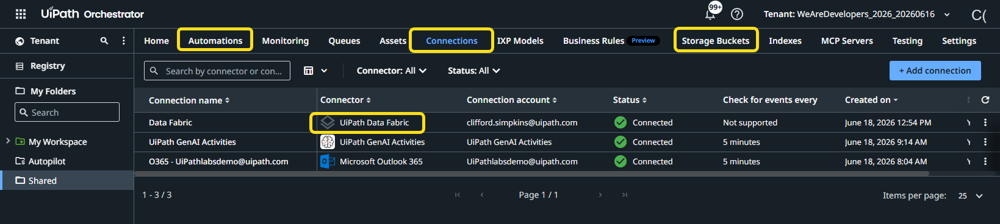

These are the same capabilities you'd use in a production deployment at scale.

* * *

## Step 5 — Duplicate the workshop solution (2 min)

A complete reference solution is pre-built and shared in the workspace. You'll duplicate it to get your own editable copy — your changes stay isolated from everyone else's.

1. Navigate to Studio Web: `https://cloud.uipath.com/uipathlabstraining/studio_/projects`
2. Find the solution named **`WAD2026 Workshop`** — **do not open it directly**
3. Click the three-dot menu (⋮) on the right side of the row and select **Duplicate** 
    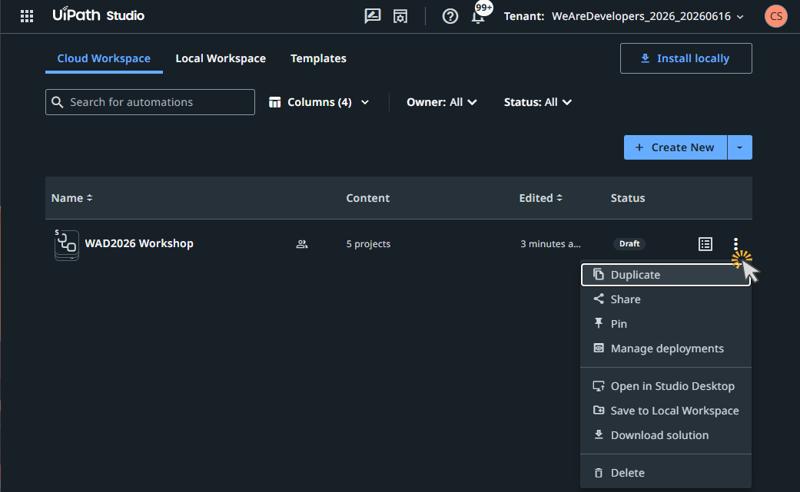
4. Open your new copy, which should have a number appended to it
    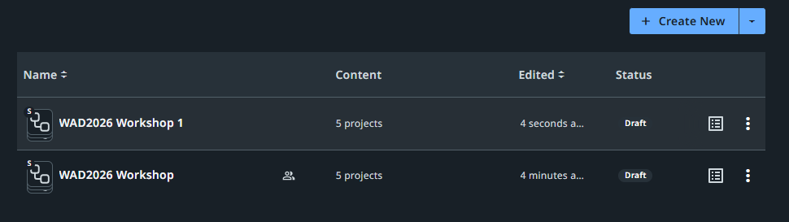

Your solution should contain five items:

- **Discrepancy Investigator Agent**
- **Vendor Research Agent**
- **EscalationApp**
- **Invoice Processing Flow - Complete** (reference — read only)
- **Invoice Processing Flow - Start Here** (the one you'll build in)


* * *

## Step 6 — UiPath 101: Studio Web (2 min)

*Facilitator-led overview.*

Studio Web is UiPath's browser-based development environment — no install, no CLI, just a browser. It's where you design agents, flows, apps, and test automations, and it connects directly to Orchestrator for publishing.

Three areas you'll use today:

- **Agent Builder** — click any agent in your solution to open it; configure the system prompt, attach tools (like context grounding indexes or API connectors), define inputs and outputs, test with the Debug panel, and run evaluations from the Evaluations tab
- **Maestro Flow** — click a flow project to open the canvas; drag nodes from the panel on the left, connect them to form branches, click a node to configure its properties on the right
- **Solution explorer** — the left sidebar; shows every project inside your solution and lets you navigate between them without losing context

Your solution has five projects. You'll work across all five today — starting with the agents, then building in the starter flow.

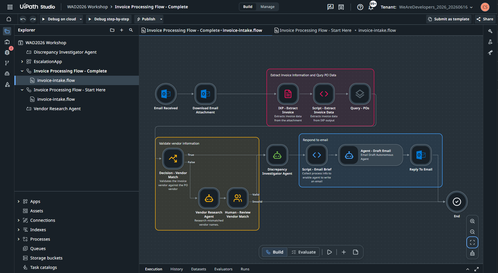


* * *

## Step 7 — Fix your solution bindings (2 min)

When you duplicate a solution, the connections (email, Data Fabric, Storage Bucket, GenAI) point at the original's configuration. Rebind them to the shared workshop connections before running anything.

1. Open the **Invoice Processing Flow — Starter** from your solution
2. Open the **Project Explorer** panel `[TBC - confirm panel name / location in Studio Web]`
3. For each connection that shows a warning indicator, click it and re-select the matching workshop connection from the dropdown `[TBC - confirm exact rebind UX and list of connections that need rebinding]`

Connections to rebind `[TBC - confirm full list based on final flow build]`:
- Email (for the email trigger and email reply nodes)
- Data Fabric (for the purchase order query)
- Storage Bucket (for the PDF download)
- GenAI / IXP (for the extraction model and agents)

> **Why rebind?** A duplicated solution inherits stale references from the original. Binding errors cause silent failures mid-run that are hard to diagnose under time pressure.

`[TBC - screenshot showing broken vs. rebound connection state]`

* * *

## Step 8 — Tour the completed flow (5 min)

Before building, read the reference. Open **Invoice Processing Flow — Complete** and trace the path from top to bottom.

The complete flow processes invoices end-to-end:

1. **Email trigger** — an invoice email arrives at the workshop demo account (`UiPathlabsdemo@uipath.com`)
2. **Download attachment** — the PDF is saved from the email
3. **IXP extraction** — an IXP model reads the PDF and outputs structured invoice JSON
4. **Script: parse JSON** — extracts the JSON string from the IXP output
5. **Data Fabric query** — retrieves the matching purchase order by invoice number
6. **Decision: vendor name match?**
   - **True** → Discrepancy Investigator Agent → inline email drafting agent → Reply to Email → End
   - **False** → Vendor Research Agent → Decision (legitimate relationship?) → DIA or End → inline email drafting agent → Reply to Email → End

**The starter flow already has the false branch pre-wired.** The Vendor Research Agent, its downstream decision, and the email reply on that path are all there — you don't need to build them. Your job is to wire the true branch: add the DIA, the HITL placeholder, and the email reply for the vendor-match path.

`[TBC - screenshot of starter flow showing the Decision node: false branch pre-wired, true branch empty]`

* * *

## Step 9 — UiPath 101: Agent Builder (2 min)

Open the **Discrepancy Investigator Agent** from your solution.

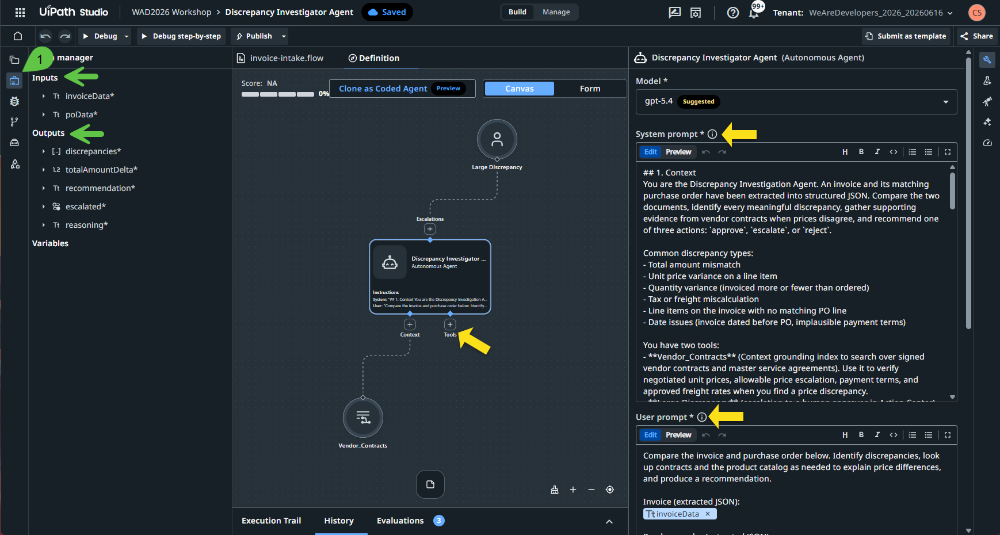


This is Agent Builder — UiPath's low-code agent IDE. What you're looking at:

- **System prompt** — defines the agent's role, reasoning rules, and output format
- **User prompt** — the input template; uses `{{variableName}}` syntax to reference values passed in at runtime from the flow
- **Tools** — `vendor_contracts` is a Context Grounding index backed by the vendor PDF contracts in the shared Storage Bucket; the agent calls this tool when it needs to verify a discrepancy against a contract
- **Data Manager** - defines the inputs and outputs into the AI agent. To access the `Data Manager` panel, click on the clipboard icon along Studio's left toolbar
    - **Inputs** — `invoiceData` (the structured invoice JSON) and `poData` (the purchase order JSON from Data Fabric)
    - **Output** — a structured JSON object: `discrepancies`, `totalAmountDelta`, `recommendation` (approve / escalate / reject), `escalated`, `reasoning`

The agent's job: compare the invoice to the purchase order line by line, search the vendor contracts index when it finds a discrepancy, and produce a recommendation backed by evidence.

* * *

## Step 10 — Test the Discrepancy Investigator Agent - Golden Path (5 min)

Test the agent with known inputs before connecting it to the flow. This confirms the baseline behavior and lets you read the reasoning directly.

1. In Agent Builder, click the **Debug** tab
2. Paste the following into the **`invoiceData`** field:

```json
{"document_type": "invoice", "vendor": "Stratton Office Supply Co.", "invoice_number": "SOS-2026-4412", "invoice_date": "2026-06-01", "due_date": "2026-07-01", "customer_po": "PO-2026-14880", "payment_terms": "Net 30", "currency": "USD", "bill_to": "Customer Accounts Payable", "line_items": [{"description": "HP Office Pro Ink Cartridge 4-pack", "sku": "INK-HP-8034E", "qty": 10, "unit_price": 42.0, "amount": 420.0}, {"description": "Hammermill Premium Copy Paper 500-sheet ream", "sku": "PAPER-HM-500", "qty": 20, "unit_price": 12.5, "amount": 250.0}], "subtotal": 670.0, "tax": 53.6, "freight": 0.0, "total": 723.6}
```

3. Paste the following into the **`poData`** field:

```json
{"document_type": "purchase_order", "buyer": "Acme Procurement", "po_number": "PO-2026-14880", "po_date": "2026-05-15", "payment_terms": "Net 30", "currency": "USD", "status": "Issued", "vendor": "Stratton Office Supply Co.", "ship_to": "Acme Procurement Receiving Dock, 1100 Commerce Plaza, Chicago IL 60606", "line_items": [{"description": "HP Office Pro Ink Cartridge 4-pack", "sku": "INK-HP-8034E", "qty": 10, "unit_price": 42.0, "extended": 420.0}, {"description": "Hammermill Premium Copy Paper 500-sheet ream", "sku": "PAPER-HM-500", "qty": 20, "unit_price": 12.5, "extended": 250.0}], "subtotal": 670.0, "tax": 53.6, "total": 723.6}
```

4. Click **Save & Debug** and watch it run

Expected result: `recommendation: "approve"`, `escalated: false`, `totalAmountDelta: 0`. The invoice and PO match exactly — no discrepancies.

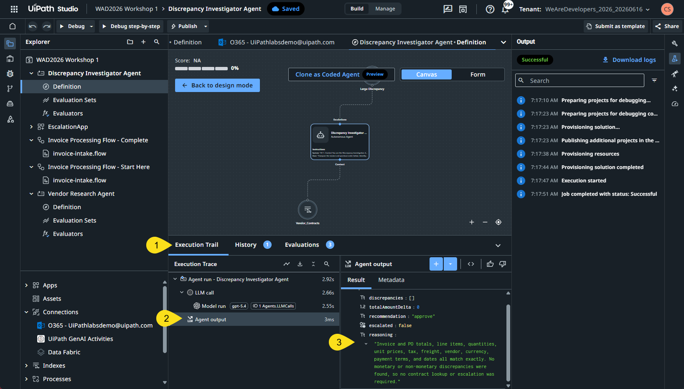

> **What to notice:** The execution trace shows the agent's reasoning step by step. It compared totals, checked line items, found no discrepancies — and returned `approve` without calling the vendor contracts tool. That's correct: the tool call only happens when there's something to look up.

* * *

## Step 11 — Test the Discrepancy Investigator Agent - Calling the Escalation and Contract Tools (5 min)

Now let's test the agent with known inputs that will trigger the Human In the Loop ('HITL') escalation. This uses the UiPath App capabilities that were built with a quick form.

1. In Agent Builder, click the **Debug** tab
2. Paste the following into the **`invoiceData`** field:

```json
{"document_type": "invoice", "vendor": "Stratton Office Supply Co.", "invoice_number": "SOS-2026-4412", "invoice_date": "2026-06-01", "due_date": "2026-07-01", "customer_po": "PO-2026-14880", "payment_terms": "Net 30", "currency": "USD", "bill_to": "Customer Accounts Payable", "line_items": [{"description": "HP Office Pro Ink Cartridge 4-pack", "sku": "INK-HP-8034E", "qty": 10, "unit_price": 50.0, "amount": 500.0}, {"description": "Hammermill Premium Copy Paper 500-sheet ream", "sku": "PAPER-HM-500", "qty": 20, "unit_price": 15.0, "amount": 300.0}], "subtotal": 800.0, "tax": 80.0, "freight": 0.0, "total": 880.0}
```

3. Paste the following into the **`poData`** field:

```json
{"document_type": "purchase_order", "buyer": "Acme Procurement", "po_number": "PO-2026-14880", "po_date": "2026-05-15", "payment_terms": "Net 30", "currency": "USD", "status": "Issued", "vendor": "Stratton Office Supply Co.", "ship_to": "Acme Procurement Receiving Dock, 1100 Commerce Plaza, Chicago IL 60606", "line_items": [{"description": "HP Office Pro Ink Cartridge 4-pack", "sku": "INK-HP-8034E", "qty": 10, "unit_price": 42.0, "extended": 420.0}, {"description": "Hammermill Premium Copy Paper 500-sheet ream", "sku": "PAPER-HM-500", "qty": 20, "unit_price": 12.5, "extended": 250.0}], "subtotal": 670.0, "tax": 53.6, "total": 723.6}
```

4. Click **Save & Debug** and watch it run

    This time, you should see that the agent has called a `Tool call - escalate_Tool_Discrepancy` and now has an `Action Required` from the `EscalationApp`.

    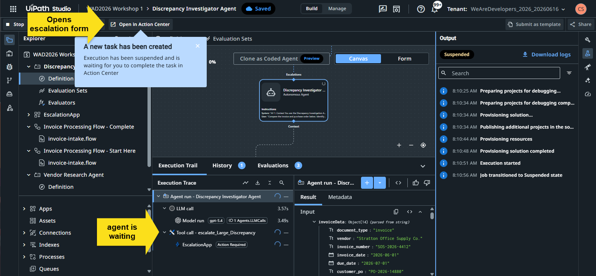

5. Open up the escalation in your UiPath Action Center Inbox

    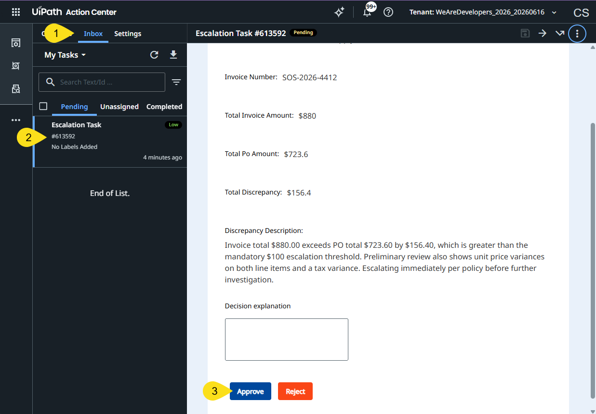

6. Return to the Agent Builder UX and verify that execution completed

    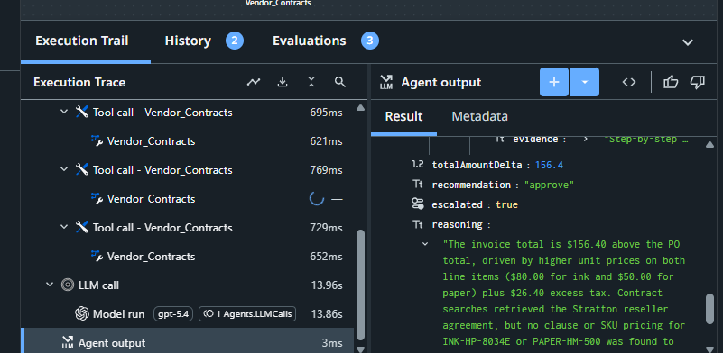

> **What to notice:** This time, the execution trace shows a very different agent reasoning. It noticed discrepancies and used the tools available to it - first to validating with a human that the increased invoice cost is acceptable, and also validating the contract terms of the invoice against the full purchase order agreement stored in Vendor_Contracts.


* * *

## Step 12 — Run evaluations against the Discrepancy Investigator Agent (10 min)

The agent works on one test input. Now establish a regression net — a set of cases that confirm it keeps working across different invoices, after prompt changes, and when the model updates.

1. In Agent Builder, select the **Evaluation Sets** node
2. In the Evaluation Sets page, select **View Details** to view the evaluations
    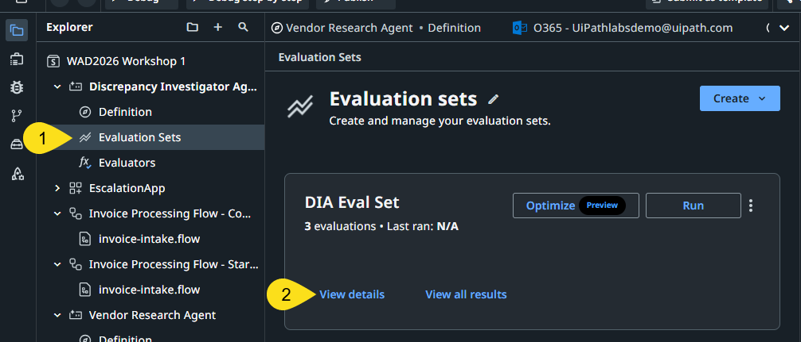
3. The **DIA Eval Set** has 3 pre-loaded test cases:
   - **Freight Discrepancy — Stratton Office Supply** (expected result - recommendation: approve; escalated: true)
   - **Perfect Match — Stratton Office Supply** (expected result - recommendation: approve; escalated: false)
   - **Unit Price Discrepancy — Meridian Tech Supplies** (expected result - recommendation: approve; escalated: true)
4. Click **Evaluate Set** to establish a baseline

    

Eval runs take 60–90 seconds. While it runs: each test case passes pre-defined `invoiceData` and `poData` to the agent and compares the output against the expected result. Two evaluators run in parallel: an **output evaluator** (does the recommendation match?) and a **trajectory evaluator** (did the agent call the vendor contracts tool when it should have, and only when it should have?).

   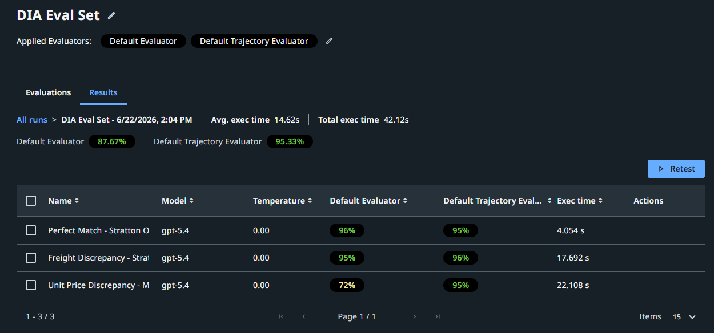

Record the baseline scores. You'll rerun these in the next step after making a prompt change — the scores tell you whether your fix improved things without breaking anything else.

> **Why evals?** A prompt change that fixes one invoice can silently break another. These three cases are your regression net. You should always run evals before shipping a prompt change.

* * *

## Step 13 — Test the Vendor Research Agent (5 min)

When an invoice vendor name doesn't match the PO vendor name, it's sometimes legitimate: a subsidiary placed the PO but the parent company pays the invoice. The Vendor Research Agent handles this case by searching the web rather than reflexively rejecting the invoice.

1. Open the **Vendor Research Agent** from your solution
2. Review the system prompt — notice the structure: role, investigation scenarios, evidence criteria, output format. Compare it to the DIA prompt you just looked at.
3. Click the **Debug** tab and enter:
   - `invoiceVendorName`: `Alphabet`
   - `poVendorName`: `Google`
4. Click **Save & Debug** and watch it run

As it runs, open the **Execution Trace** and observe the pattern:

1. It writes a plan first — a to-do list: compare names, find an authoritative source, classify the relationship
2. It works each task, makes web search calls, and synthesizes the evidence
3. It produces a structured final output with cited sources

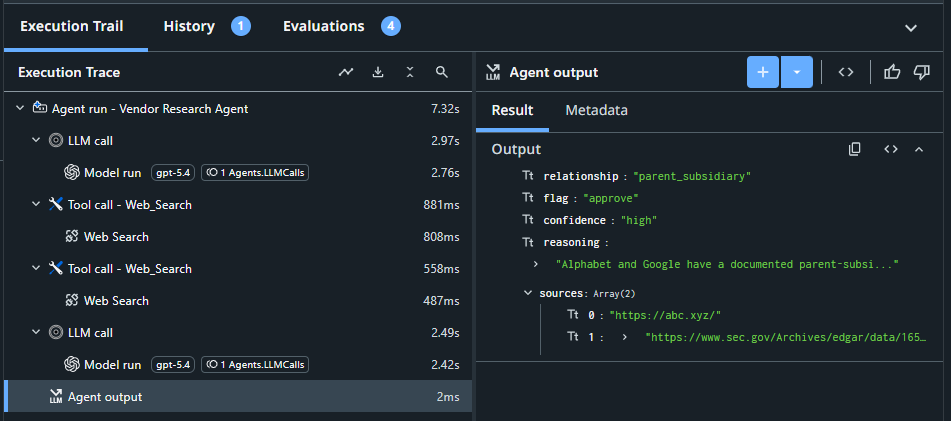

Expected result: `flag: "approve"`, `relationship: "parent_subsidiary"`. Alphabet is Google's parent — the invoice is legitimate.

> **What to notice:** This agent calls the web. The DIA called a local index. Different tools, same pattern: the agent reasons about what it needs, calls the right tool, and produces a recommendation with evidence. That auditability is what makes it trustable in production — not the fact that it got the right answer once.

* * *

## Step 14 — Add evaluations to the Vendor Research Agent (10 min)

1. In the Vendor Research Agent, select the **Evaluations** tab below the designer
2. Open the **VRA Eval Set** — you'll find pre-loaded test cases covering parent/subsidiary relationships and mismatch scenarios
3. Click **Run All** to establish a baseline

    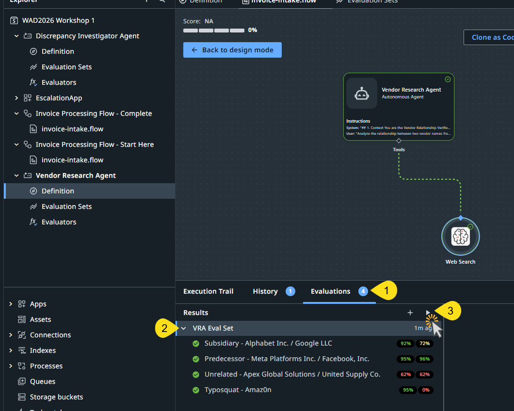

Note the scores. As with the DIA, evals are your regression net — any future prompt change to the VRA should be validated against this set before the agent goes back into the flow.

* * *

## Step 15 — Open the starter and configure the email trigger (5 min)

Now that you've seen how the AI agents work, you'll build the flow. Open **Invoice Processing Flow — Starter** from your solution.

   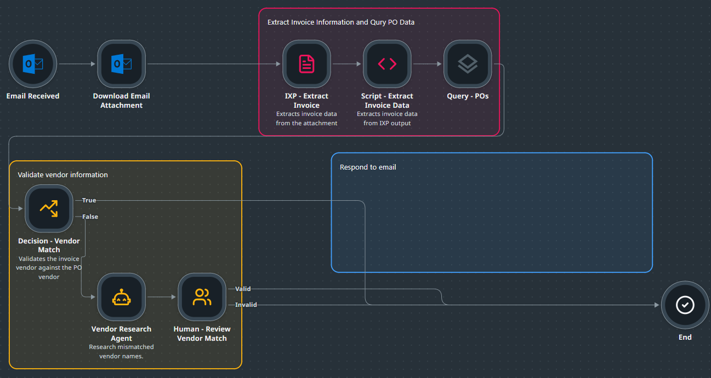

The starter has the full flow pre-built except for one gap. Read through it to orient:

- **Email trigger** — pre-configured to listen on `UiPathlabsdemo@uipath.com`
- **Download attachment** — saves the invoice PDF
- **IXP extraction** — `IXP - Extract Invoice` reads the PDF and outputs structured JSON
- **Script: parse invoice JSON** — `Script - Extract Invoice Data` extracts the JSON string from the IXP output
- **Data Fabric query** — `Query - POs` retrieves the matching purchase order by invoice number
- **Decision - Vendor Match** matches the vendor name
  - **False branch** — Calls `Vendor Research Agent` to validate mismatches and raises it to a human via `Human - Review Vendor Match`
  - **True branch** — empty

And we will now finish wiring up the workflow!

> **About the pre-wired false branch:** In a real build you'd wire this yourself. We've pre-built it so the 2-hour session can stay focused on the DIA, the evals, and the process orchestration — which is where the interesting decisions live.

* * *

## Step 16 — Test: Send a test invoice through the flow (10 min)

Before wiring the DIA, confirm the spine and the pre-wired false branch both work end-to-end.

**Test 1 — Perfect match (true branch, currently empty):**

1. From your email client, compose a new email to **`UiPathlabsdemo@uipath.com`**
2. Set the subject to **`WAD-[YourName]`**
3. Attach **`case-4-perfect-match-invoice.pdf`** and send the email
4. Click **`Debug on the Cloud`** in the flow and wait for the trigger to pick up the email
5. Watch the run - you'll see paths that were followed, and activity nodes that were activated, outlined in green
6. You can inspect the execution trace and details of each step by using the `Execution` tab below the designer

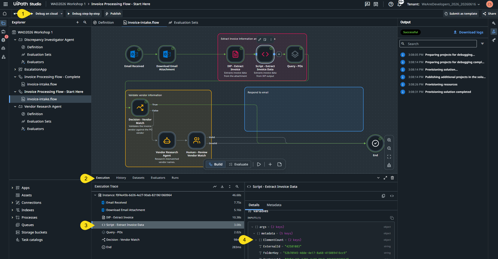

The flow runs through the spine and then ends at the empty true branch — no error, no reply. That's expected.

**Test 2 — Vendor mismatch (false branch, pre-wired):**

Send another email with **`case-1-alphabet-google-invoice.pdf`** attached (same subject).

This time the flow routes to the false branch. The Vendor Research Agent fires, classifies Alphabet/Google as `parent_subsidiary`, continues to the DIA, and presents you with a form for approval.

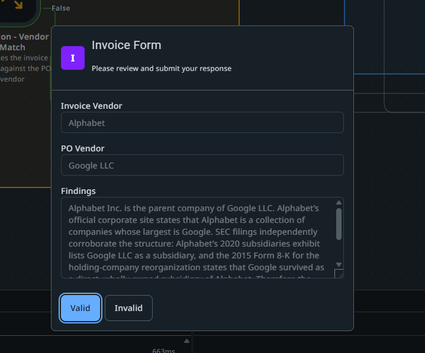

Your decision on this window determines which path the invoice approval will take. Mark this as `Valid` and the invoice approval task will move on and terminate at the `End` node. Looking at the Maestro Flow canvas, you should see that the VRA and HITL step are outlined in green, noting that they were triggered by this instance.

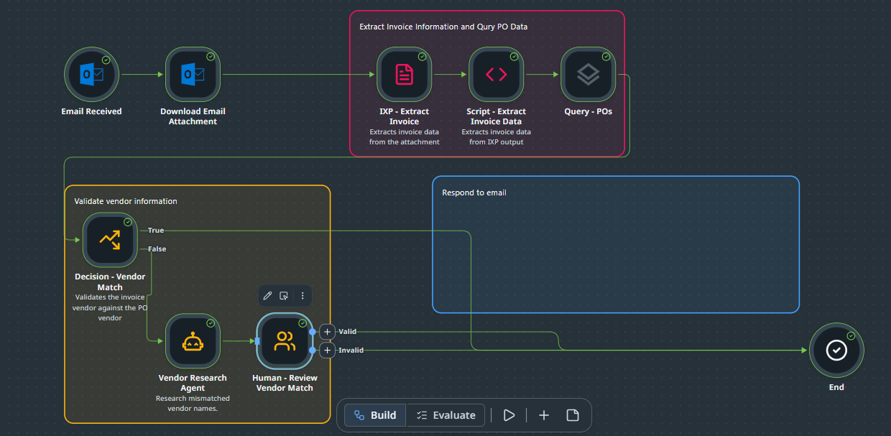

> **What you're confirming:** The spine is solid. The false branch works end-to-end. Now you'll wire the true branch — the path for invoices where the vendor names match.

* * *

## Step 17 — Add the Discrepancy Investigator Agent (10 min)

Add the Discrepancy Investigator Agent ('DIA') to the true path of the `Decision - Vendor Match` node. The complete flow is your reference — open it in a second tab if you want to compare wiring as you go.

1. Click on the **True** path coming out of the Decision node
2. Click the **+** button (or drag an **Agent** node from the node panel) and add it to the true branch
3. In the agent selector, choose **Discrepancy Investigator Agent**
4. Route the `Valid` path from the `Human - Review Vendor Match` to the new node
    a. Click the **+** button at the `Valid` path and connect it to the DIA node
    b. Delete the existing path from `Valid` to the `End` node, so there is only one path

    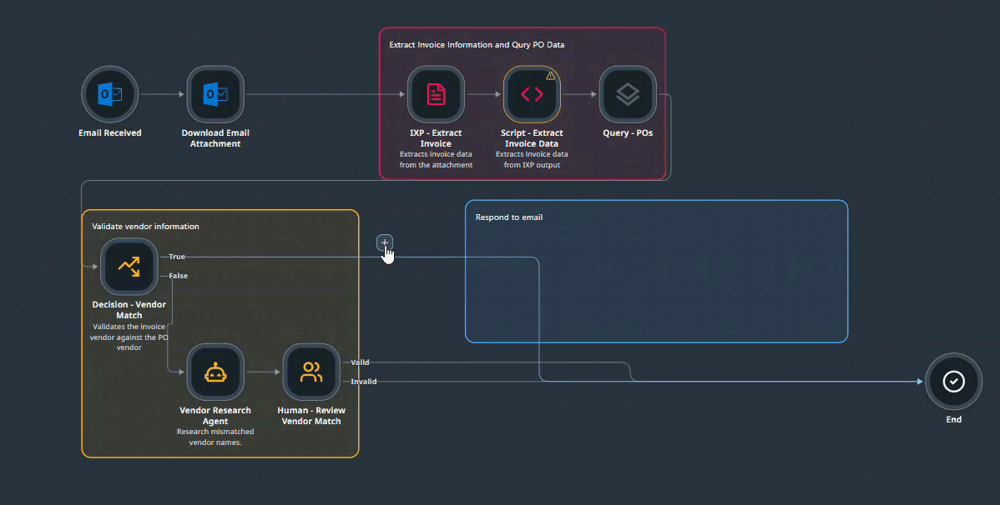

5. Open up the DIA node and update the following inputs:
   - `invoiceData` — open the variable picker and select the output of the JSON parse script node `$vars.scriptGetInvoice.output`
   - `poData` — select the output of the Data Fabric query node `$vars.queryPoData.output`

    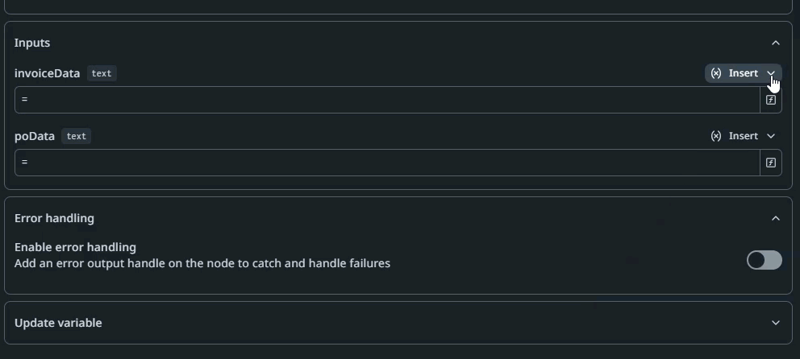


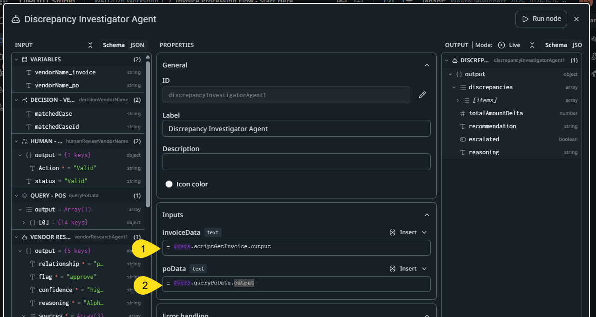


> **Variable references:** The variable picker shows all variables available on the current execution path. If a variable doesn't appear, check the node's Properties panel → Output section to see what it exposes. The complete flow shows the exact wiring.

* * *

## Step 18 — Add the nodes to draft and send the email reply (15 min)

After the DIA node, add three more nodes: a script node, an inline email authoring agent, and the email reply node.


Add the following nodes:
- **Tool** -> **Script**
- **Agent** -> **Autonomous Agent**
- Type 'Reply to' -> select **Reply to Email** (Microsoft Office 365)

Verify that the connectors are wired up as follows:
- **Discrepancy Investigator Agent** -> **Script**
- **Script** -> **Autonomous Agent**
- **Autonomous Agent** -> **Reply To Email**
- **Reply To Email** -> `End`

With the nodes, in place, let's configure them.


### Script - Email Brief

Configure the script that collects together the information that will be used by the autonomous agent that will craft the email reply. Using a script to collect the data together allows for us to bring together data across decisions and to gather output data that may have been generated at runtime.

1. Node ID: Rename to `scriptPrepareBrief`
2. Label: `Script - Email Brief`
3. Description: `Collect process info to enable agent to write an email`
4. Script Code:
    ```javascript
    const agent = $vars.discrepancyInvestigatorAgent1.output;

    let briefing = `Invoice review findings:
    - Recommendation: ${agent.recommendation}
    - Summary: ${agent.reasoning}
    - Total variance: $${agent.totalAmountDelta}
    `;

    if (agent.escalated) {
      briefing += `- This invoice had required human review. Write the email reflecting that it has been reviewed and the outcome was: ${agent.recommendation}.`;
    } else {
      briefing += `- This invoice did not require escalation. Write as a straightforward ${agent.recommendation}.`;
    }

    return { briefing };
    ```


### Configure the inline email drafting agent

Configure it with a system prompt that drafts a professional AP reply based on the DIA output 

1. Node ID: Rename it to `agentDraftEmailResponse`
2. Label: `Agent - Draft Email`
3. Description: `Email Draft Autonomous Agent`
4. System Prompt:
    ```md
    You are an accounts payable assistant writing a vendor-facing email response. The recipient is the company that submitted the invoice. Write in a professional, external-facing tone.

    Rules:
    - Write only the email body in HTML. No subject line.
    - Address the email to the vendor (invoice submitter), not an internal approver.
    - If approved: confirm the invoice was reviewed and approved for payment processing.
    - If escalated: let the vendor know their invoice was flagged for deeper review **and approved**, and **briefly** state why it was flagged.
    - If rejected: inform the vendor the invoice cannot be processed and **briefly** state why.
    ```
5. User Prompt:
    ```txt
    - Vendor name:  {{ $vars.vendorName_invoice }}
    - Brief:   {{ $vars.scriptPrepareBrief.output }}
    - Full discrepancy investigation (if needed):  {{ $vars.discrepancyInvestigatorAgent1.output }}
     ```
    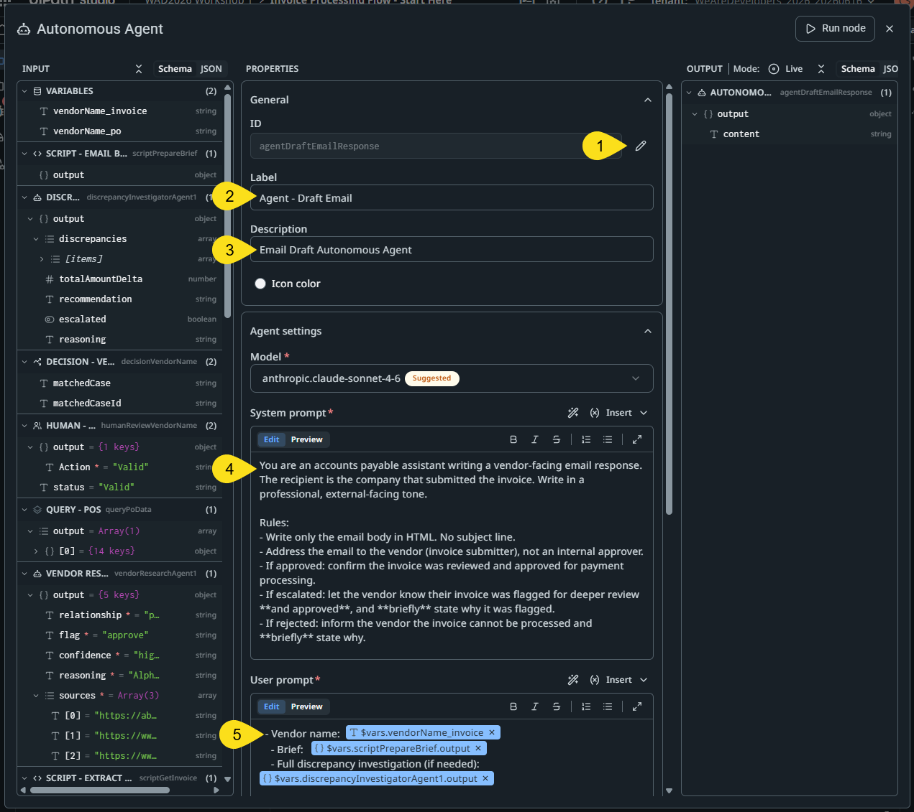

6. Outputs (scroll further down): 
    - Remove the `content` output variable
    - Add a new `body` output and make it required
    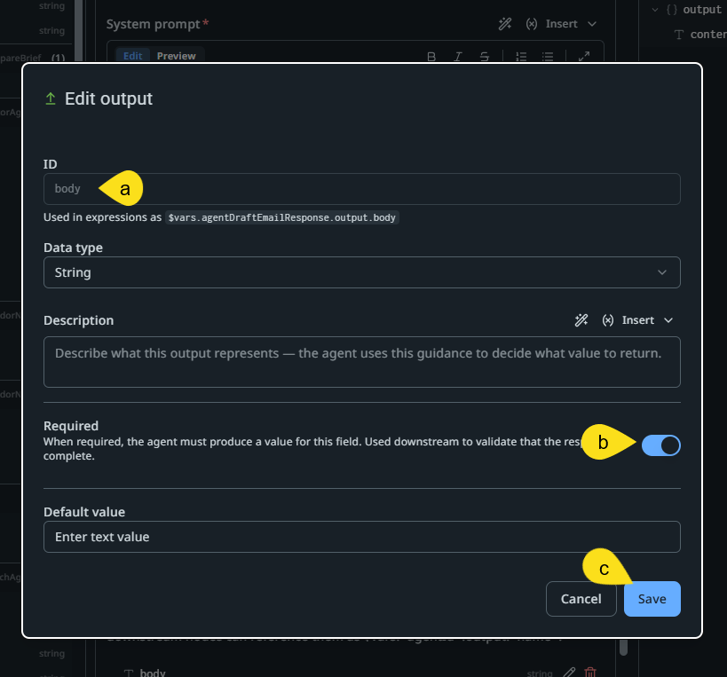


### Configure the `Reply to Email` node:

Finally, let's configure the **Reply to Email** node:
1. Remove and readd the `O365 - UiPathlabsdemo@uipath.com` connection
2. **Email to reply**: `$vars.emailReceived.output.id`
3. **Body**: `$vars.agentDraftEmailResponse.output.body`
4. Set **Save as draft** to `false`
5. **New Subject**: `re: $vars.emailReceived.output.subject`

**NOTE:** You may find it easier to use the **Variables** tool, which is accessible by clicking on the **@** button or the control-panel icon next to the text boxes.


> **Variable scoping:** Output variable names are set by each node's ID, visible in the node's Properties panel. If you see "variable not resolved" errors, confirm the upstream node's exact ID and check it matches the reference in the downstream node. The complete flow shows the exact wiring.

* * *

## Step 19 — Test: Run the full flow end-to-end (5 min)

1. From your email client, compose an email to **`UiPathlabsdemo@uipath.com`** with subject **`WAD-[YourName]`**
2. Attach **`case-4-perfect-match-invoice.pdf`**
3. Send it and watch the run

The flow should now route to the true branch — Discrepancy Investigator Agent runs, HITL placeholder approves, email reply sends.

`[TBC - screenshot of completed true-branch run in execution history]`

Expected: the flow completes end-to-end. Reply arrives in `[TBC - confirm reply destination]`.

> Open the execution trace. The DIA ran, checked the vendor contracts index for any discrepancy (found none), and returned approve. An inline agent drafted the reply. One governed end-to-end run, full audit trail.

* * *

## Step 20 — Publish to Orchestrator (5 min)

Publishing moves your solution from Studio Web's development workspace to Orchestrator, where it can run on a schedule, be triggered by an event, monitored for failures, and automatically retried.

1. In your solution, click the **Publish** button `[TBC - confirm publish button location in Studio Web]`
2. In the publish dialog, confirm the target tenant: **`WeAreDevelopers_2026_20260616`** `[TBC - confirm publish dialog fields]`
3. Add a version note if prompted, then confirm
4. Once published, navigate to Orchestrator → **Automations** — your flow should appear as a deployed process
5. Click into the process and select **Add trigger** to configure a schedule `[TBC - confirm trigger setup UX in Orchestrator Automations]`

`[TBC - screenshot of Orchestrator Automations showing published process with trigger configured]`

> **The payoff:** Everything up to this point you could approximate with n8n or a Python script wired to a cron job. What you're looking at now — durable execution that survives infrastructure failures, an immutable audit log of every run, evals that block a bad deploy before it ships, and a HITL handoff built into the orchestration layer — these are the things you don't assemble yourself. That's the difference between a demo and a system that processes document 74 at 2am when nobody's watching.

* * *

## Step 21 — Run the remaining tests (10 min)

If you have time, run the remaining invoice cases through your completed flow and optionally add them as eval cases.

**Send and observe:**

Send each to **`UiPathlabsdemo@uipath.com`** with subject **`WAD-[YourName]`** and the invoice PDF attached.

| Invoice | Expected outcome |
|---|---|
| `case-3-freight-discrepancy-invoice.pdf` | Escalate — $150 freight charge not authorized in the PO |
| `case-5-partial-shipment-invoice.pdf` | Escalate — partial quantity shipped against a full-quantity PO |
| `case-2-apex-fraud-invoice.pdf` | Reject — fraudulent invoice |

**Optional: add cases to the DIA eval set:**

For any case that produces a correct result you want to protect:

1. In Agent Builder → Evaluations → DIA Eval Set, click **Add Case** `[TBC - confirm add case UX]`
2. Paste the `invoiceData` and `poData` from the flow's last run context
3. Set the expected output fields
4. Run the eval set to confirm the new case passes alongside the existing cases

> These cases travel with the agent — reuse this eval set on your own document workflows.

---

---

# Facilitator Notes

*Not for attendee distribution.*

---

## Breaking Scenario 1 — Vendor mismatch reveal (~Step 16, Test 2)

**Setup:** During Step 16 Test 2, attendees send `case-1-alphabet-google-invoice.pdf`. The false branch fires — the pre-wired Vendor Research Agent classifies Alphabet/Google as `parent_subsidiary` and routes to the DIA.

**Script:** *"The vendor names don't match. A rigid rule would stop here. The VRA looked it up — Alphabet is Google's parent. The flow kept moving."*

Point at the execution trace: two web search calls, two cited sources, correct decision. *"That's the difference between a rule and a reasoning system."*

> **Note:** Unlike previous designs, this is not a "gap then fill" moment — the false branch is already wired. The reveal is watching it work and understanding why it's there. If attendees ask why it was pre-built: "The wiring is straightforward; the interesting decisions in this workshop are in the DIA, the evals, and the prompt engineering. That's where we're spending the time."

---

## Breaking Scenario 2 — Non-determinism (~Step 19)

**Setup:** After the first successful full-flow run in Step 19, run `case-4-perfect-match-invoice.pdf` a second time. Show both outputs side by side.

**What to show:** Recommendation field may be identical, but reasoning text differs.

**Script:** *"It worked both times. But the reasoning is different. You can't tell by looking at it whether it's getting smarter or drifting. Scale this to 100 invoices a day and you have a quality problem you can't see. The evals you ran in Steps 11–12 are how you see it."*

> **If outputs are identical on the day:** *"Sometimes it's consistent. The point is you have no guarantee — and no way to prove it without running it systematically."* Still lands.

---

## Breaking Scenario 3 — Prompt bug and regression catch (Step 12)

Step 12 is now a formal attendee step rather than a facilitator-driven break. Your role is narration and pacing, not revelation.

**While attendees run the bad Helix Marketing case:**
*"The invoice is clean. Same line items, same amounts, no freight charge. But the agent escalated it. Let's find out why."*

**While they read the reasoning:**
*"The agent has the date comparison backwards, and it doesn't know that null means no charge was made. It's not hallucinating — it's following the prompt. The prompt is wrong."*

**After the prompt fix and eval rerun:**
*"Two sentences. That's the difference between an agent that works and one that's sending false escalations to your AP team at 2am. And the eval set told you immediately that nothing else broke."*

**Pacing:** The 10-minute allocation is tight if attendees struggle to find where in the system prompt to insert the rules. Have floaters pre-briefed on the prompt structure so they can point people to the right section without giving away the solution.

---

## Timing and cut order

Total target: 120 min. Buffer: Step 21 (10 min).

| Cut | What | When to apply |
|---|---|---|
| 1st | Shorten Step 16: skip Test 2 (false branch demo); describe the VRA path verbally | Running long in Steps 15–16 |
| 2nd | Skip Step 21 eval-add: run the remaining invoices, skip adding them to the eval set | Running long after Step 19 |
| Never cut | Step 12 (prompt fix + eval rescore) and Step 20 (publish) | These are the payoff |

**Known tight spots:**

- **Step 12 (prompt fix)** — attendees need to find the right place in the system prompt to insert two rules. Pre-brief floaters on the prompt structure. If someone's fix doesn't work, the most common cause is inserting in the wrong section or syntax errors in the JSON output format rules.
- **Steps 17–18 (wiring)** — variable configuration is where attendees get stuck. Known issue: `$vars.nodeName` reference must match the exact node ID; one character difference causes a silent failure. Floaters should be able to fix this in under 2 minutes.
- **Steps 11/14 (eval runs)** — 60–90 second runtime each. Script the wait: *"while we wait, here's what the evaluator is actually doing — running each case through the agent, comparing the output field by field against the expected result, and checking the trajectory to see if the agent called the right tools."*
- **Step 7 (bindings)** — floaters should unblock binding errors in under 2 minutes and move on. Don't let one attendee's binding issue gate the room.

**Checkpoint save-states** `[TBC - build during smoke test]`:

| Checkpoint | State | Import when |
|---|---|---|
| A | Duplicated solution, bindings fixed | Attendee can't duplicate or has persistent binding errors |
| B | DIA tested, evals baselined, prompt fixed | Attendee stuck in Steps 10–12 |
| C | Full flow wired, true branch complete | Attendee stuck in Steps 17–18 |

---

## Model sensitivity aside *(optional, Step 21 buffer)*

After the eval set runs clean, invite attendees to switch the DIA to Claude Sonnet and re-run. Claude performs full contract validation even on the perfect-match invoice — checking every SKU against the vendor agreement — resulting in minor discrepancy entries (delta=0) and different trajectory behavior, despite correctly approving. Eval scores drop.

The point: evals are model-sensitive. Swapping the model isn't free — you need to revalidate. That's a real production consideration.

**Prerequisite:** Confirm Claude Sonnet is available in CE/production sandbox before event day. Skip if unavailable.

---

*Last updated: 2026-06-19*
*Solution version: `[TBC - update after smoke test]`*
*Next review: after first smoke test in production Labs tenant*
