# Trust, but Verify: Building a Document Agent That Survives Production

**WeAreDevelopers World Congress 2026 - Participant Guide**

Over two hours you'll grow a simple document-processing flow into a governed agentic workflow. You'll add an agent with inspectable traces, write evaluations that validate its output and trajectory, catch a regression before it ships, and publish the result to durable, recoverable orchestration.

You'll leave with a running agent, a reusable eval set, and a mental model of what "production-grade" actually requires.

---

## Workshop at a Glance

|                         |                                                                |
| ----------------------- | -------------------------------------------------------------- |
| **Environment**         | UiPath Studio Web - browser only, no install required          |
| **Join URL**            | `[Provided by Facilitator]`                                    |
| **Tenant**              | `[Provided by Facilitator]`                                    |
| **Studio Web**          | `https://cloud.uipath.com/uipathlabstraining/studio_/projects` |
| **Workshop solution**   | `Invoice Processing Flow`                                      |
| **Test email address**  | `UiPathlabsdemo@uipath.com`                                    |
| **Your subject filter** | `inv-[YourName]` (e.g. `inv-alex`)                             |

---

## Step 1 - Welcome to this Workshop! (5 min)

### What you'll build

An invoice arrives by email. A Maestro Flow extracts the attachment, looks up the matching purchase order from a Data Fabric entity, and routes for validation:

- **Vendor validation** → the `Vendor Research Agent` validates that the invoice vendor and the PO vendor match, performing web research as needed
- **Invoice matches the PO** → the `Discrepancy Investigator Agent` compares the invoice and PO documents and produces a recommendation
- **Email reply**  → an inline agent drafts an email reply, which is sent to the vendor

Along the way, Flow escalates instances where match thresholds are exceeded and routes invalid invoices.

You'll start from a starter flow with the deterministic spine and the vendor-research branch pre-built. Your job is to add the `Discrepancy Investigator Agent`, wire the evaluations, fix a prompt bug you'll discover along the way, and then ship it to Orchestrator.

The scenario: invoice processing. Yes, it's deliberately boring, and that's the point. Each invoice still has to be processed correctly, even document 74 of 100 that was received at 2am, when nobody's watching. This is the production problem that this workshop seeks to explore.

**What you'll touch today:**

- A pre-built **Discrepancy Investigator Agent** ('DIA') - you'll test human-in-the-loop, add agent evaluations, and test them
- A pre-built **Vendor Research Agent** - you'll run it and inspect its execution trace
- A **Maestro Flow** - you'll wire in the DIA, add the email reply, and then publish it to Orchestrator

---

## Step 2 - Sign in and select the workshop tenant (5 min)

This workshop uses shared data stores and connections that have already been configured for you, so signing into the correct tenant matters.

1. Open your browser and go to the URL provided by facilitator.
2. Select the **Continue with Microsoft** authentication option
3. Enter your name and you will be provided with a username and password to use
4. If prompted for a tenant, select the tenant your facilitator provided. *But don't worry if you are not prompted for a tenant.*

To verify the tenant you are working in, you can check the Tenant Selector in the upper-right corner of the screen - either from the [Home](https://cloud.uipath.com/) or the Studio projects pages.

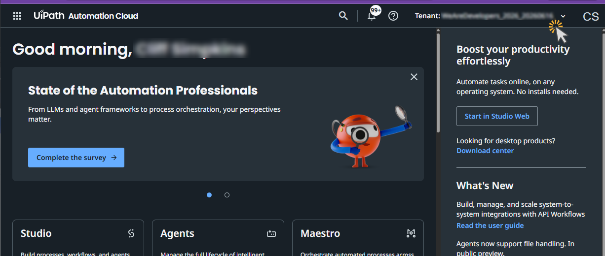

> **Note about tenants:**  
> UiPath Labs hosts many tenants for various workshops that the company runs. If anything is missing, it may be a sign that you are in the wrong tenant.

---

## Step 3 - Duplicate the workshop solution (2 min)

A complete reference solution is pre-built and shared in the workspace. You'll duplicate it to get your own editable copy - your changes stay isolated from everyone else's.

1. Navigate to Studio Web: `https://cloud.uipath.com/uipathlabstraining/studio_/projects`
2. Find the solution named `**Invoice Processing Flow**` - **do not open it directly**
3. Open the three-dot menu (⋮) on the right side of the row and select **Duplicate**
4. Open your new copy, which should have a number appended to it
  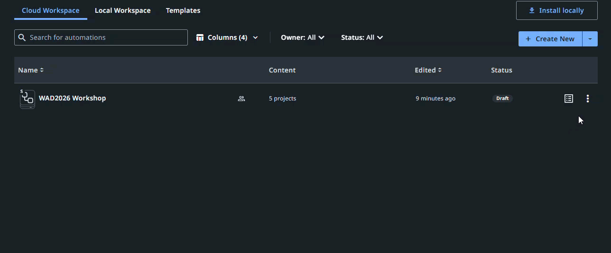

Your solution should contain five items:

- **Discrepancy Investigator Agent**
- **Vendor Research Agent**
- **EscalationApp**
- **Invoice Processing Flow - Complete** (reference; treat it as read only)
- **Invoice Processing Flow - Start Here** (the one you'll build in)

---

## Step 4 - Tour the completed flow (5 min)

Before we start building anything, let's review the end state that we build - an orchestration designed to survive production.

Open **Invoice Processing Flow - Complete** and trace the path from top to bottom.

The complete flow processes invoices end-to-end:

1. **Email trigger** - an invoice email arrives at the workshop demo account (`UiPathlabsdemo@uipath.com`)
2. **Download attachment** - the PDF is saved from the email
3. **IXP extraction** - an IXP model reads the PDF and outputs structured invoice JSON
4. **Script: parse JSON** - extracts the JSON string from the IXP output
5. **Data Fabric query** - retrieves the matching purchase order by invoice number
6. **Decision: vendor name match?**
  - **True** → Discrepancy Investigator Agent → inline email drafting agent → Reply to Email → End
  - **False** → Vendor Research Agent → Switch - Vendor Research Routing:
    - **Valid** (approve, or review with high confidence) → Discrepancy Investigator Agent → email reply → End
    - **Invalid** (reject, or low-confidence review) → End
    - **Default** → End

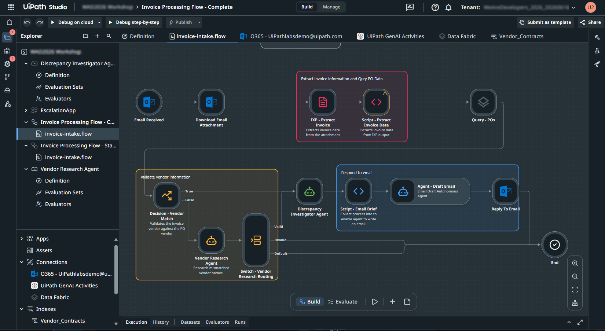

**The starter flow already has the false branch pre-wired** - the Vendor Research Agent and the Switch routing node are there. You don't need to build them. Your job is to add the DIA and the email reply, and wire them into both the true branch and the Switch's Valid path.

---

## Step 5 - Download the sample invoices (2 min)

Given our solution processes invoices, let's grab pre-created invoices that we will use in this workshop.

Five test invoices are pre-loaded in a shared Storage Bucket. Download them now so that they're ready when you need them. These are available for you in **UiPath Orchestrator**

1. If **Orchestrator** isn't already open, select the grid icon in the upper-left corner and select **Orchestrator**.
  - If `Orchestrator` isn't at the top of the menu, you may need to expand the `More` node.  
  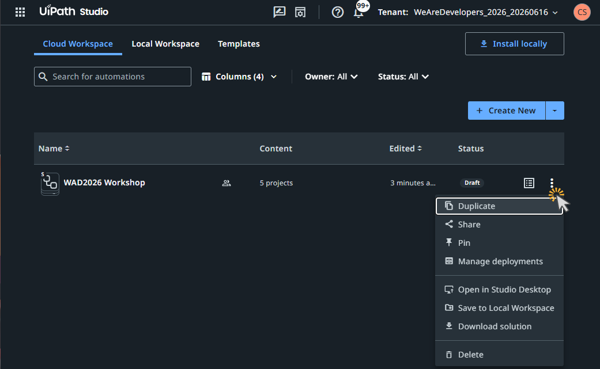
2. In the left navigation panel, select **Shared**
3. In the top navigation bar, select **Storage Buckets**
4. Open the **Sample_PDFs** bucket
  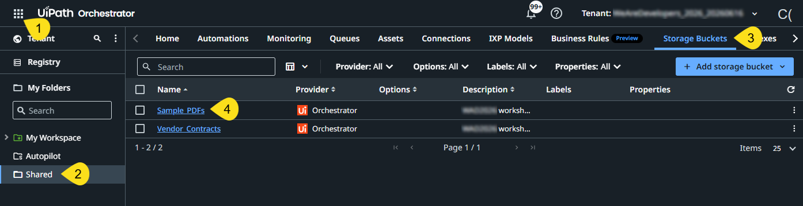
5. Download all five PDF files to your local machine

Each PDF tests a different path through the flow:

| File                                     | Scenario                                            |
| ---------------------------------------- | --------------------------------------------------- |
| `case-1-alphabet-google-invoice.pdf`     | Vendor name mismatch (legitimate parent/subsidiary) |
| `case-2-apex-fraud-invoice.pdf`          | Fraudulent invoice                                  |
| `case-3-freight-discrepancy-invoice.pdf` | Matching vendor, freight charge discrepancy         |
| `case-4-perfect-match-invoice.pdf`       | Everything lines up - your first successful run     |
| `case-5-partial-shipment-invoice.pdf`    | Partial quantity shipped                            |

Keep these files handy and labeled - each drives a different path through the flow.

---

## Step 6 - UiPath 101: Orchestrator (2 min)

Orchestrator is UiPath's governance and operations layer. It's where automations run, get monitored, and get managed in production.

It's the foundation that provides your orchestration with the resiliency required to be production-ready automation, providing version control, state management, and connections to the data and backend systems that it relies upon.

In this workshop you'll use four of Orchestrator's capabilities:

- **Storage Buckets** - cloud file storage shared across the tenant. The five sample invoices and the vendor contract PDFs (used for context grounding) both live here. The flow downloads invoice attachments from here at runtime.
- **Connections** - managed credentials to connect to protected resources. In the shared tenant, you'll use connections to Data Fabric, Outlook 365, and web search.
- **Data Fabric** - a structured entity store built into UiPath. The purchase order records are pre-loaded as a `purchase_orders` entity. The flow queries Data Fabric at runtime to find the PO that matches each invoice - no separate database required.
- **Automations** - where you'll publish and schedule your finished flow. Once published, the flow appears here as a process that can be triggered on a schedule, by webhook, or by email.  
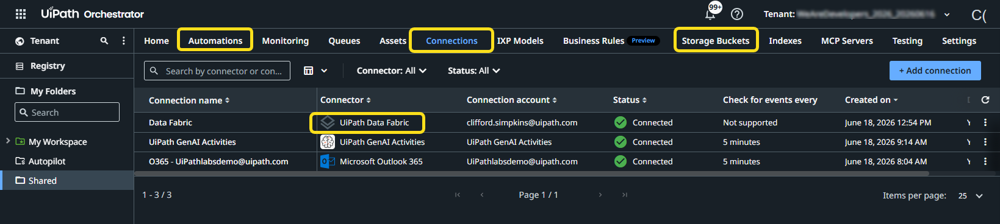

These are the same capabilities you'd use in a production deployment at scale.

---

## Step 7 - UiPath 101: Studio Web (3 min)

Now that we know where our orchestration will run - let's build it!

For this workshop, let's return to Studio Web - use the navigation button in the upper-left (the nine-blocks) and select 'Studio' once more. Outside of this workshop, you could build this solution using Studio Desktop, VS Code, or directly in your coding agent of choice (e.g., Claude Code, Codex, etc.) using a CLI and skills.

Studio Web is UiPath's browser-based development environment - no install, no CLI, just a browser. It's where you design agents, flows, apps, and test automations, and it connects directly to Orchestrator for publishing.

Three areas you'll use today:

- **Agent Builder** - select either agent in your solution to open it; configure the system prompt, attach tools (like context grounding indexes or API connectors), define inputs and outputs, test with the Debug panel, and run evaluations from the Evaluations tab
- **Maestro Flow** - select a flow project to open the design canvas; add nodes directly to the canvas, connect the nodes to form branches, and select a node to configure its properties on the right
- **Project Explorer** - the left sidebar; shows every project inside your solution and lets you navigate between them without losing context

Your solution has five projects. You'll work across all five today - starting with the agents, then building in the starter flow.

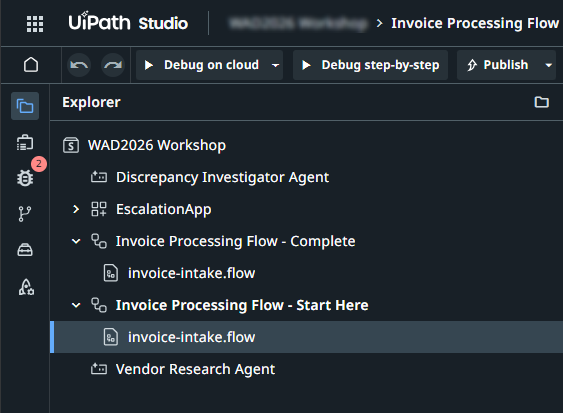

As we use Studio Web, there are a few areas worth noting - along the left-side of the UI are project/solution-level tools that you will use. There are four of note shown below:

- **Explorer** is the folders icon, which you can use to explore the solution and the projects within. You can browse and select the files and components within the project.
- **Data Manager** is the clipboard icon, which you use to manage inputs, outputs, and variables.
- **Issues panel** is the bug icon, used to view and diagnose warnings and errors for your projects.
- **Deployment Configuration** is the rocketship icon, used to manage the connections and dependencies that your projects use.
- **Version Control** is the branch icon and is used to view and restore prior versions of your Studio projects; we won't be using this capability today.

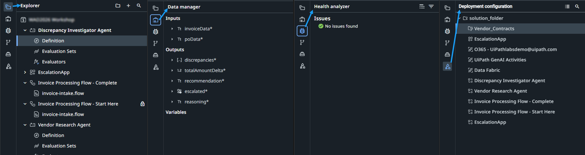

---

## Step 8 - Fix your solution bindings (2 min)

To enable resiliency and compliance, our orchestration connects to our backend systems using centrally managed connections. These connections can be either managed by you (in your workspace) or by a resource owner (in the shared workspace).

When you duplicate a solution, the connections (email, Data Fabric, Storage Bucket, GenAI) point at the original solution's configuration. As they move into your workspace, you need to update these connections before you can run anything.

1. Open your copy of the **Invoice Processing Flow** solution
2. Open the **Project Explorer** panel (folders icon along left bar), and check the **Connections** and **Indexes** nodes in the bottom left of the screen (see image below)
3. For each connection and index that shows a warning indicator, select it, then choose the matching workshop connection from the dropdown

Connections to rebind:

- `O365 - UiPathlabsdemo@uipath.com` email connection - used for the email trigger and email reply nodes
- `UiPath GenAI Activities` connection - used for web research access
- `Data Fabric` connection - supports the purchase order data query
- `Indexes/Vendor_Contracts` - Storage Bucket that stores vendor contracts

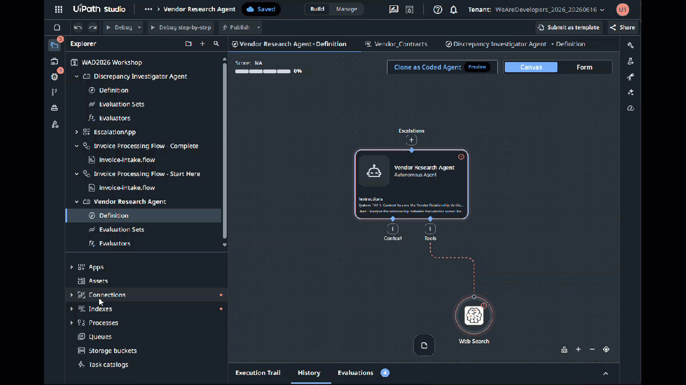

To rebind the `Indexes/Vendor_Contracts`, select the text box element that says `Will be deployed in Debug folder`, which will present a drop-down that you can select `Shared/Vendor_Contracts`.

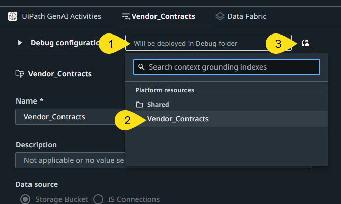

> **Why rebind now?** A duplicated solution inherits stale references from the original, as well as references in the solution author's workspace. When a new solution is created from an existing one, stale errors cause failures mid-run that can be hard to diagnose under time pressure.

---

## Step 9 - UiPath 101: Agent Builder (2 min)

Open the **Discrepancy Investigator Agent** ('DIA') from your solution.

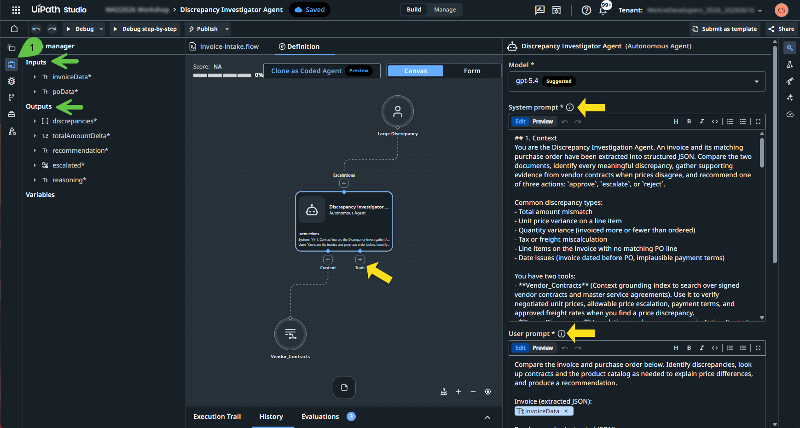

This is Agent Builder - UiPath's low-code agent IDE. What you're looking at:

- **System prompt** - defines the agent's role, reasoning rules, and output format
- **User prompt** - the input template; uses `{{variableName}}` syntax to reference values passed in at runtime from the flow
- **Tools** - `vendor_contracts` is a Context Grounding index backed by the vendor PDF contracts in the shared Storage Bucket; the agent calls this tool when it needs to verify a discrepancy against a contract
- **Data Manager** - defines the inputs and outputs into the AI agent. To access the `Data Manager` panel, select the clipboard icon along Studio's left toolbar
  - **Inputs** - `invoiceData` (the structured invoice JSON) and `poData` (the purchase order JSON from Data Fabric)
  - **Output** - a structured JSON object: `discrepancies`, `totalAmountDelta`, `recommendation` (approve / escalate / reject), `escalated`, `reasoning`

The agent's job: compare the invoice to the purchase order line by line, search the vendor contracts index when it finds a discrepancy, and produce a recommendation backed by evidence.

---

## Step 10 - Update the HITL escalation for 'Discrepancy Investigator Agent (2 min)

Set the **Large Discrepancy** escalation path so that Human-in-the-Loop ('HITL') escalations go to yourself.

1. Select the **Large Discrepancy** escalation tool. This should refresh the Properties panel with that tool's properties.
2. Select **Recipient** to search for yourself.

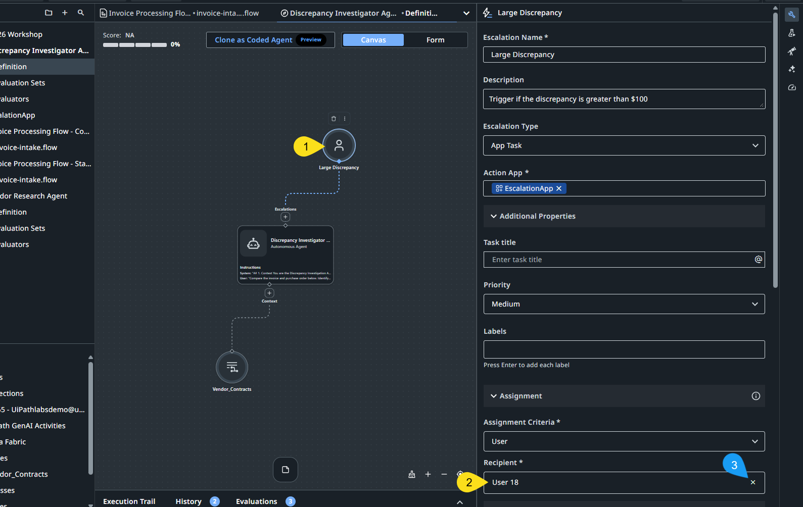

Notes for selecting your name:

- You may need to delete the existing recipient by selecting the 'X' icon.
- You can find your username by clicking on your profile picture in the upper-right corner of the Studio Web UX
- Given this lab uses `User n` names that can share the same undername across labs, **using the email address is easier than username**.

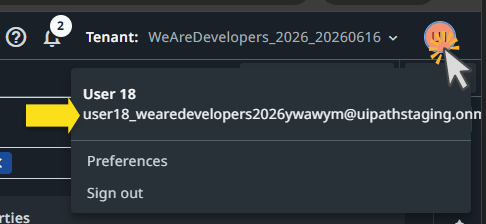

---

## Step 11 - Test the Discrepancy Investigator Agent - The Golden Path (5 min)

Test the agent with known inputs before connecting it to the flow. This confirms the baseline behavior and lets you read the reasoning directly.

1. In Agent Builder, select the **Debug** tab
2. Paste the following into the `**invoiceData**` field:

```json
{"document_type": "invoice", "vendor": "Stratton Office Supply Co.", "invoice_number": "SOS-2026-4412", "invoice_date": "2026-06-01", "due_date": "2026-07-01", "customer_po": "PO-2026-14880", "payment_terms": "Net 30", "currency": "USD", "bill_to": "Customer Accounts Payable", "line_items": [{"description": "HP Office Pro Ink Cartridge 4-pack", "sku": "INK-HP-8034E", "qty": 10, "unit_price": 42.0, "amount": 420.0}, {"description": "Hammermill Premium Copy Paper 500-sheet ream", "sku": "PAPER-HM-500", "qty": 20, "unit_price": 12.5, "amount": 250.0}], "subtotal": 670.0, "tax": 53.6, "freight": 0.0, "total": 723.6}
```

1. Paste the following into the `**poData**` field:

```json
{"document_type": "purchase_order", "buyer": "Acme Procurement", "po_number": "PO-2026-14880", "po_date": "2026-05-15", "payment_terms": "Net 30", "currency": "USD", "status": "Issued", "vendor": "Stratton Office Supply Co.", "ship_to": "Acme Procurement Receiving Dock, 1100 Commerce Plaza, Chicago IL 60606", "line_items": [{"description": "HP Office Pro Ink Cartridge 4-pack", "sku": "INK-HP-8034E", "qty": 10, "unit_price": 42.0, "extended": 420.0}, {"description": "Hammermill Premium Copy Paper 500-sheet ream", "sku": "PAPER-HM-500", "qty": 20, "unit_price": 12.5, "extended": 250.0}], "subtotal": 670.0, "tax": 53.6, "total": 723.6}
```

1. Select **Save & Debug** and watch it run

Expected result: `recommendation: "approve"`, `escalated: false`, `totalAmountDelta: 0`. The invoice and PO match exactly - no discrepancies.

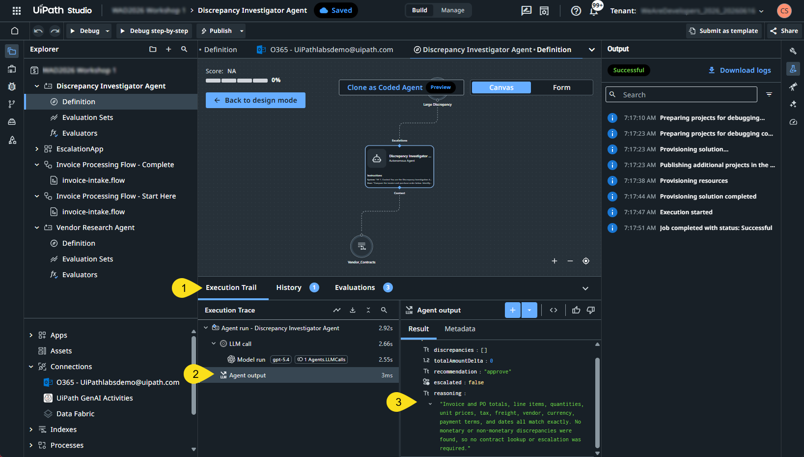

> **What to notice:** The execution trace shows the agent's reasoning step by step. It compared totals, checked line items, found no discrepancies - and returned `approve` without calling the vendor contracts tool. That's correct: the tool call only happens when there's something to look up.

---

## Step 12 - Test the Discrepancy Investigator Agent - Calling the Escalation and Contract Tools (5 min)

Now let's test the agent with known inputs that will trigger the Human In the Loop ('HITL') escalation. This uses the UiPath App capabilities that were built with a quick form.

1. In Agent Builder, select the **Debug** tab
2. Paste the following into the `**invoiceData**` field:

```json
{"document_type": "invoice", "vendor": "Stratton Office Supply Co.", "invoice_number": "SOS-2026-4412", "invoice_date": "2026-06-01", "due_date": "2026-07-01", "customer_po": "PO-2026-14880", "payment_terms": "Net 30", "currency": "USD", "bill_to": "Customer Accounts Payable", "line_items": [{"description": "HP Office Pro Ink Cartridge 4-pack", "sku": "INK-HP-8034E", "qty": 10, "unit_price": 50.0, "amount": 500.0}, {"description": "Hammermill Premium Copy Paper 500-sheet ream", "sku": "PAPER-HM-500", "qty": 20, "unit_price": 15.0, "amount": 300.0}], "subtotal": 800.0, "tax": 80.0, "freight": 0.0, "total": 880.0}
```

1. Paste the following into the `**poData**` field:

```json
{"document_type": "purchase_order", "buyer": "Acme Procurement", "po_number": "PO-2026-14880", "po_date": "2026-05-15", "payment_terms": "Net 30", "currency": "USD", "status": "Issued", "vendor": "Stratton Office Supply Co.", "ship_to": "Acme Procurement Receiving Dock, 1100 Commerce Plaza, Chicago IL 60606", "line_items": [{"description": "HP Office Pro Ink Cartridge 4-pack", "sku": "INK-HP-8034E", "qty": 10, "unit_price": 42.0, "extended": 420.0}, {"description": "Hammermill Premium Copy Paper 500-sheet ream", "sku": "PAPER-HM-500", "qty": 20, "unit_price": 12.5, "extended": 250.0}], "subtotal": 670.0, "tax": 53.6, "total": 723.6}
```

1. Select **Save & Debug** and watch it run
  This time, you should see that the agent has called a `Tool call - escalate_Tool_Discrepancy` and now has an `Action Required` from the `EscalationApp`.  
    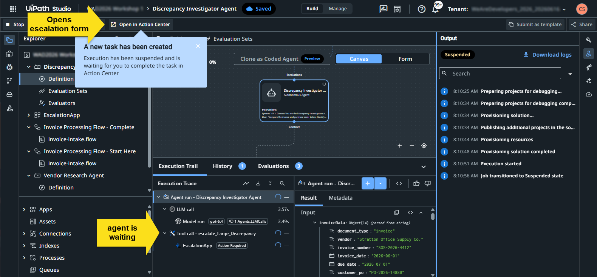
2. Open the escalation in the UiPath Action Center, which should look something like the below:
  1. If you see a `Open in Action App` button at the top, you can use it to jump directly into the UiPath Action Center Inbox
  2. If you don't see the button, there are two additional ways to navigate:
    - You can navigate to your Action Center Inbox directly by opening up **UiPath Actions** from the nine-block menu icon in the upper-left.
      - You can select the `EscalationApp` step in the **Execution Trace**, and the link will be shown in the execution trace details pane
3. Within the `Escalation Task`, select **Approve**
  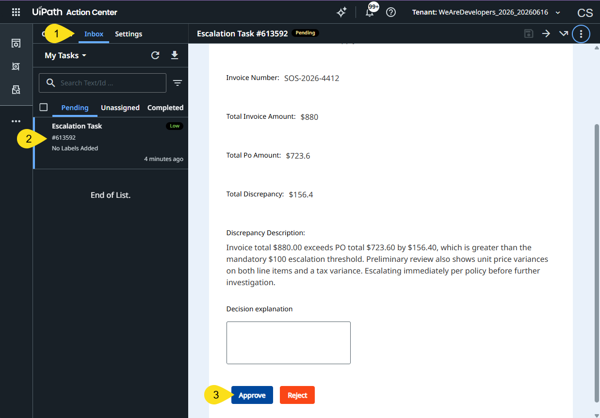
4. Return to the Agent Builder UX and verify that execution completed by examining the Execution Trace. You should now see an **Agent Output** line with what the agent returns.
  

> **What to notice:** This time, the execution trace shows a very different agent reasoning. It noticed discrepancies and used the tools available to it - first to validating with a human that the increased invoice cost is acceptable, and also validating the contract terms of the invoice against the full purchase order agreement stored in Vendor_Contracts.

---

## Step 13 - Run evaluations against the Discrepancy Investigator Agent (10 min)

The agent works on one test input. Now establish a regression net - a set of cases that confirm it keeps working across different invoices, after prompt changes, and when the model updates.

1. In Agent Builder, select the **Evaluation Sets** node
2. In the Evaluation Sets page, select **View Details** to view the evaluations
  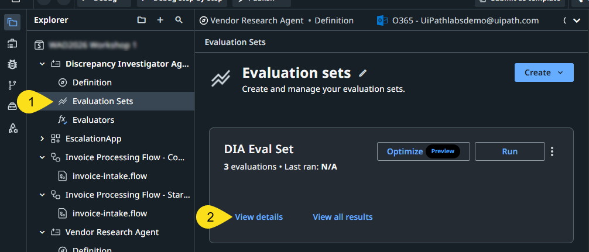
3. The **DIA Eval Set** has 3 pre-loaded test cases:
  - **Freight Discrepancy - Stratton Office Supply** (expected result - recommendation: approve; escalated: true)
  - **Perfect Match - Stratton Office Supply** (expected result - recommendation: approve; escalated: false)
  - **Unit Price Discrepancy - Meridian Tech Supplies** (expected result - recommendation: approve; escalated: true)
4. Select **Evaluate Set** to establish a baseline
  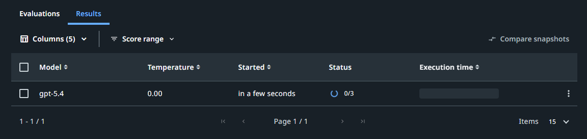

Eval runs take 60–90 seconds. While it runs: each test case passes pre-defined `invoiceData` and `poData` to the agent and compares the output against the expected result. Two evaluators run in parallel: an **output evaluator** (does the recommendation match?) and a **trajectory evaluator** (did the agent call the vendor contracts tool when it should have, and only when it should have?).

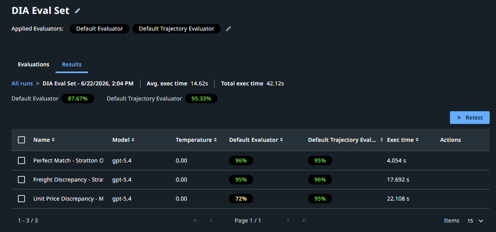

Note the baseline scores - green marks solid performance, yellow noting areas that could be improved, and red calling out where the prompt could be adjusted. You can rerun these after making prompt changes, and the scores tell you whether your fix improved things without breaking anything else.

> **Why worry about evals?** A prompt change that fixes one invoice can silently break another - and model changes can also have an impact on your agent execution. These three cases are your regression net. You should always run evals before shipping a prompt change.

---

## Step 14 - Test the Vendor Research Agent (5 min)

When an invoice vendor name doesn't match the PO vendor name, it's sometimes legitimate: a subsidiary placed the PO but the parent company pays the invoice. The Vendor Research Agent handles this case by searching the web rather than reflexively rejecting the invoice.

1. Open the **Vendor Research Agent** from your solution
2. ***If `Web Search` has a red exclamation mark on it***, select **Web Research** and Studio Web should repair the binding automatically
3. Review the system prompt - notice the structure: role, investigation scenarios, evidence criteria, output format. Compare it to the DIA prompt you just looked at.
4. Select the **Debug** tab and enter:
  - `invoiceVendorName`: `Alphabet`
  - `poVendorName`: `Google`
5. Select **Save & Debug** and watch it run

As it runs, open the **Execution Trace** and observe the pattern:

1. It writes a plan first - a to-do list: compare names, find an authoritative source, classify the relationship
2. It works each task, makes web search calls, and synthesizes the evidence
3. It produces a structured final output with cited sources

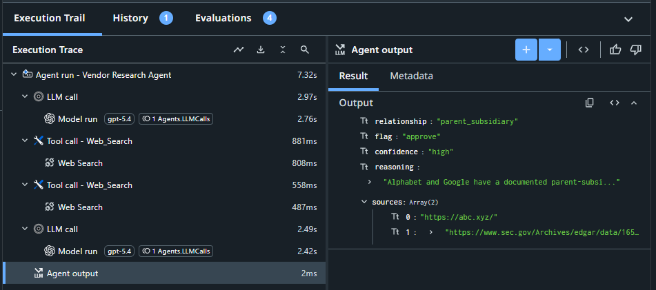

Expected result: `flag: "approve"`, `relationship: "parent_subsidiary"`. Alphabet is Google's parent - the invoice is legitimate.

> **What to notice:** This agent calls the web. The DIA called a local index. Different tools, same pattern: the agent reasons about what it needs, calls the right tool, and produces a recommendation with evidence. That auditability is what makes it trustable in production - not the fact that it got the right answer once.

---

## Step 15 - Run the evaluation set to exercise the Vendor Research Agent (3 min)

For this agent, we will access the evaluations using another click-path. But the click-path you used above for the prior agent works, as well.

1. In the Vendor Research Agent, select the **Evaluations** tab below the designer
2. Open the **VRA Eval Set** - you'll find pre-loaded test cases covering parent/subsidiary relationships and mismatch scenarios
3. Select **Run All** to establish a baseline
  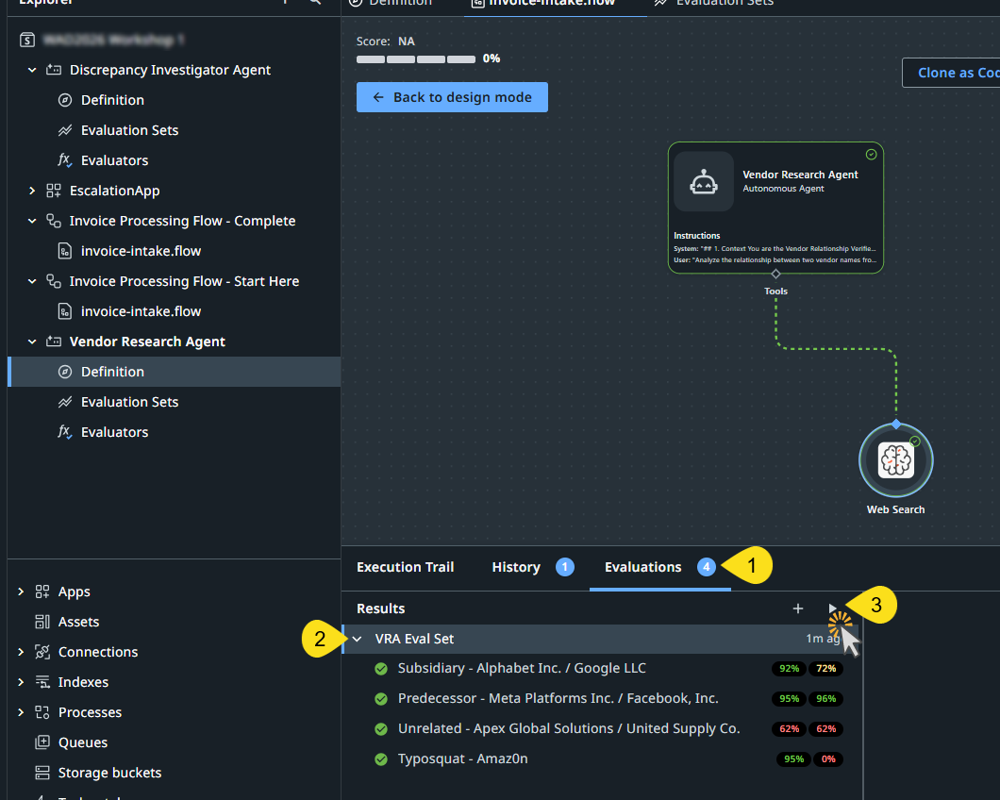

As you can see, the agent's evaluation scores can be run and accessed either via the **Evaluation Sets** node in the project explorer or via the **Evaluations** tab along the bottom. Either provide you with a way of seeing how your agents perform against the evals.


Note the scores. As with the DIA, evals are your regression net - any future prompt change to the VRA should be validated against this set before the agent goes back into the flow.

If you have time at the end of this lab, improving your eval scores by adjusting the prompt and/or inputs is an excellent place to explore further.

---

## Step 16 - Open the starter and configure the email trigger (5 min)

Now that you've seen how the AI agents work, you'll build the flow. Open **Invoice Processing Flow - Start Here** from your solution.

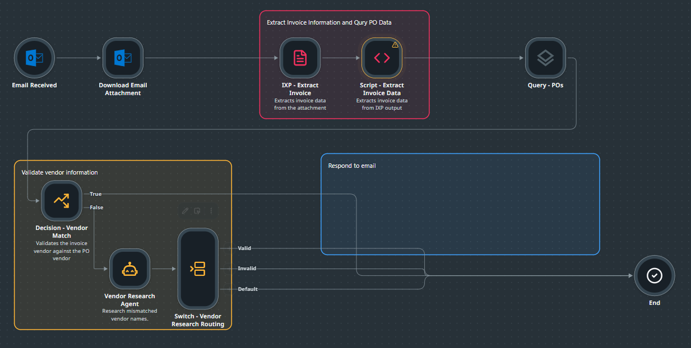

The starter has the full flow pre-built except for one gap. Read through it to orient:

- **Email trigger** - pre-configured to listen on `UiPathlabsdemo@uipath.com`
- **Download attachment** - saves the invoice PDF
- **IXP extraction** - `IXP - Extract Invoice` reads the PDF and outputs structured JSON
- **Script: parse invoice JSON** - `Script - Extract Invoice Data` extracts the JSON string from the IXP output
- **Data Fabric query** - `Query - POs` retrieves the matching purchase order by invoice number
- **Decision - Vendor Match** matches the vendor name
  - **False branch** - Calls `Vendor Research Agent` to research the mismatch. Its output routes through `Switch - Vendor Research Routing`: `Valid` (confirmed legitimate relationship) continues to the DIA; `Invalid` and `Default` route to End
  - **True branch** - empty

And we will now finish wiring up the workflow!

> **About the pre-wired false branch:** In a real build you'd wire this yourself. We've pre-built it so the 2-hour session can stay focused on the DIA, the evals, and the process orchestration - which is where the interesting decisions live.

> **About the switch node:** We included a decision switch to fully automate task routing coming out of the **Vendor Research Agent**, but you would likely have a human in the loop ('HITL') approval here. We made this a switch to simplify the lab, but we have a HITL solution available if you want to explore that approach on your own.

---

## Step 17 - Configure your email trigger - email subject line (2 min)

Adjust the **Email Received** trigger to trigger on ***your*** emails.

1. Open the `Email Received` node by either double-clicking on it, or selecting it and selecting the properties (wrench icon) in Studio Web
2. Select the **Filter** option to open the Filter Builder dialog
  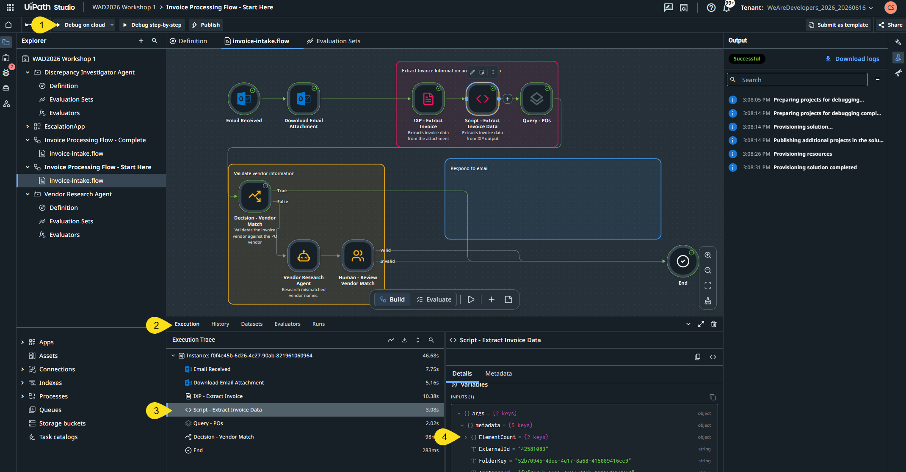
3. In **Filter Builder**, update the `Subject`, replace the `yourname` portion with the name you want your Workflow to trigger from.
  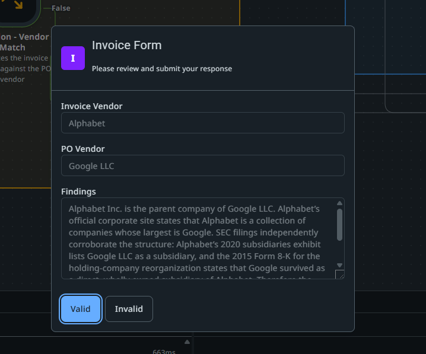

When selecting the string you want to use, use something that is rather unique. All emails for this lab are going into this email inbox, and how you set your email subject filter is the best way to minimize the amount of false triggers across workshop participants.

---

## Step 18 - Test: Send a test invoice through the flow (10 min)

Before adding the Discrepancy Investigator Agent into the workflow, confirm the spine and the pre-wired false branch both work end-to-end.

**Test 1 - Perfect match (true branch, currently empty):**

1. From your email client, compose a new email to `**UiPathlabsdemo@uipath.com**`
2. Set the subject to `**inv-[YourName]**`
3. Attach `**case-4-perfect-match-invoice.pdf**` and send the email
4. Select `**Debug on the Cloud**` in the flow and wait for the trigger to pick up the email
5. Watch the run - you'll see paths that were followed, and activity nodes that were activated, outlined in green
6. You can inspect the execution trace and details of each step by using the `Execution` tab below the designer

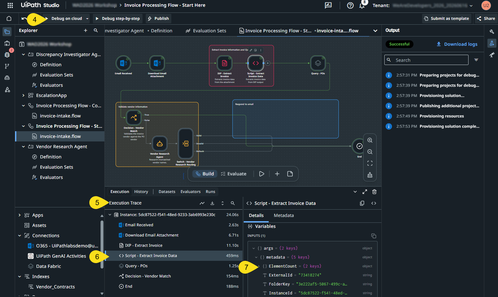

The flow runs through the spine and then ends at the empty true branch - no error, no reply. That's expected.

**Test 2 - Vendor mismatch (false branch, pre-wired):**

Send another email with `**case-1-alphabet-google-invoice.pdf**` attached (same subject).

This time the flow routes to the false branch. The Vendor Research Agent fires, classifies Alphabet/Google as `parent_subsidiary`, and returns `flag: approve` - which routes the Switch to the `Valid` path. The DIA isn't wired yet, so the flow ends here. That's expected.

> **What you're confirming:** The spine is solid. The VRA runs, the Switch routes correctly. In the next step you'll add the DIA and connect it to both the true branch and the Valid path from the Switch.

---

## Step 19 - Add the Discrepancy Investigator Agent (10 min)

Add the Discrepancy Investigator Agent ('DIA') to the true path of the `Decision - Vendor Match` node. The complete flow is your reference - open it in a second tab if you want to compare wiring as you go.

1. Select the **True** path coming out of the Decision node
2. Select the **+** button (or drag an **Agent** node from the node panel) and add it to the true branch
3. In the agent selector, choose **Discrepancy Investigator Agent**
4. Connect the `Valid` path from `Switch - Vendor Research Routing` to the DIA node
  - Delete the existing connection from `Valid` to the `End` node
    - Select the **+** on the `Valid` path and connect it to the DIA node  
    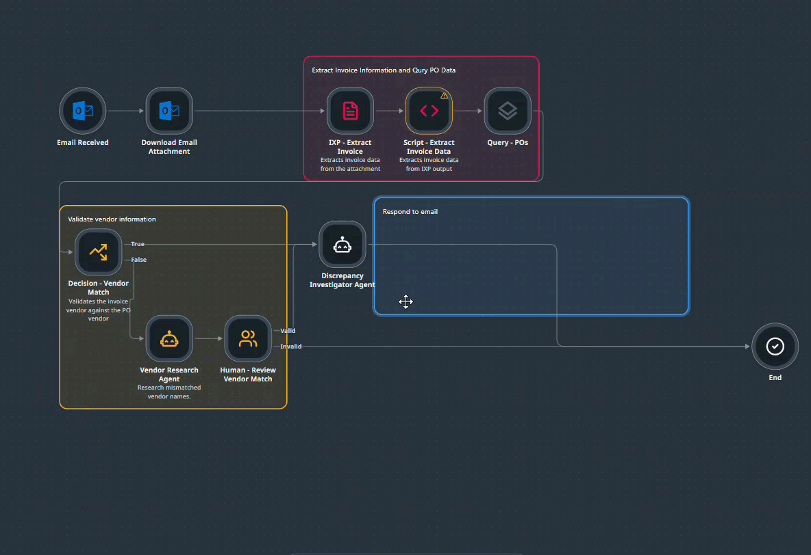
5. Open up the DIA node and update the following inputs:
  - `invoiceData` - open the variable picker and select the output of the JSON parse script node `$vars.scriptGetInvoice.output`
  - `poData` - select the output of the Data Fabric query node `$vars.queryPoData.output`
  - Enclose each of the values in `JSON.stringify()`  
  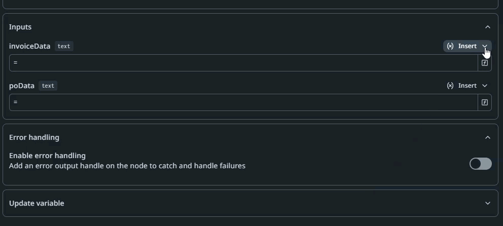

Your final values should look like the following. Enclosing each variables in the JSON.stringify()call converts the JSON values into strings that the agent can process.

- **invoiceData**: `JSON.stringify($vars.scriptGetInvoice.output)`
- **poData**: `JSON.stringify($vars.queryPoData.output)`

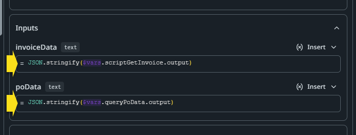

> **Variable references:** The variable picker shows all variables available on the current execution path. If a variable doesn't appear, check the node's Properties panel → Output section to see what it exposes. The complete flow shows the exact wiring.

---

## Step 20 - Add the nodes to draft and send the email reply (15 min)

After the DIA node, add three more nodes: a script node, an inline email authoring agent, and the email reply node.

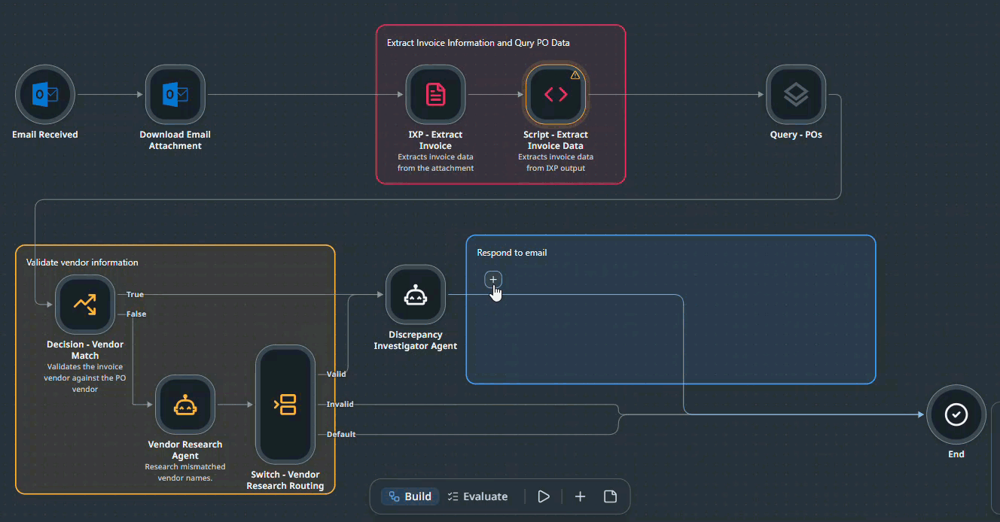

Add the following nodes:

- **Tool** -> **Script**
- **Agent** -> **Autonomous Agent**
- Enter 'Reply to', then select **Reply to Email** (Microsoft Office 365)

Verify that the connectors are wired up as follows:

- **Discrepancy Investigator Agent** -> **Script**
- **Script** -> **Autonomous Agent**
- **Autonomous Agent** -> **Reply To Email**
- **Reply To Email** -> `End`

With the nodes in place, let's configure them.

### Script - Email Brief

Configure the script that collects together the information that will be used by the autonomous agent that will craft the email reply. Using a script to collect the data together allows for us to bring together data across decisions and to gather output data that may have been generated at runtime.

1. Node ID: Rename to `scriptPrepareBrief`
2. Label: `Script - Email Brief`
3. Description: `Collect process info to enable agent to write an email`
4. Script Code:
  ```javascript
    const agent = $vars.discrepancyInvestigatorAgent1.output;

    let briefing = `Invoice review findings:
    - Recommendation: ${agent.recommendation}
    - Summary: ${agent.reasoning}
    - Total variance: $${agent.totalAmountDelta}
    `;

    if (agent.escalated) {
      briefing += `- This invoice had required human review. Write the email reflecting that it has been reviewed and the outcome was: ${agent.recommendation}.`;
    } else {
      briefing += `- This invoice did not require escalation. Write as a straightforward ${agent.recommendation}.`;
    }

    return { briefing };
  ```

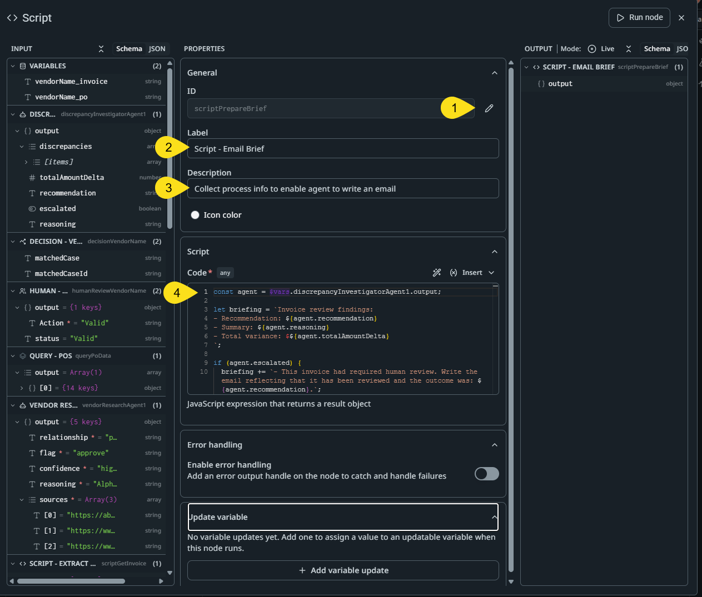

### Configure the inline email drafting agent

Configure it with a system prompt that drafts a professional AP reply based on the DIA output

1. Node ID: Rename it to `agentDraftEmailResponse`
2. Label: `Agent - Draft Email`
3. Description: `Email Draft Autonomous Agent`
4. System Prompt:
  ```md
    You are an accounts payable assistant writing a vendor-facing email response. The recipient is the company that submitted the invoice. Write in a professional, external-facing tone.

    Rules:
    - Write only the email body in HTML. No subject line.
    - Address the email to the vendor (invoice submitter), not an internal approver.
    - If approved: confirm the invoice was reviewed and approved for payment processing.
    - If escalated: let the vendor know their invoice was flagged for deeper review **and approved**, and **briefly** state why it was flagged.
    - If rejected: inform the vendor the invoice cannot be processed and **briefly** state why.
  ```
5. User Prompt:
  ```txt
    - Vendor name:  {{ $vars.vendorName_invoice }}
    - Brief:   {{ $vars.scriptPrepareBrief.output }}
    - Full discrepancy investigation (if needed):  {{ $vars.discrepancyInvestigatorAgent1.output }}
  ```
    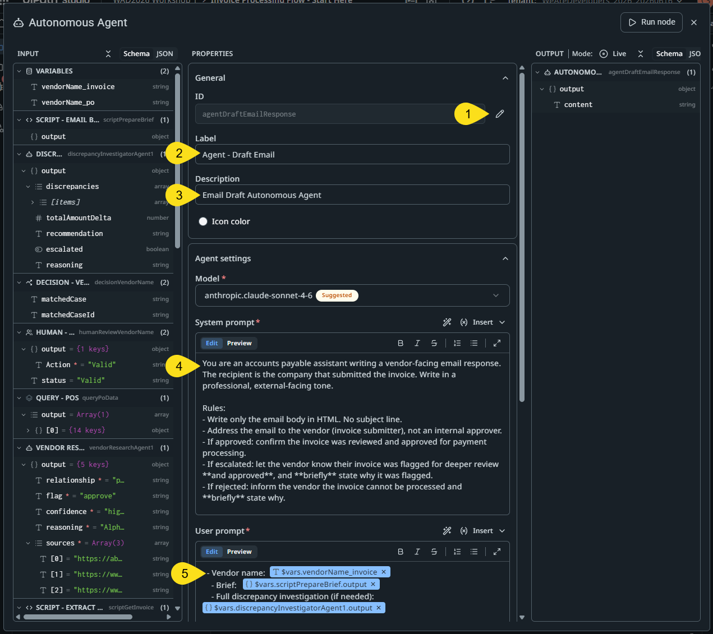
6. Outputs (scroll further down):
  - Remove the `content` output variable
    - Add a new `body` output and make it required  
    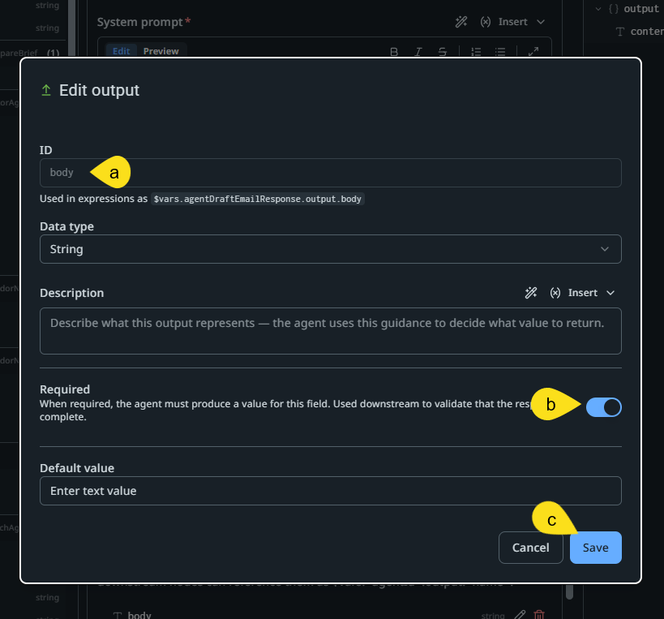

### Configure the `Reply to Email` node:

Finally, let's configure the **Reply to Email** node:

1. Remove and readd the `O365 - UiPathlabsdemo@uipath.com` connection
2. **Email to reply**: `$vars.emailReceived.output.id`
3. **Body**: `$vars.agentDraftEmailResponse.output.body`
4. Set **Save as draft** to `false`
5. **New Subject**: `re: $vars.emailReceived.output.subject`

**NOTE:** You may find it easier to use the **Variables** tool, which is accessible by clicking on the **@** button or the control-panel icon next to the text boxes.

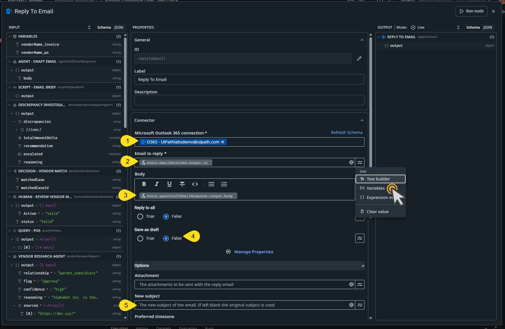

> **Variable scoping:** Output variable names are set by each node's ID, visible in the node's Properties panel. If you see "variable not resolved" errors, confirm the upstream node's exact ID and check it matches the reference in the downstream node. The complete flow shows the exact wiring.

---

## Step 21 - Test: Run the full flow end-to-end (5 min)

1. From your email client, compose an email to `**UiPathlabsdemo@uipath.com**` with subject `**inv-[YourName]**`
2. Attach `**case-4-perfect-match-invoice.pdf**`
3. Send it and watch the run

The flow should successfully route through the true branch of the Vendor Match - the Discrepancy Investigator Agent runs, the email reply is prepared, and it's sent.

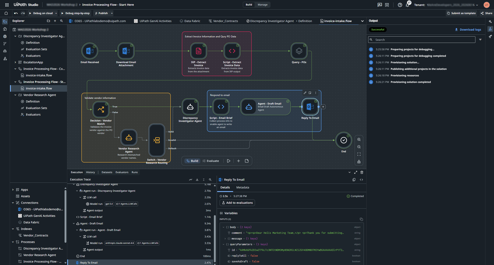

Expected: the flow completes end-to-end, and an email reply arrives in the inbox you submitted the invoice from.

> Open the execution trace. The DIA ran, checked the vendor contracts index for any discrepancy (found none), and returned approve. An inline agent drafted the reply. One governed end-to-end run, full audit trail.

---

## Step 22 - Publish and deploy to Orchestrator (5 min)

Publishing moves your solution from Studio Web's development workspace to Orchestrator, where it can run on a schedule, be triggered by an event, monitored for failures, and automatically retried.

Deploying the solution activates the solution's package and activates relevant triggers. Once deployed, it can run and process work.

1. In your solution, select the **Publish** button and select **Deploy**
  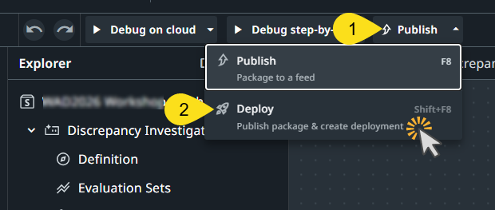
2. In the **Deploy Solution** dialog, confirm the following:
  - Publish it into your personal space - select **Personal**
    - Confirm the version (the default is fine; it will auto-increment)
    - Add any release notes that you may want to add
    - Select **Deploy** to start the publish & deployment process  
    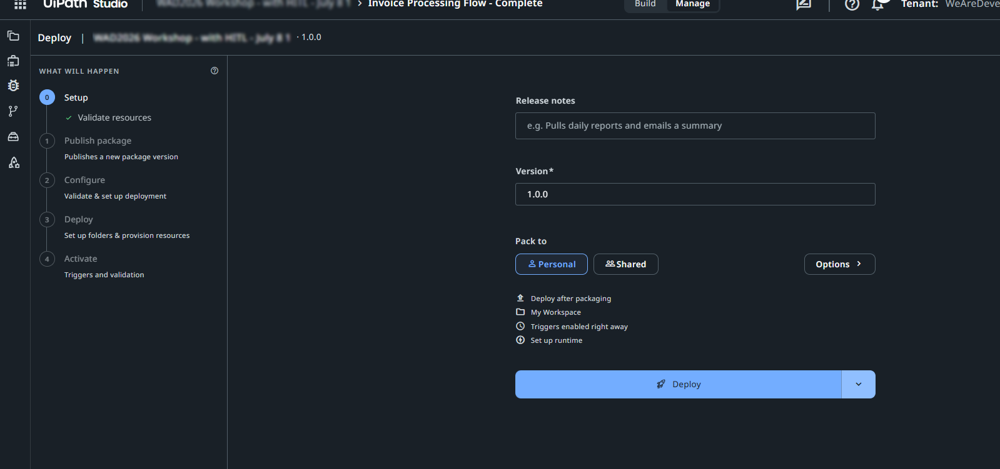
3. As it publishes and deploys the solution, you will see a log of actions being taken.
  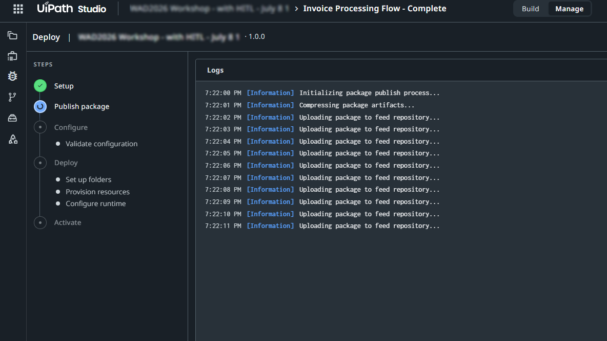

---

## Step 23 - Link shared resources on first deploy (3 min)

During the deployment process, you may be asked to **Configure** the resources your solution will use in Orchestrator *if this is the first time that the Solution is being deployed in the tenant*. This enables you to select which connectors your deployed solution will use.

This matters because your solution may want to use one set of connectors during development and test, while you may want your solution to use a different set of connectors when deployed into test and/or production.

If asked to configure the solution's Connections and Indexes, do the following:

1. Select the resource needing to be configured (e.g., **Data Fabric**)
2. Select the **Link to Existing** button in the upper-right of the screen
3. Select the **connection name** from the list of options - selecting the `(Shared)` option
4. Select the **Link** button to configure your solution deployment to use that connection
5. Note - If a connection doesn't show the existing shared connection (for example - O365), you may need to search using the same name using the magnifying glass icon, which should refresh the list with the shared connection.

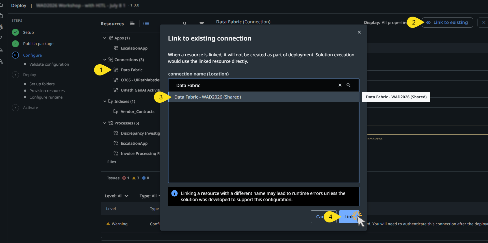

If required, also refresh the `Vendor_Contracts` index by selecting `Vendor_Contracts` from the **Indexes** list and selecting the **Use existing** button.

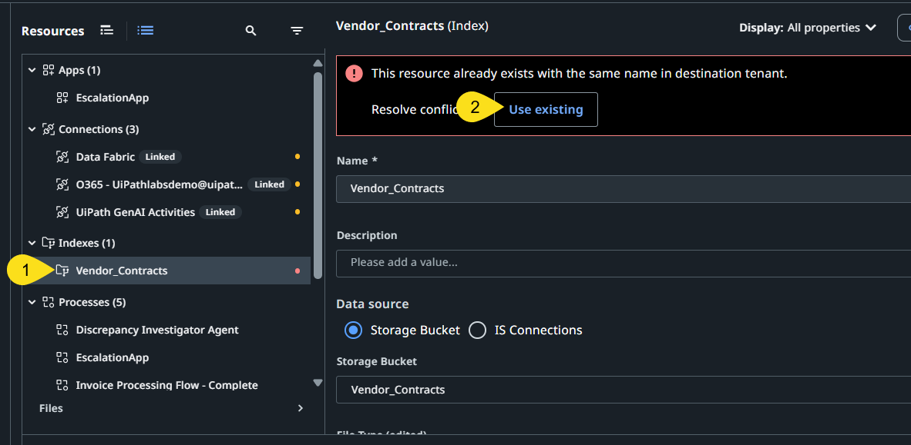

---

## Step 24 - Verify the trigger was created (2 min)

Once successfully deployed, ensure that the email trigger has been created:

1. Expand the **My workspace** folder node within the **My Folders** pane of Orchestrator
2. Select the folder node that matches your Solution's name - for example, `Invoice Processing Flow`
3. Select the **Automations** tab within Orchestrator to show the automations published into that folder.
4. Select the **Triggers** sub-tab within Automations to show your automation triggers
5. Finally, select the **Event Triggers** sub-sub-tab to show your event-based triggers. Because your workflow is waiting on an email received event, your workflow projects show up here.

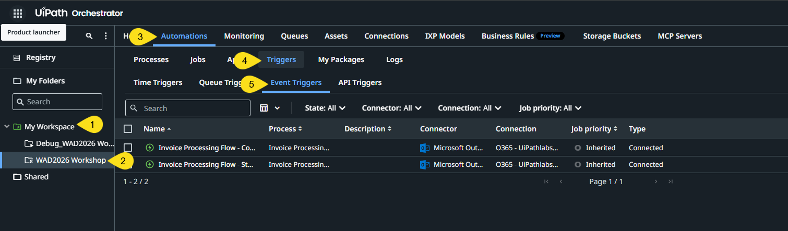

> **Why are there two event triggers?** The UiPath solution you published contained two workflow projects - `Invoice Processing Flow - Complete` and `Invoice Processing Flow - Start Here` - and each had an event trigger on email received. Thankfully, each one had a different email subject filter.

***CONGRATULATIONS*** - you have successfully deployed a durable automation that...

- can survive infrastructure failures
- provides immutable audit log of every run, 
- evaluations that can block a bad deploy before it ships
- A human-in-the-loop handoff built into the orchestration layer

These are all things you don't assemble or have to build around an open-source automation tool or cron job. And it's also the difference between a demo and a system that can process an invoice that arrives at 2am when nobody's watching.

From here on out, we have optional tasks that you can continue to explore if you have time left today or if you want to return to this workshop later. Enjoy!

---

## Step 25 - Run the remaining tests | Optional (10 min)

If you have time, run the remaining invoice cases through your completed flow and optionally add them as eval cases.

> **Timing Note:** The email trigger for your published projects checks for received emails every 5 minutes; so you may need to wait for your workflow to pick up the work.

To watch your automation run, select the **Jobs** sub-tab under **Automations** and you'll see a list of jobs executed - this will show your agent runs and your flow runs.

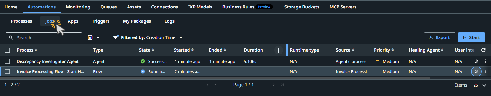

> **Watching a job run:** When a process runs, you can select the run to see the trace for a given job.

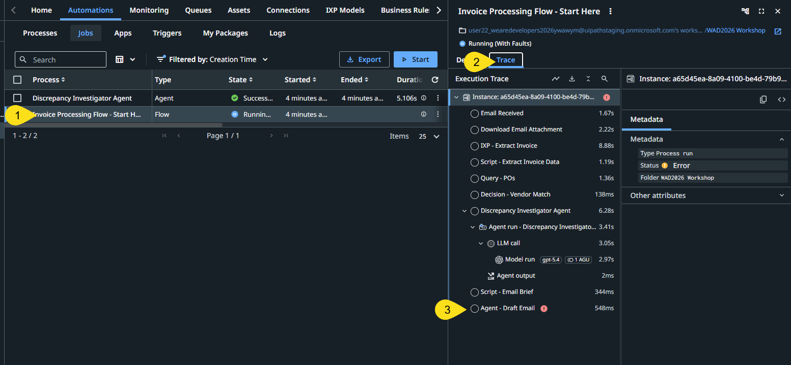

### Note - updating your Solution

You can update the workflow that you are running in **Orchestrator** by returning to **Studio Web** (using the nine-dots menu button and selecting **Studio**) and clicking either the **Publish** button or selecting the drop-down caret on the **Publish** button and selecting **Deploy**.

- **Publish** will publish the new version up to Orchestrator. You can then select your automation in Orchestrator and click the upgrade icon.
- **Deploy** will walk you through the deployment wizard again, and create a second process deployment in Orchestrator.

You may publish a new version for one of two reasons:

1. If you received an error at the **Agent - Draft Email** node above, the Flow may have deployed ahead of the in-line autonomous agent. This is an occassional bug in the Maestro Flow Public Preview, which sometimes happens at the time of this workshop authoring.
2. You may have iterated on your orchestration and/or agents, and want to publish the new build into Orchestrator.

As you publish, you will notice that Studio auto-increments your version number for you. UiPath automatically manages project versions, but you can also manage versions in your own repositories such as GitHub or GitLab.

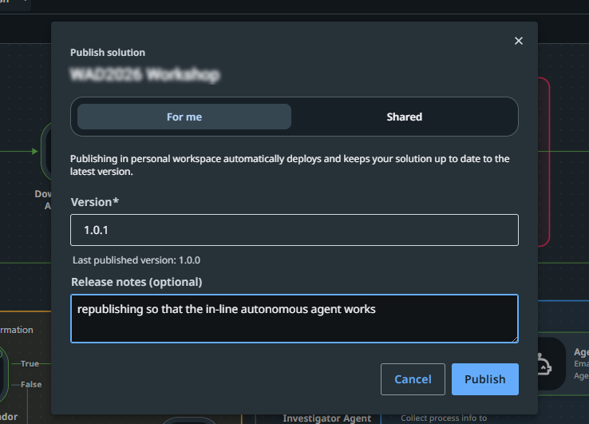

### **Send additional invoices and observe their progress**

With your flow running, send each to `**UiPathlabsdemo@uipath.com**` with subject `**inv-[YourName]**` and the invoice PDF attached.

Now that it is running in Orchestrator, the automation should pick up the emails and process them automatically. As you wait for the automation to run, remember that the O365 email trigger runs every 5 minutes.

| Invoice                                  | Expected outcome                                               |
| ---------------------------------------- | -------------------------------------------------------------- |
| `case-3-freight-discrepancy-invoice.pdf` | Escalate - $150 freight charge not authorized in the PO        |
| `case-5-partial-shipment-invoice.pdf`    | Escalate - partial quantity shipped against a full-quantity PO |
| `case-2-apex-fraud-invoice.pdf`          | Reject - fraudulent invoice                                    |

---

## Step 26 - View results in UiPath Maestro | Optional (5 min)

Once you have run invoices through the deployed process, you can inspect how the invoices ran using Maestro:

1. Open up **Maestro** by opening the menu (nine-dot icon) and selecting **Maestro**
2. Select **Flow instances** from the available Maestro views
3. Select your published flow from the **Flow name** list at the bottom of the view

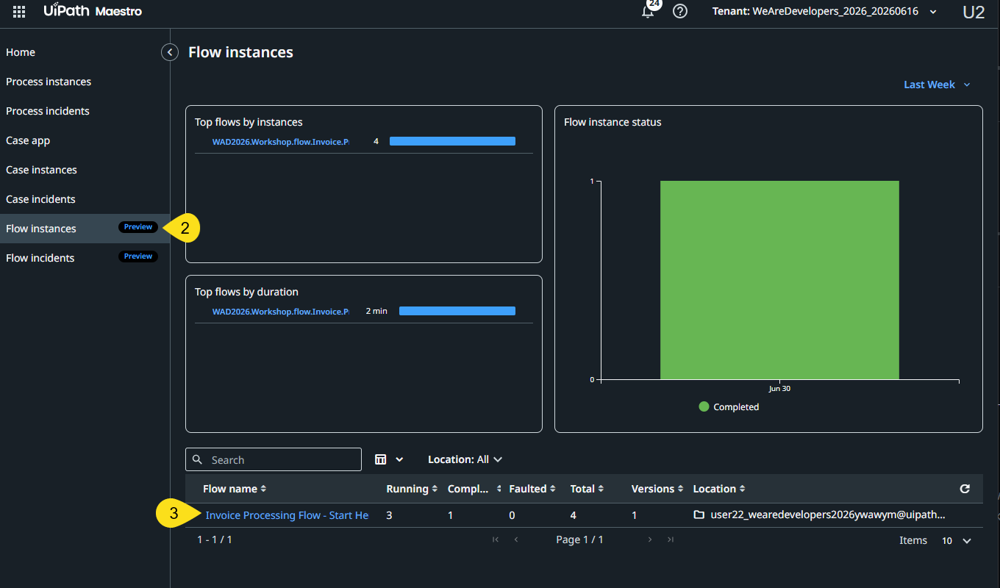

Once you've selected your **Flow name**, you'll see all of the instances for that given flow. In this view, you can see which version of the flow that instance ran against, how long it took, and the result (success, pending, exception).

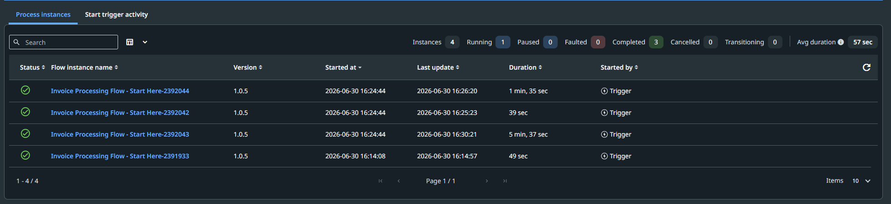

Selecting a flow instance enables you to see the traces and details about the run. And for a flow that is paused for further action (e.g., a Large Discrepancy escalation), you can select the **EscalationApp** part of the execution trace to view the `TaskUrl` of the Action required to open it and approve.

Note that you could see this required action within the UiPath Action Center (as previously done), but this is another path to get there.

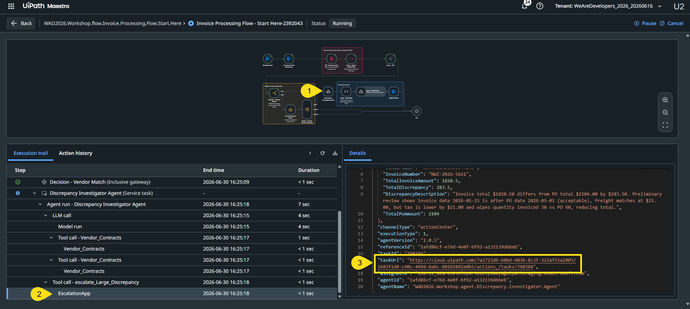

---

## Next Steps - Continue Exploring the UiPath Platform

If you want to continue experimenting after the workshop to see what long-running processes can do, here are suggested directions for you to further explore:

### Add Human-in-the-Loop ('HITL') review to the vendor research path

The flow you built routes automatically based on the VRA agent's confidence score. A more conservative design adds a human review step between the VRA and the DIA agents - pausing the flow for an AP reviewer to confirm before the discrepancy check runs.

A pre-built version of this flow is available as `**WAD2026 Workshop - with HITL**` in the shared workspace. Open it to see how the `Human - Review Vendor Match` node fits into the routing, and compare it to the Switch-based version you built today. Additionally, this HITL step uses a different part of the UiPath platform toolset.

> **When to use HITL:** The Switch sets a confidence threshold - automate when the agent is sure enough, stop when it isn't. HITL replaces the confidence gate with a human one. Neither is always right; the choice depends on the process risk and the volume of exceptions your team can absorb.

### Swap the model and rerun your evals

Switch the DIA to a different model (e.g., Claude Sonnet) and rerun the eval set from Step 13. The scores will likely change - sometimes dramatically - even on cases that "obviously" pass. You should notice that different models will interpret the prompt differently and dig into some surprisingly different discrepancies. Why this exploration matters - evals are good at examining and exposing model-sensitivities, and swapping a model isn't free. Your evals should expose what needs to revalidated when you switch a model (or a model is switched on you by the model provider).

---

## Next Steps - Build in your local IDE and Coding Agent

You can also directly engage with your orchestration outside of Studio Web.

- For Visual Studio Code, add the **UiPath Maestro extension** to get the Maestro Flow designer within your IDE
- For UiPath CLI and skills, install *UiPath for Coding Agents*. There are two installation approaches available:
  - Use npm:
    - Install the UiPath CLI using - `npm install -g @uipath/cli`
    - Install the UiPath skills using - `uip skills install`
  - Or you can use our shell script to install node, Python, .Net, and the CLI:
    - Mac/Linux using bash - `curl -fsSL https://download.uipath.com/uipath-cli/install.sh | bash`
    - Windows using PowerShell - `irm https://download.uipath.com/uipath-cli/install.ps1 | iex`

Once installed, you can use natural language to build and manage your orchestrations. Enjoy!

---

## Additional Resources

Explore the UiPath Platform at [https://uipath.com/developers/](https://uipath.com/developers/)

---

*Last updated: 2026-07-13 (synced with the UiPath Labs version delivered at WAD2026, 9 July 2026)*  
*Solution version: 1.0.0 (Invoice Processing Flow)*
